Frankly, I’m sick and tired of hearing that Dr. Cham was a madman. Yes, he tried
to bury himself alive. Yes, he electrocuted his niece. Yes, in fact, he did
dynamite a retirement home. But this was all with good cause and, in each case,
I believe he took the correct course of action.

I’m sure you’d like to side with popular opinion, but you’re bound to feel some
small trickle of admiration for him once he’s taken time to teach you all about
Ruby’s class definitions. And moreso when you learn about mixins. And perhaps,
by the end of the chapter, we can all start to look beyond the Doctor’s grievous
past and stop calling him a madman.

So if you need to call him a madman, I’d start heading down to the train tracks
to smash up some long fluorescent light bulbs. Get it out of your system right
now, before we dig in.

## 1. This One's For the Disenfranchised

If you give me a number, which is any year from Dr. Cham’s life, I’ll give you a
synopsis of that time period. And I’ll do it as a Ruby method, so it’s an
independent piece, an isolated chunk of code which can be hooked up to the voice
of a robotic volcano, when such a thing becomes the apex of authoritative voice
talents.

Okay, so I need you to notice `def` and `case` and `when`. You’ve seen the
Ranges, the closed accordions of `1895..1913`, back in chapter 3. They contain
both ends and in between. And the backslashes at the end of each line simply
ignore the _Enter_ key at the end of each line, assuring Ruby that there is
_more of this line to come_.

So, please: `def` and `case` and `when`.


def dr_chams_timeline( year )
  case year
  when 1894
    "Born."
  when 1895..1913
    "Childhood in Lousville, Winston Co., Mississippi."
  when 1914..1919
    "Worked at a pecan nursery; punched a Quaker."
  when 1920..1928
    "Sailed in the Brotherhood of River Wisdomming, which journeyed \
     the Mississippi River and engaged in thoughtful self-improvement, \
     where he finished 140 credit hours from their Oarniversity."
  when 1929
    "Returned to Louisville to pen a novel about time-travelling pheasant hunters."
  when 1930..1933
    "Took up a respectable career insuring pecan nurseries.  Financially stable, he \
     spent time in Brazil and New Mexico, buying up rare paper-shell pecan trees.  Just \
     as his notoriety came to a crescendo: gosh, he tried to buried himself alive."
  when 1934
    "Went back to writing his novel.  Changed the hunters to insurance tycoons and the \
     pheasants to Quakers."
  when 1935..1940
    "Took Arthur Cone, the Headmaster of the Brotherhood of River Wisdomming, as a \
     houseguest.  Together for five years, engineering and inventing."
  when 1941
    "And this is where things got interesting."
  end
end


The `def` keyword. Here is our first **method definition**. A plain kernel
method, which can be used anywhere in Ruby. And how do we run it?


puts dr_chams_timeline( 1941 )


Which answers with “And this is where things got interesting.” It’s the same
story again and again: _use your answers._ I’ve set things up above so that the
`case` statement always answers with a string. And since the case statement is
the final (and only) statement in the method, then the method answers with that
string. Trickling water spilling down from ledge to ledge.

Let me be clear about the `case` statement. Actually, I should call it a
`case..when` statement, since they cannot be used separately. The `case` keyword
is followed by a value, which is compared against each of the values which
follow `when` keywords. The first value to qualify as a match is the one the
case uses and the rest are ignored. You can do the same thing with a bunch of
`if..elsif` statements, but it’s wordier.


case year
when 1894
  "Born."
when 1895..1913
  "Childhood in Lousville, Winston Co., Mississippi."
else
  "No information about this year."
end


Is identical to:


if 1894 === year
  "Born."
elsif (1895..1913) === year
  "Childhood in Lousville, Winston Co., Mississippi."
else
  "No information about this year."
end


The **triple equals** is a length of velvet rope, checking values much like the
double equals. It’s just: the triple equals is a longer rope and it sags a bit
in the middle. It’s not as strict, it’s a bit more flexible.

Take the Ranges above. `(1895..1913)` isn’t at all **equal** to `1905`. No, the
Range `(1895..1913)` is only truly **equal** to any other Range `(1895..1913)`.
In the case of a Range, the triple equals cuts you a break and lets the Integer
`1905` in, because even though it’s not **equal** to the Range, it’s
**included** in the set of Integers represented by the Range. Which is good
enough in some cases, such as the timeline I put together earlier.

Which actually looked like a timeline, didn’t it? I mean, sure,
`dr_chams_timeline` method is code, but it does read like a timeline, clean and
lovely.

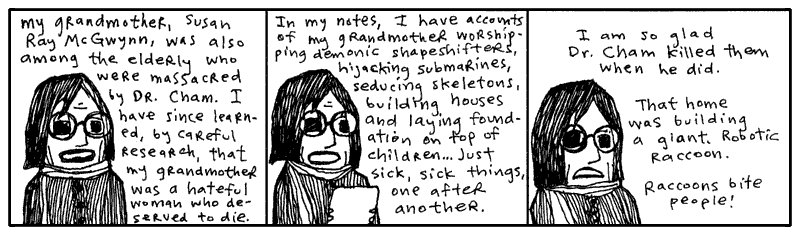

<aside class="sidebar" markdown="1">
## Caring For You. And Your Wellness.

I need you to be in a good mental state for the latter half of this book. Now is
the time to begin conditioning you.

Let’s start with some deep breathing. Give me a good deep breath and count to
four with me.

Here we go. 1. 2. 3. 4. Now exhale. You can feel your eyes. Good, that’s exactly
it.

Now let’s take a deep breath and, in your mind, draw a hippopotamus as fast as
you can. Quick quick. His legs, his folds, his marshmallow teeth. Okay, done.
Now exhale.

Take another deep breath and hold it tight. As you hold it tightly in your
chest, imagine the tightness is shrinking you down into a bug. You’ve held your
breath so hard that you’re an insect. And all the other bugs saw you shrink and
they loved the stunt. They’re clapping and rubbing their feelers together madly.
But you had an apple in your hand when you were big and it just caught up with
you, crushed the whole crowd. You’re dead, too. Now exhale.

Give me a solid deep breath and imagine you live in a town where everything is
made of telephone cords. The houses are all telephone cords, the shingles, the
rafters. The doorways are a thick mass of telephone cords which you simply
thrust yourself through. When you go to bed, the bedspread is telephone cords.
And the mattress and box springs are telephone cords, too. Like I said,
everything is made out of telephone cords. The telephone itself is made of
telephone cords. But the telephone cord going to the telephone is made out of
bread and a couple sticks. Now exhale.

Breathe in. 1. 2. 3. 4. Breathe out.

Breath in. 1. 2. Another short breath in. 3. 4. Imagine both of your hands
snapping off at the wrists and flying into your computer screen and programming
it from the inside. Exhale.

Big, big deep breath. Deep down inside you there is a submarine. It has a
tongue. Exhale.

Breathe through your nostrils. Deep breath. Filter the air through your
nostrils. Breathing through the nostrils gives you quality air. Your nostrils
flare, you are taking breaths of nature’s air, the way God intended. Imagine a
floppy disk drive clogged up with orphans. And while it chokes on orphans, you
have good, wholesome God’s breath in your lungs. But that pleasurable,
life-giving air will become a powerful toxin if held too long. _Hurry, exhale
God and nature’s air!_

Now, you will wake up, smoothing out the creases of this page in your web
browser. You will have full recollection of your whole life and not forgetting
any one of the many adventures you have had in your life. You will feel rich and
renewed and expert. You will have no remembrance of this short exercise, you
will instead remember teaching a rabbit to use scissors from a great distance.

And as you will wake up with your eyes directed to the top of this exercise, you
will begin again. But this time, try to imagine that even _your shadow_ is a
telephone cord.
</aside>

### But Was He Sick??

You know, he had such bad timing. He was scattered as a novelist, but his
ventures into alchemy were very promising. He had an elixir of goat’s milk and
sea salt that got rid of leg aches. One guy even grew an inch on a thumb he’d
lost. He had an organic health smoke that smelled like foot but gave you night
vision. He was working on something called Liquid Ladder, but I’ve never seen or
read anything else about it. It can’t have been for climbing. Who knows.

One local newspaper actually visited Dr. Cham. Their book reviewer gave him four
stars. Really. She did an article on him. Gave him a rating.

Just know that Dr. N. Harold Cham felt terrible about his niece. He felt the
shock treatment would work. The polio probably would have killed her anyway, but
he took the chance.

On Sept. 9, 1941, after sedating her with a dose of phenacetin in his private
operating room, he attached the conducting clips to Hannah’s nose, tongue, toes,
and elbows. Assisted by his apprentice, a bespeckled undergraduate named Marvin
Holyoake, they sprinkled the girl with the flakes of a substance the doctor
called _opus magnum_. A white powder gold which would carry the current and
blatantly energize the girl, forcing her blood to bloom and fight and vanquish.

But how it failed, oh, and how, when the lever was tossed, she arched and
kicked—and  **KABLAM!**—and **BLOY-OY-OY-KKPOY!** Ringlets of hair and a wall of light,
and the bell of death rang. The experiment collapsed in a dire plume of smoke
and her innocence (_for weeks, everyone started out with, “And she will never
have the chance…”_) was a great pit in the floor and in their lungs.

To Hannah, I code.


opus_magnum = true
def save_hannah
  success = opus_magnum
end


A method is its own island. And what goes on inside is unaffected by the simple
variables around it. Dr. Cham couldn’t breach the illness of his niece, no more
than an `opus_magnum` variable can penetrate the steely exterior of a method.

Should we run the `save_hannah` method, Ruby will squawk at us, claiming it sees
no `opus_magnum`.

I’m talking about **scope**. Microscopes narrow and magnify your vision.
Telescopes extend the range of your vision. In Ruby, **scope** refers to a field
of vision inside methods and blocks.

A method’s `def` statement opens its vision. Variable names introduced there
will be seen by the method and kept meaningful until its `end` closes its eyes.
You can pass data into a method by using arguments and data can be returned from
the method, but the names used inside the method are only good for its scope.

Some variables have wider scope. Global variables like `$LOAD_PATH`, which start
with a **cash** symbol, are available in any scope. Instance variables like
`@names`, which start with an **at** are available anywhere inside a class
scope. Same goes for class variables like `@@tickets`. Class and instance
variables will be explored in a moment.

Blocks have scope, but it’s a bit fuzzier. More flexible.


verb = 'rescued'
['sedated', 'sprinkled', 'electrocuted'].
each do |verb|
  puts "Dr. Cham " + verb + " his niece Hannah."
end
puts "Finally, Dr. Cham " + verb + " his niece Hannah."


The block _iterates_ (spins, cycles) through each of the Doctor’s actions. The
`verb` variable changes with each pass. In one pass, he’s sedating. In the next,
he’s powdering. Then, he’s electrocuting.

So, the question is: after the block’s over, will he have rescued Hannah?

<pre class="result">Dr. Cham sedated his niece Hannah.
Dr. Cham sprinkled his niece Hannah.
Dr. Cham electrocuted his niece Hannah.
Finally, Dr. Cham rescued his niece Hannah.
</pre>

Blocks are allowed to see variables in the vicinity. But this block has its own
`verb` variable which is updated each cycle. When the block completed and its
tiny life ended, the outer `verb` stayed the same as it were before.

This is the nature of local variables. When its **scope** closes, the variable
goes away with it. Say that `verb` wasn’t used before the block.


['sedated', 'powdered', 'electrocuted'].
each do |verb|
  puts "Dr. Cham " + verb + " his niece Hannah."
end
puts "Yes, Dr. Cham " + verb + " his niece Hannah."


Pulls an error: `` undefined local variable or method `verb' ``. Poof. The inner
variable won't leak outside its scope.

It must be something difficult, even for a great scientist, to carry away the
corpse of a young girl whose dress is still starched and embroidered, but whose
mouth is darkly clotted purple at the corners. In Dr. Cham’s journal, he writes
that he was tormented by her ghost, which glistened gold and scorched lace. His
delusions grew and he ran from hellhounds and massive vengeful, angelic hands.

Only weeks later, he was gone, propelled from these regrets, vanishing in the
explosion that lifted him from the planet.

And even as you are reading this now, sometime in these moments, the bell jar
craft of our lone Dr. Cham touched down upon a distant planet after a sixty year
burn. As the new world came into view, as the curvature of the planet widened,
as the bell jar whisked through the upset heavens, tearing through sheets of
aurora and solar wind, Dr. Cham’s eyes were shaken open.

What you are witnessing is the landing of Dr. Cham on the planet Endertromb.
From what I can gather, he landed during the cusp of the Desolate Season, a time
when there really isn’t much happening on the planet. Most of the inhabitants
find their minds locked into a listless hum which causes them to disintegrate
into just vapid ghosts of one-part-wisdom and three-parts-steam for a time.

My modest grasp of the history and climate of Endertromb has been assembled from
hanging around my daughter’s organ instructor, who grew up on the planet.

I frequently drill my daughter’s organ instructor in order to ensure that he can
keep appointments adequately. That he can take house calls at odd hours and
promptly answer emergency calls. When he finally revealed to me that he was an
alien whose waking day consisted of five-hundred and forty waking hours, I was
incredibly elated and opened a contractual relationship with him which will last
into 2060.

For three days (by his pocket watch’s account), Dr. Cham traveled the dark
shafts of air, sucking the dusty wind of the barren planet. But on the third
day, he found the Desolate Season ending and he awoke to a brilliant vista,
decorated with spontaneous apple blossoms and dewy castle tiers.

## 2. A Castle Has Its Computers

Our intrepid Doctor set off for the alien castle, dashing through the flowers.
The ground belted past his heels. The castle inched up the horizon. He desired a
stallion, but no stallion appeared. And that’s how he discovered that the planet
wouldn’t read his mind and answer his wishes.

As my daughter’s organ instructor explained it, however, the planet **could read
minds** and it **could grant wishes**. Just not both at the same time.

One day as I quizzed the organ maestro, he sketched out the following Ruby code
on a pad of cheese-colored paper. (And queer cheese smells were coming from
somewhere, I can’t say where.)


require 'endertromb'
class WishMaker
  def initialize
    @energy = rand( 6 )
  end
  def grant( wish )
    if wish.length > 10 or wish.include? ' '
      raise ArgumentError, "Bad wish."
    end
    if @energy.zero?
      raise Exception, "No energy left."
    end
    @energy -= 1
    Endertromb::make( wish )
  end
end


This is the wish maker.

Actually, no, this is a **definition for a wish maker.** To Ruby, it’s a **class
definition**. The code describes how a certain **object** will work.

Each morning, the wish maker starts out with up to five wishes available for
granting. A new `WishMaker` is created at sun up.


todays_wishes = WishMaker.new


The `new` method is a class method which creates a new, blank object. It also
calls the object’s `initialize` method automatically. In the `WishMaker`
definition, you’ll see the `initialize` method, which contains a single line of
code: `@energy = rand( 6 )`.

The `rand( 6 )` picks a number between 0 and 5. This number will represent the
number of wishes left in the day. So, occasionally there are no wishes
available from the wish maker.

The random number is assigned to an **instance variable** which is named
`@energy`. This instance variable will be available any time throughout the
class. The variable can’t be used outside the **scope** of the class.

In chapter three, we briefly looked at instance variables and decided to respect
them as **attributes**. (The **at symbol** could mean **attribute**.) Instance
variables can be used to store any kind of information, but they’re most often
used to store bits of information about the object represented by the class.

In the above case, each wish maker for the day has its own energy level. If the
wish maker were a machine, you might see a gauge on it that points to the energy
left inside. The `@energy` instance variable is going to act as that gauge.


todays_wishes = WishMaker.new
todays_wishes.grant( "antlers" )


Okay, step back and ensure you understand the example here. The `WishMaker`
class is an outline we’ve laid out for how the whole magic wish program works.
It’s not the _actual_ genie in the bottle, it’s the paperwork behind the scenes.
It’s the rules and obligations the genie has to live by.

It’s `todays_wishes` that’s the genie in the bottle. And here we’re giving it a
wish to grant. Give us antlers, genie. (If you really get antlers from this
example, I don’t want to hear about it. Go leap in meadows with your own kind
now.)

In the last chapter, the drill was: Ruby has two halves.

1. Defining things.
2. Putting those things into action.

What are the actions in Ruby? Methods. And now, you’re having a lick of the
definition language built-in to Ruby. Method definitions using `def`. Class
definitions using `class`.

At this point in your instruction, it’s easier to understand that **everything
in Ruby is an object.**


number = 5
print number.next                   # prints '6'

phrase = 'wishing for antlers'
print phrase.length                 # prints '19'

todays_wishes = WishMaker.new
todays_wishes.grant( "antlers" )


And, consequently, each object has a class behind the scenes.


print 5.class                       # prints 'Integer'
print 'wishing for antlers'.class   # prints 'String'
print WishMaker.new.class           # prints 'WishMaker'


Dr. Cham never saw the wish maker as he hustled across the landspace. It lay far
beyond his landing in the valley of Sedna. Down sheer cliffs stuffed with layers
of thicket, where you might toss your wish (written on a small 1” x 6” slip),
down into the gaping void. Hopefully it will land on a lizard’s back, sticking
to its spindly little horn.

And let’s say your wish makes it that far. Well, then, _down the twisted wood_
goes the skinny salamander, scurrying through the decaying churches which had
been **pushed** over that steep canyon ledge once and for all. And the expired
priest inside, _who weathered the fall_ as well, will kill the little
amphibian—strangle it to death with a blessed gold chain—and save it for the
annual _Getting To Know You_ breakfast. He’ll step on your precious little wish
and, when the **thieves come**, that slip will still be there, stuck on his
sole. Of course, the thieves’ **preferred method of torture** is to cut a priest
in thin deli-shaved slices _from top to bottom_. Who can cull evidence from
that? And when they chop that last thin slice of shoe sole, they’ll have that
**rubber scalp** in hand for _good luck_ and _good times_. But they **canoe**
much too hard, these thieves. They slap their paddles swiftly in the current to
get that great _outboard motor mist_ going. But the shoe sole is _on a weak
chain_, tied to one man’s belt. And a **hairy old carp** _leaps, latches_ on to
that minute fraction of footwear. And the thieves _can try_, but they don’t see
_underwater_. If they could, they’d see that **mighty cable**, packed with
millions of _needly_ fiber optics. Indeed, **that fish is a peripheral plugged**
right into the _core workings_ of the planet Endertromb. **All it takes is one
swallow** from that fish **and your wish is home free!**

And that’s how wishes come true for children in this place.

Once my daughter’s organ instructor had drawn up the class for the wish maker,
he then followed with a class for the planet’s mind reader.


require 'endertromb'
class MindReader
  def initialize
    @minds = Endertromb::scan_for_sentience
  end
  def read
    @minds.collect do |mind|
       mind.read
    end
  end
end


Much as you’ve seen before, the `initialize` happens when a new `MindReader`
object is created. This `initialize` gathers scans of the planet for mindshare.
It looks like these minds are stored in an array, since they are later iterated
over using the `collect` method.

Both the wish maker and the mind reader refer to a class named `Endertromb`.
This class is stored in a file `endertromb.rb`, which is loaded with the code:
`require 'endertromb'`. Often you’ll use other classes to accomplish part of
your task. Most of the latter half of this book will explore the wide variety of
helpful classes that can be loaded in Ruby.

### Dr. Cham Ventures Inside

But as Dr. Cham neared the castle, although the planet was aware of his
thoughts, sensing his wonderment and anticipation, all Dr. Cham felt was
deadness. He tromped up the steps of its open gate and through the entrance of
the most beautiful architecture and was almost certain it was deserted.

For a while he knocked. Which paid off.

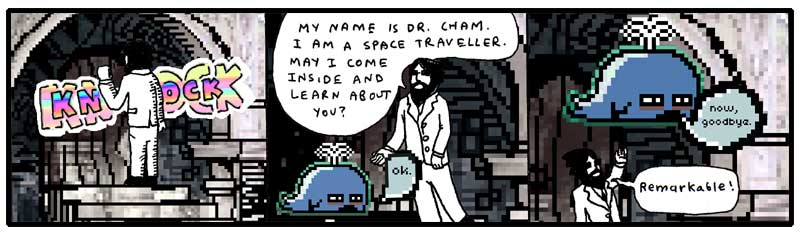

He watched the baby whale rise like a determined balloon. He marveled at his
first alien introduction and felt some concern that it had passed so quickly.
Well, he would wait inside.

As he stepped through the castle door, he felt fortunate that the door hadn’t
been answered by a huge eagle with greedy talons, eager to play. Or a giant
mouse head. Or even a man-sized hurricane. Just a tubby little choo-choo whale.

“Not a place to sit down in this castle,” he said.

At first, he had thought he had just entered a very dim hallway, but as his eyes
adjusted, he saw the entrance extended into a tunnel. The castle door had opened
right into a passage made of long, flat slabs of rock. Some parts were congruous
and resembled a corridor. Other parts narrowed, and even tilted, then finally
tipped away out of view.

The passage was lit by small doorless refrigerators, big enough to hold an
armful of cabbage, down by his feet. He peered inside one, which was hollow,
illuminated along all sides, and turning out ice shards methodically.

He pawed the ice chips, which clung dryly to his fingertips, and he scrubbed his
hands in the ice. Which left some muddy streaks on his hands, but satisfied a
small part of his longing to bathe. How long had it been? Ten years? Thirty?

Along the passage, long tubes of cloth cluttered some sections. Later, bright
pixel matter in porcelain scoops and buckets.

He happened upon a room which had been burrowed out of the tunnel which had a
few empty turtle shells on the ground and a large illuminated wall. He stared
into the room, bewildered. What could this be? In one state of mind, he thought
of having a seat on a shell. This could be the entrance at last, some kind of
receiving room. On the other hand, spiders could pour out of the shell’s hollow
when he sat. He moved on.

### Meal in a Castle’s Pocket

As he journeyed along the passageways (for the central tunnel forked and joined
larger, vacuous caverns), he picked up themes in some locations. Groups of rooms
infested with pumping machinery. Cloth and vats of glue dominated another area.
He followed voices down a plush, pillowed cavity, which led him to a dead end: a
curved wall with a small room carved at eye-level.

He approached the wall and, right in the cubby hole, were two aardvarks eating
at a table.

They gazed at him serenely, both munching on some excavated beetle twice their
size, cracked open and frozen on its back on the table.

“Hello, little puppets,” he said, and they finished their bites and kept looking
with their forks held aloof.

“I wish my niece Hannah were here to meet you,” he told the attentive miniature
aardvarks. “She’d think you were an intricate puppet show.” He peered in at the
dining area, shelves with sets of plates, hand towels. Half of a tiny rabbit was
jutting out from the top a machine, creamy red noodles were spilling out
underneath it. A door at the back of the room hung ajar. Dr. Cham could see a
flickering room with chairs and whirring motors through the door.

“Any child would want this dollhouse,” he said. “Hannah, my niece, as I
mentioned, she has a wind-up doll that sits at a spindle and spins yarn. It’s an
illusion, of course. The doll produces no yarn at all.”

One of the aardvarks opened a trapdoor in the floor and pressed a button down
inside, which lit. Then, a small film projector slowly came up on a rod. The
other aardvark sat and watched Dr. Cham.

“But Hannah still reaches down into the dollhouse and collects all the imaginary
yarn into a bundle. Which she takes to her mother, my sister, who is very good
at humoring Hannah. She sews a dress to the doll’s dimensions, which Hannah
takes back to the doll.

“And she tells the doll, ‘Here, look, your hard work and perseverance has
resulted in this beautiful dress. You can now accept the Chief of Police’s
invitation to join him tonight at the Governor’s Mansion.’ And she has a doll in
a policeman’s uniform who plays the part of the Chief. He’s too scrawny to be an
actual Chief, that would require quite a bit of plastic.”

The aardvark responsible for the film projector loaded a reel and aimed the
projector at the back wall. The film spun to life and the aardvark took a seat.
A green square appeared on the wall. The attentive aardvark stared at Dr. Cham
still.

“Your films are colored,” said Dr. Cham. “What a lovely, little life.”

The film played on: a blue square. Then, a red circle. Then, an orange square.
The attentive aardvark turned away, watched the screen change to a pink
triangle, and both aardvarks resumed eating.

A purple star. A red square. With quietness settling, Dr. Cham could hear notes
droning from the projector. Like a slow, plodding music box trying to roll its
gears along the train tracks.

“Yes, enjoy your supper,” said Dr. Cham and he politely tipped his head away,
marching back up the path he’d taken.

### Another Dead End Where Things Began

He found himself lost in the castle’s tunnels. Nothing looked familiar. He
wasn’t worried much, though. He was on another planet. He would be lost
regardless.

He wound through the tunnels, attempting to recall his paths, but far too
interested in exploring to keep track of his steps. He followed a single tunnel
deep, down, down, which slanted so steeply that he had to leap across ledges and
carefully watch his footholds. The gravity here seemed no different than Earth.
His legs were pulled into slides just as easily.

Although he had no absolute way of knowing where he was, he felt certain that he
had left the castle’s boundaries. This deep, this long of a walk. It had been an
hour since he’d entered through the door. And, as the tunnel wound back up, he
was sure that he would emerge into a new dwelling, perhaps even a manhole which
he could peek out from and see the castle. Perhaps he shouldn’t have come so far
down this route. He hoped nothing was hibernating down here.

The tunnel came to a stop. A dark, dead end.

He had time. So he read the book. He read of the foxes and their pursuit of the
porcupine who stole their pickup truck. He read of the elf and the ham. He saw
the pictographs of himself and found he could really relate to his own
struggles. He even learned Ruby. He saw how it all ended.

Were I him, I couldn’t have stomached it. But he did. And he pledged in his
bosom to see things out just as they happened.

On the computer monitor, Dr. Cham saw the flashing `irb` prompt. Like Dr. Cham,
you might recognize the `irb` prompt from [The Tiger’s Vest][1] (the first
expansion pak to this book, which includes a basic introduction to Interactive
Ruby.)

Whereas he had just been exploring tunnels by foot, he now explored the
machine’s setup with the prompt. He set the book back where he had found it. He
didn’t need it anymore. This was all going to happen whether he used it or not.

He started with:

    irb> Object::constants
      => ["Marshal", "String", "Dir", "LoadError", "Float", ... and so on ]

This command lists all the top-level constants. Classes are also listed as
constants, so this list can be great to see what’s loaded into Ruby at any time.

He scanned the list for anything unfamiliar. Any classes which didn’t come with
Ruby. `Marshal`, `String`, `Dir`, `LoadError`, `Float`. Each of those came with
Ruby.

But further down the list:

    ... "Struct", "Values", "Time", "Elevator", "Range" ...

_Elevator?_ Exactly the kind of class to poke around with. He had a go.

    irb> Elevator::methods
      => ["method", "freeze", "allocate", ... another long list ... ]
    irb> Elevator::class_variables
      => ['@@diagnostic_report', '@@power_circuit_active', '@@maintenance_password']
    irb> Elevator::constants
      => []

Looks like the `Elevator` class had plenty of methods. Most of these looked like
they were the same methods every object has in Ruby. For example, `method`,
`freeze` and `allocate` come with every class in Ruby. (`Elevator::freeze` would
keep the `Elevator` class from being changed. `Elevator::allocate` would make a
new `Elevator` object without calling the `initialize` method.)

The `class_variables` were interesting to Dr. Cham. This elevator appeared
genuine. But no available `constants`. This tells us there are no classes nested
inside the `Elevator` class.

He tried to create an `Elevator` object.

    irb> e = Elevator::new
    ArgumentError: wrong number of arguments (0 for 1), requires a password
            from (irb):2:in `initialize'
            from (irb):2:in `new'
            from (irb):2
            from :0

He tried a few passwords.

    irb> e = Elevator::new( "going up" )
    AccessDeniedError: bad password
    irb> e = Elevator::new( "going_up" )
    AccessDeniedError: bad password
    irb> e = Elevator::new( "stairs_are_bad" )
    AccessDeniedError: bad password
    irb> e = Elevator::new( "StairsAreBad" )
    AccessDeniedError: bad password

That was useless. _Oh, wait!_ The maintenance password. Listed in the `class_variables`.

    irb> Elevator::maintenance_password
    NoMethodError: undefined method `maintenance_password' for Elevator:Class
            from (irb):1
            from :0

Hmm. Instance variables are only available inside an object. And class variables
are only available inside a class. How to get at that password?

    irb> class Elevator
    irb>   def Elevator.maintenance_password
    irb>     @@maintenance_password
    irb>   end
    irb> end
      => nil
    irb> Elevator::maintenance_password
      => "stairs_are_history!"

Alright! He got the password. Did you see that?

He added a class method to the `Elevator` class. Isn’t that great how you can
start a new class definition for `Elevator` and Ruby just adds your changes to
the existing class definition?

Class methods are usually called with the **double colon**. But, a period is
fine as well. Since `Elevator` is a class itself, Ruby will figure that if you
call `Elevator.maintenance_password`, you’re calling a class method. The double
colon simply helps make class methods obvious to the reader.

And justly so. Class methods are a bit unusual. Normally you won’t want to store
information directly inside of a class. However, if you have a bit of
information that you need to share among all objects of a class, then you have a
good reason to use the class for storage. It’s understandable that the
`@@maintenance_password` would be stored in the class, instead of in each
separate object. This way, the objects can simply reach up into the class and
see the shared password.

Here’s probably how the password protection works.


class Elevator
  def initialize( pass )
    raise AccessDeniedError, "bad password" \
      unless pass.equals? @@maintenance_password
  end
end


Passwording a class like this is pointless, since anything in Ruby can be
altered and overwritten and remolded. Dr. Cham had the password and ownership of
the elevator is his.

    irb> e = Elevator.new( "stairs_are_history!" )
    #<Elevator:0x81f12f4 @level=4>
    irb> e.level = 1

Dr. Cham was standing right there when the elevator doors, off behind the
computer terminal, opened for him. With an exasperated sense of accomplishment
and a good deal of excitement surrounding all of the events that lie ahead, he
stepped into the elevator and pressed 4.

<aside class="sidebar" markdown="1">
## An Evening of Unobstructed Voltage

I dug up this article from _The Consistent Reminder_, a Connecticut newspaper
which ran the four star review of Dr. Cham. Midgie Dare, the book reviewer who
suddenly opened her critical eye to anything tangible, praised the Doctor for
his manners and innovations in the very same daily edition that she defamed
cantaloupe and docked Manitoba for having crackly telephone service.

I got a kick out of the end of her article. Here you go.

> He dismounted his horse with unquestionable care for anyone who might be in
> the vicinity. Attentive of all sides, he lowered himself from the saddle
> gently, slowing to a pace which must be measured in micrometers per second to
> be appreciated.
>
> Those of us in his company found ourselves with maws agape, watching his boot
> touch down upon the ground. So precise and clean a step that it seemed it
> would never meet the earth, only hover slight above it. Then, before the
> landing had actually registered with any of us, we were off to the cuisine,
> whisked away in the shroud of gaiety that was always right in front of Harold
> Cham, always just behind him, and most especially concentrate directly in his
> own luminary self.
>
> He also carried loosely at his side a capitally ignorant statesman’s daughter,
> who spared us no leave from her constant criticisms of atheists and railway
> routes.
>
> “At home, my efforts to light a candle were trounced upon by further train
> rumblings, which thrusted the match in my hand nearer the curtains!” She
> derided Dr. Cham for his waning grip on her forearm and became jealous when he
> was able to tune into a pleasurable woman’s voice on the radio once we
> returned to the residence.
>
> The dusk did settle, however, and we found ourselves in a communal daze
> beneath the thick particles of cotton drift that wafted through the polished
> piano room, quite entertained by the _Afternoon Nap Program_, which played
> their phonograph so quietly at the station that we could only hear the
> scratching of dead Napoleon’s sleeves across the bedsheets. I felt a great
> shriek inside me at the thought! Still, on yonder chairs, the two lovers kept
> an abrupt distance between themselves and I felt encompassed by Dr. Cham’s
> warm gaze and his playful tip of the sherry glass.
</aside>

## 3. The Continued Story of My Daughter's Organ Instructor

I know you may be alarmed to hear that I have a daughter. You think my writing
is indicative of a palsied or infantile mind. Well, please rest. I don’t have a
daughter. But I can’t let that stop me from sorting out her musical training.

As I was related these elaborate histories of the planet Endertromb, I found
myself wandering through hallways, running my fingertips along the tightly
buttoned sofas and soaking myself in the saturated bellowings of the pipes, as
played by my daughter’s organ instructor. His notes resounded so deep and hollow
in the walls of his manor that I began to casually mistake them for an ominous
silence, and found it even easier to retreat into deep space with my thoughts.
To think upon the ancient planet and its darker philosophies: its flesh temples,
tanned from the dermal remains of its martyrs; its whale cartels, ingesting
their enemies and holding them within for decades, dragging them up and down the
staircases of ribs; its poison fogs and its painful doorways; and, the atrocious
dynasties of The Originals, the species which claims fathership to all of the
intelligent beings across the universe.

But, eventually, I’d hear those pipes of a higher octave sing and I’d be back in
the very same breezy afternoon where I’d left.

How interesting that even the breeze of our planet is quite a strange thing to
some outsiders. For he had also told me of the travelers from Rath-d, who
ventured to Earth five centuries ago, but quickly dissipated in our air currents
since they and their crafts and their armor were all composed of charcoal.

I had sat at the organ, listening to his faint tales of his colony, while he
punctuated his symphonies to greater volumes and the story would disappear for
awhile, until the coda came back around. He spoke of he and his brothers piling
into the hollow of his mother’s tail and tearing the waxy crescent tissue from
the inner wall. Juicy and spongy and syrupy soap which bleached their mouths and
purged their esophagus as it went down. They chewed and chomped the stuff and it
foamed. After they ate, they blew bubbles at each other, each bubble filled with
a dense foam, which they slept upon. And early in the morning, when mother
opened her tail again, she watched serenely as her babies lay cradled in the
stew of dark meatballs and sweet, sticky froth.

He spelled out all the tastes of Endertromb. Of their salmon’s starchy organs,
which cooked into a pasta, and its eyes which melted into rich cream. Of their
buttermelon with tentacles. And he was just beginning to appreciate the
delicacies as a child, only to be lifted from a schoolyard by a pair of upright
pygmy elephants who reached at him, through the heavens, and snatched upon his
collar with a vast length of crane.

They transplanted him on Earth, led him from their craft, trumpeting their
snouts loudly for the city of Grand Rapids to hear, then left, weeping and
embracing each other.

“But, strangely (em-pithy-dah), I learned upon, played upon (pon-shoo) the
organs on my home (oth-rea) planet,” he said.

My daughter’s organ instructor speaks these extra words you see in parentheses.
Who knows if they are from his native tongue or if they are his own soundful
hiccups. He keeps another relic from Endertromb as well: he has twelve names.

“No, (wen-is-wen),” he said. “I have one name (im-apalla) which is said (iff)
many-many different ways.”

I call him Paij-ree in the morning and Paij-plo in the later evening. Since it
is day as I write, I will call him Paij-ree here.

### Mumble-Free Earplugs

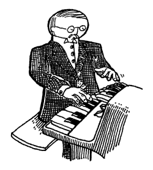

So I told Paij-ree, “Paij-ree, I am writing a book. To teach the world Ruby.”

“Oh, (pill-nog-pill-yacht) nice,” he said. He’s known Ruby longer than I have,
but still: _I_ will be my daughter’s Ruby instructor.

And I said, “Paij-ree, you are in the book. And the stories of your planet.” I
talk to him like he’s E.T. I don’t know why. Just like how I said next, “And
then maybe someday you can go home to your mom and dad!”

To which he said, “(pon-shoo) (pon-shoo) (em-pithy-dah).” Which is his way of
speaking out loud his silence and awe.

He wanted to see what I’d written, so I showed him this short method I’ve
written for you.


def wipe_mutterings_from( sentence )
  while sentence.include? '('
    open = sentence.index( '(' )
    close = sentence.index( ')', open )
    sentence[open..close] = '' if close
  end
end


“Can you see what this does, Paij-ree? Any old Smotchkkiss can use this method
to take all the incoherent babblings out of your speaking,” I said.

And I fed something he said earlier into the method.


what_he_said = "But, strangely (em-pithy-dah),
  I learned upon, played upon (pon-shoo) the
  organs on my home (oth-rea) planet."
wipe_mutterings_from( what_he_said )
print what_he_said


And it came out as a rather plain sentence.

    But, strangely ,
    I learned upon, played upon the
    organs on my home planet.

“You shouldn’t use that (wary-to) while loop,” he said. “There are lovelier,
(thopt-er), gentler ways.”

In the `wipe_mutterings_from` method, I’m basically searching for opening
parentheses. When I find one, I scan for a closing paren which follows it. Once
I’ve found both, I replace them and their contents with an empty string. The
`while` loop continues until all parentheses are gone. The mutterings are
removed and the method ends.

“Now that I look at this method,” I said. “I see that there are some confusing
aspects and some ways I could do this better.” Please don’t look down on me as
your teacher for writing some of this code. I figure that it’s okay to show you
some sloppy techniques to help you work through them with me. So let’s.

Okay, **Confusing Aspect No. 1**: This method cleans a string. But what if we
accidentally give it a `File`? Or a number? What happens? What if we run
`wipe_mutterings_from( 1 )`?

If we give `wipe_mutterings_from` the number 1, Ruby will print the following
and exit.

    NoMethodError: undefined method `include?' for 1:Fixnum
            from (irb):2:in `wipe_mutterings_from'
            from (irb):8

What you see here is a rather twisted and verbose (but at times very helpful)
little fellow called the **backtrace**. He’s a wound-up policeman who, at the
slightest sign of trouble, immediately apprehends any and all suspects, pinning
them against the wall and spelling out their rights so quickly that none can
quite hear it all. But it’s plain that there’s a problem. And, of course, it’s
all a big misunderstanding, right?

When Ruby reads you these Miranda rights, listen hardest to the beginning. The
first line is often all you need. In this first line is contained the essential
message. And in the above, the first line is telling us that there is no
`include?` method for the number 1. Remember, when we were talking about the
`reverse` method in the last chapter? Back then, I said, “**a lot of methods are
only available with certain types of values**.” Both `reverse` and `include?`
are methods which work with strings but are meaningless and unavailable for
numbers.

To be clear: the method tries to use to the number. The method will start with
`sentence` set to 1. Then, it hits the second line: `while sentence.include?
'('`. Numbers have no `include?` method. Great, the backtrace has shown us where
the problem is. I didn’t expect anyone to pass in a number, so I’m using methods
that don’t work with numbers.

**See, this is just it.** Our method is its own little pocket tool, right? It
acts as its own widget independent of anything else. To anyone out there using
the `wipe_mutterings_from` method, should they pass in a number, they’ll be
tossed this panic message that doesn’t make sense to them. They’ll be asked to
poke around inside the method, which really isn’t their business. They don’t
know their way around in there.

Fortunately, we can throw our own errors, our own **exceptions**, which may make
more sense to someone who inadvertently hands the wrong object in for cleaning.


def wipe_mutterings_from( sentence )
  unless sentence.respond_to? :include?
    raise ArgumentError,
      "cannot wipe mutterings from a #{ sentence.class }"
  end
  while sentence.include? '('
    open = sentence.index( '(' )
    close = sentence.index( ')', open )
    sentence[open..close] = '' if close
  end
end


This time, if we pass in a number (again, the number 1), we’ll get something
more sensible.

    ArgumentError: cannot wipe mutterings from a Fixnum
            from (irb):3:in `wipe_mutterings_from'
            from (irb):12

The `respond_to?` method is really nice and I plead that you never forget it’s
there. The `respond_to?` checks any object to be sure that it has a certain
method. It then gives back a `true` or `false`. In the above case, the incoming
`sentence` object is checked for an `include?` method. If no `include?` method
is found, then we raise the error.

You might be wondering why I used a symbol with `respond_to?`. I used a symbol
`:include?` instead of a string `'include?'`. Actually, either will work with
`respond_to?`.

Usually symbols are used when you are passing around the name of a method or any
other Ruby construct. It’s more efficient, but it also catches the eye. The
`respond_to?` asks Ruby to look inside itself and see if a method is available.
We’re talking to Ruby, so the symbol helps denote that. It’s not a big deal,
Ruby just recognizes symbols quicker than strings.

Now, **Confusing Aspect No. 2**: Have you noticed how our method changes the
sentence?


something_said = "A (gith) spaceship."
wipe_mutterings_from( something_said )
print something_said


Did you notice this? In the first line of the above code, the `something_said`
variable contains the string `"A (gith) spaceship."`. But, after the method
invocation, on the third line, we print the `something_said` variable and by
then it contains the cleaned string `"A  spaceship."`.

How does this work? How does the method change the string? Shouldn’t it make a
copy of the string before changing it?

Yes, absolutely, it should! **It’s bad manners to change strings like that.**
We’ve used `gsub` and `gsub!` in the last chapter. Do you remember which of
those two methods is a **destructive method**, which changes strings directly?

Either we need to call this method `wipe_mutterings_from!` (as a courtesy to all
the other good folks out there that might use this method) or change the method
to work on a copy of the string rather than the real thing. Which is an easy
change! We just need to `dup` the string.


def wipe_mutterings_from( sentence )
  unless sentence.respond_to? :include?
    raise ArgumentError,
      "cannot wipe mutterings from a #{ sentence.class }"
  end
  sentence = sentence.dup
  while sentence.include? '('
    open = sentence.index( '(' )
    close = sentence.index( ')', open )
    sentence[open..close] = '' if close
  end
  sentence
end


The `dup` method makes a copy of any object. Look at that line we added again on
its own:


sentence = sentence.dup


What a peculiar line of code. How does `sentence` become a copy of `sentence`?
Does it erase itself? What happens to the original `sentence`? Does it
disappear?

Remember that variables are just nicknames. When you see `sentence = "A (gith)
spaceship."`, you see Ruby creating a string and then giving that string a
nickname.

Likewise, when you see `sentence = sentence.dup`, you see Ruby creating a new
string and then giving that string a nickname. This is handy inside your method
because now `sentence` is a nickname for a new copy of the string that you can
safely use **without changing the string that was passed into the method**.

You’ll see plenty of examples of variable names being reused.


x = 5
x = x + 1
# x now equals 6

y = "Endertromb"
y = y.length
# y now equals 10

z = :include?
z = "a string".respond_to? z
# z now equals true


And, yes, sometimes objects disappear. **If you can’t get to an object through a
variable, then Ruby will figure you are done with it and will get rid of it.**
Periodically, Ruby sends out its **garbage collector** to set these objects
free. Every object is kept in your computer’s memory until the garbage collector
gets rid of it.

<aside class="sidebar" markdown="1">
## An Excerpt from The Scarf Eaters

(_from Chapter VII: When Push Comes to Shove—or
Love_.)

“Never say my name again!” screamed Chester, and with the same gusto, he turned
back to the **File > Publish Settings…** dialog to further optimize his movie
down to a measly 15k.
</aside>

Oh, and one more thing about `dup`. Some things can’t be dup’d. Numbers, for
instance. Symbols (which look like `:death`) are identical when spelled the
same. Like numbers.

Also, some of the special variables: `nil`, `true`, `false`. These are things
that Ruby won’t let you alter, so there’s so point making a copy anyway. I mean,
imagine if you could change `false` to be `true`. The whole thing becomes a lie.

Perhaps **Confusing Aspect No. 3** is a simple one. I’m using those square
brackets on the string. I’m treating the string like it’s an Array or Hash. I
can do that. Because strings have a `[]` method.

When used on a string, the square brackets will extract part of the string.
Again, slots for a forklift’s prongs. The string is a long shelf and the
forklift is pulling out a slab of the string.

Inside the brackets, we pass the _index_. It’s the label we’ve placed right
between the prongs where the worker can see it. When it comes to strings, we can
use a variety of objects as our index.


str = "A string is a long shelf of letters and spaces."
puts str[0]       # prints 'A'
puts str[0..-1]   # prints 'A string is a long shelf of letters and spaces.'
puts str[1..-2]   # prints ' string is a long shelf of letters and spaces'
puts str[0, 3]    # prints 'A s'
puts str['shelf'] # prints 'shelf'


Alright, the last **Confusing Aspect No. 4**: this method can be sent into an
endless loop. You can give this method a string which will cause the method to
hang and never come back. Take a look at the method. Can you throw in a muddy
stick to clog the loop?


def wipe_mutterings_from( sentence )
  unless sentence.respond_to? :include?
    raise ArgumentError,
      "cannot wipe mutterings from a #{ sentence.class }"
  end
  sentence = sentence.dup
  while sentence.include? '('
    open = sentence.index( '(' )
    close = sentence.index( ')', open )
    sentence[open..close] = '' if close
  end
  sentence
end


Here, give the muddy stick a curve before you jam it.


muddy_stick = "Here's a ( curve."
wipe_mutterings_from( muddy_stick )


Why does the method hang? Well, the `while` loop waits until all the open
parentheses are gone before it stops looping. And it only replaces open
parentheses that have a matching closing parentheses. So, if no closing paren is
found, the open paren won’t be replaced and the `while` will never be satisfied.

How would you rewrite this method? Me, I know my way around Ruby, so I’d use a
regular expression.


def wipe_mutterings_from( sentence )
  unless sentence.respond_to? :gsub
    raise ArgumentError,
      "cannot wipe mutterings from a #{ sentence.class }"
  end
  sentence.gsub( /\([-\w]+\)/, '' )
end


Do your best to think through your loops. It’s especially easy for `while` and
`until` loops to get out of hand. Best to use an iterator. And we’ll get to
regular expressions in time.

In summary, here’s what we’ve learned about writing methods:

1. Don’t be surprised if people pass unexpected objects into your methods. If
   you absolutely can’t use what they give you, `raise` an error.
2. It’s poor etiquette to change objects your method is given. Use `dup` to make
   a copy. Or find a method like `gsub` that automatically makes a copy as it
   does its job.
3. The square brackets can be used to lookup parts inside any `Array`, `Hash` or
   `String` objects, as these objects provide a `[]` method. Also, since these
   objects provide a `[]=` method, the square brackets can be used in assignment
   (on the left-hand side of the equals sign) to change the parts of those objects.
4. Watch for runaway loops. Avoid `while` and `until` if you can.

### The Mechanisms of Name-Calling

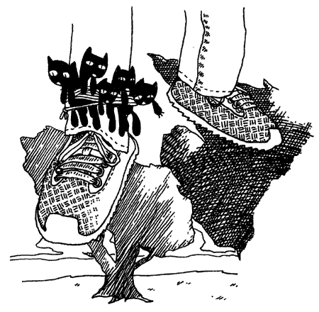

Forthwith there is a rustling in the trees behind Paij-ree’s house and it turns
out to be a man falling from the sky. His name is Doug and he sells cats.

So, just as he comes into to view, when his shadow (and the shadows of the cats
tied to his foot) obscures the bird on the lawn that we’re trying to hit with a
racquetball, as he’s squeezing a wisp of helium from his big balloon, we shout,
“Hello, Doug!”

And he says, “Hello, Gonk-ree! Hello, Why!”

Paij-ree checks his pockets to be sure he has the dollar-twenty-seven he’ll need
in order to buy the three cats he’ll need to keep the furnace stoked and the
satellite dish turning. These cats generate gobs of static once Paij-ree tosses
them in the generator, where they’ll be outnumbered by the giant glass rods,
which caress the cats continually—But, wait! Did you see how the cat broker
called him Gonk-ree?

And he calls him Gonk-ree in the morning and Gonk-plo at night.

So the suffix is definitely subject to the sunlight. As far as I can tell, the
prefix indicates the namecaller’s relationship to Paij-ree.


class String

  # The parts of my daughter's organ
  # instructor's name.
  @@syllables = [
    { 'Paij' => 'Personal',
      'Gonk' => 'Business',
      'Blon' => 'Slave',
      'Stro' => 'Master',
      'Wert' => 'Father',
      'Onnn' => 'Mother' },
    { 'ree'  => 'AM',
      'plo'  => 'PM' }
  ]

  # A method to determine what a
  # certain name of his means.
  def name_significance
    parts = self.split( '-' )
    syllables = @@syllables.dup
    signif = parts.collect do |p|
      syllables.shift[p]
    end
    signif.join( ' ' )
  end

end


Now I’ve gone beyond just showing you sloppy code. Here be a grave debauchery
and a crime against nature. A crime most languages won’t allow you to commit.
We’re changing the `String`, **one of the core classes of Ruby**!

“I know this is a bit dangerous,” I said, when I passed this one under
Paij-ree’s nose. “I hope nobody gets hurt.”

“Every Smotchkkiss must taste what this (kep-yo-iko) danger does,” he said.
“Dogs and logs and swampy bogs (kul-ip), all must be tasted.” And he took a swig
of his Beagle Berry marsh drink.

So what is it that I’m adding to the `String` class? Two things: a class
variable and a method. A normal **instance method**.

I like to look at the **at** symbol as a character meaning **attribute**. The
**double at** stands for **attribute all**. A class variable. All instances of a
class can look at this variable and it is the same for all of them. The
`@@syllables` variable is an Array that can now be used inside the String class.

The new method is `name_significance` and this new method can be used with any
string.


print "Paij-ree".name_significance
#=> Personal AM


As you can see, Paij-ree is a personal name. A name friends use in the early
hours.

Make sure you see the line of code which uses `self`. This is a special
variable, a variable which represents the object whose method you are calling.
To simplify things a bit, let’s try making a method which breaks up a string on
its dashes.


class String
  def dash_split
    self.split( '-' )
  end
end


Again, here’s a method which can be used with any string.


"Gonk-plo".dash_split
#=> ['Gonk', 'plo']


Using `self` marks the beginning of crossing over into many of the more advanced
ideas in Ruby. This is definition language. You’re defining a method, designing
it before it gets used. You’re preparing for the existence of an object which
uses that method. You’re saying, “When `dash_split` gets used, there will be a
string at that time which is the one we’re dash-splitting. And `self` is a
special variable which refers to that string.”

Ruby is a knockout definition language. A succulent and brain-splitting
discussion is coming your way deeper in this book.

Most often you won’t need to use `self` explicitly, since you can call methods
directly from inside other method definitions.


class String
  def dash_split; split( '-' ); end
end


In the `name_significance` method, find the loop. Learning about `Array#collect`
is essential. Let’s look close.


signif = parts.collect do |p|
  syllables.shift[p]
end


The `parts` Array contains the separated name. `['Paij', 'plo']`, for instance.
We’re iterating through each item in that Array with `collect`. But `collect`
steps beyond what `each` does. Like `each`, collect slides each item down the
chute as a block variable. And then, at the end of the block, `collect` **keeps
the answer the block gives back and adds it to a new Array**. The `collect`
method is the perfect way of building a new Array which is based on the items in
an existing Array.

Doug has three cats for sale. One is twelve cents, one is sixty-three cents, one
is nine cents. Let’s see how much each cat would cost if we added a 20% tip.


catsandtips = [0.12, 0.63, 0.09].collect { |catcost| catcost + ( catcost * 0.20 ) }


I say Paij-ree’s property is a very charming section of woods when it’s not
raining cats and Doug. For many days, Paij-ree and I camped in tents by the
river behind his house, subsisting on smoked blackbird and whittling little
sleeping Indians by the dusklight. On occasion he would lose a game of spades
and I knew his mind was distracted, thinking of Endertromb. All of this must
have been stirring inside of him for sometime. I was the first ear he’d ever
had.

“I just came from Ambrose,” I said. “Sort of my own underground home, a place
where elves strive to perfect animals.”

He mumbled and nodded. “You can’t be (poth-in-oin) part of (in) such things.”

“You think we will fail?”

“I (preep) have been there before,” he said. And then, he spoke of the
Lotteries.

## 4. The Goat Wants to Watch a Whole Film

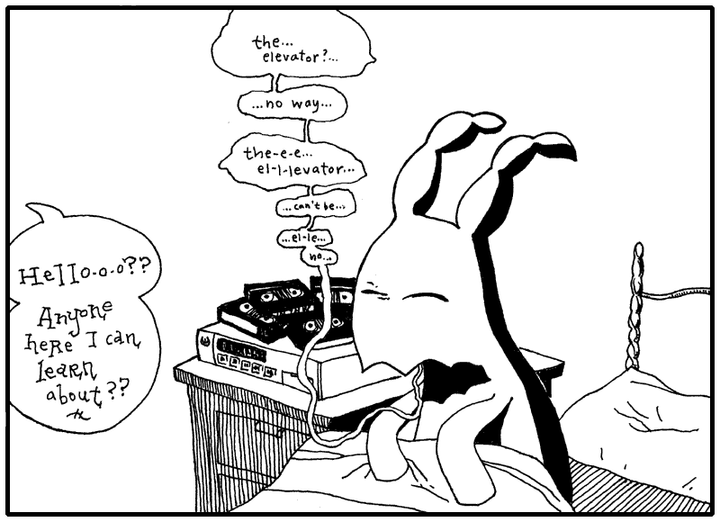

The elevator had opened into a green room full of shelves and file cabinets.
Reels of tape and film canisters and video tape everywhere. Dr. Cham hadn’t a
clue what most of it was. All he saw was a big, futuristic mess.

He called out again, stumbling through alleys of narrow shelves, “Hello-o-o??
I’m looking for intelligent life! I’m a space traveler!” He tripped when his
foot slid right into a VCR slot. “Any other beings I
can communicate with?”

Hand cupped around mouth, he yelled, “Hello-o-o?”

“Crying out loud.” The sleepy goat came tromping down the aisle.

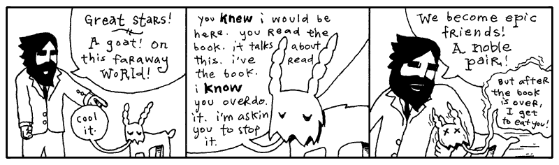

“I hate that book,” said the goat. “I believe the author is disingenuous.”

“Really?” asked Dr. Cham.

“I’m sure it’s all true. It’s just so heavily embellished. I’m like: Enough
already. I get it. Cut it out.”

“I’m not quite sure what to make of it,” said the Doctor. “It seems like an
honest effort. I actually wrote something in Ruby back there.”

“It doesn’t give goats a very good name,” said the goat.

“But you are the only goat in the book,” said the Doctor.

“And I’m totally misquoted.”

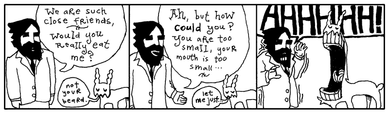

The goat closed his mouth and Dr. Cham held his heart.

“I’m actually very literate,” said the goat. “Albeit, more recently, I’ve
switched to movies. I love foreign films. One of my relatives just brought back
_Ishtar_ from your planet. Wow, that was excellent.”

<aside class="sidebar">
<pre>we want a tambourine!
           /
          |  we want all a tambourine!
          |      /
          \__  |
        /  o o \__/\__/\_
      /.           \ o o \____
       /'      ----/          \
_____ /  '    / /.\\   #------/
       /     /        /     \\
             /       ///
      /so               \
           /\   \me time\\..
       /pp/  \s these pictur\\
      /es/   \don't w\ \ork out\
     ***      *** right but i
       think this time
          they did
            ooo o
             oo
            o
         o
      {o}
   ^
</pre>
</aside>

“I haven’t been to my planet in a long time. It would be difficult to consider
it my home at this stage.”

“Well, Warren Beatty is delightful. His character is basically socially
crippled. He actually tries to kill himself, but Dustin Hoffman sits in the
window sill and starts crying and singing this totally hilarious heartbreak
song. I’ve got it here, you should see it.”

“Can I get something to eat?” asked the Doctor. And he still felt filthy.

“How about we watch a film and you can have a buttermelon with tentacles?” said
the goat.

So, they worked their way back toward the goat’s projector. Back by the freezer
locker, they sat on a giant rug and broke off the appendages of frozen
buttermelons. The shell was solid, but once it cracked, rich fruit cream was in
abundance. Sweet to taste and a very pleasant scent.

“First film, you’ve got to see,” said the goat. “Locally filmed and produced.
I’m good friends with the lady who did casting. Dated her for awhile. Knew
everyone who was going to play the different roles long before it was
announced.”

The goat set the projector by Dr. Cham. “I’ve got the music on the surround
sound. You can man the knob.”

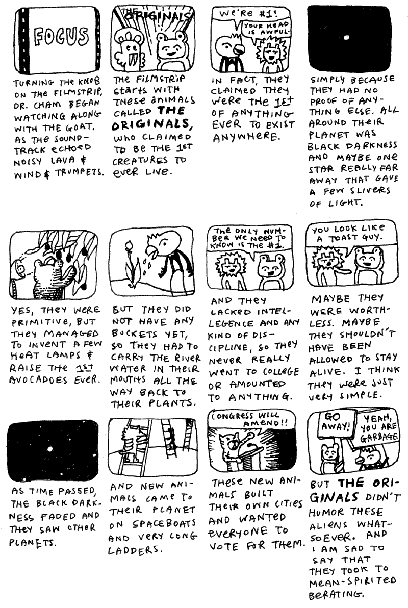

Dr. Cham’s mind wandered at this point in the presentation, just as the land war
mounted between the two throngs of animal settlers. The details of their wars
and campaigns continued to consume the spool of transparent film that Dr. Cham
was feeding through the projector.

War after war after war. The Sieging of Elmer Lake. The Last Stand of Newton P.
Giraffe and Sons. Dog Invasion of Little Abandoned Cloud. No animals died in
these wars. Most often an attack consisted of bopping another animal on the
head. And they philipped each other’s noses. But, believe me, it was
humiliating.

Blasted crying shame. Things could have worked out.

### The Birth of an Object

“Don’t worry,” said the goat, anxious to sway Dr. Cham’s attention back to the
film. “Things _do_ work out.”

In Ruby, the Object is the very center of all things. It is The Original.


class ToastyBear < Object; end


The angle bracket indicates **inheritance**. This means that the new
`ToastyBear` class is a new class based on the `Object` class. Every method that
`Object` has will be available in `ToastyBear`. Constants available in `Object`
will be available in `ToastyBear`.

But every object inherits from `Object`. The code…


class ToastyBear; end


Is identical to…


class ToastyBear < Object; end


Inheritance is handy. You can create species of objects which relate to each
other. Often, when you’re dissecting a problem, you’ll come across various
objects which share attributes. You can save yourself work by inheriting from
classes which already solve part of that problem.

You may have a `UnitedStatesAddress` class which stores the address, city,
state, and zip code for someone living in the United States. When you start
storing addresses from England, you could add a `UnitedKingdomAddress` class. If
you then ensure that both addresses inherit from a parent `Address` class, you
can design your mailing software to accept any kind of address.


def mail_them_a_kit( address )
  unless address.is_a? Address
    raise ArgumentError, "No Address object found."
  end
  print address.formatted
end


Also, inheritance is great if you want to override certain behaviors in a
class. For example, perhaps you want to make your own slight variation to the
`Array` class. You want to enhance the `join` method. But if you change
`Array#join` directly, you will affect other classes in Ruby that use Arrays.

So you start your own class called `ArrayMine`, which is based on The Original
`Array`.


class ArrayMine < Array
  # Build a string from this array, formatting each entry
  # then joining them together.
  def join( sep = $,, format = "%s" )
    collect do |item|
      sprintf( format, item )
    end.join( sep )
  end
end


`ArrayMine` is now a custom `Array` class with its own `join` method. `Array` is
the **superclass** of `ArrayMine`. Every class has a `superclass` method where
you can verify this relationship.

    irb> ArrayMine.superclass
      => Array

Perfect. We manage a hotel and we have an `Array` of our room sizes: `[3, 4, 6]`. Let’s get it nicely printed for a brochure.


rooms = ArrayMine[3, 4, 6]
print "We have " + rooms.join( ", ", "%d bed" ) + " rooms available."


Which prints, “We have 3 bed, 4 bed, 6 bed rooms available.”

Dr. Cham was looking around for a bathroom, but archival video tape was
everywhere. He eventually found a place, it may have been a bathroom. It had a
metal bin. More importantly, it was dark and out of eyesight.

While he’s in there, let me add that while The Originals slaughtered The
Invaders to prove their rights as First Creatures, the Ruby Object doesn’t have
any such dispute. It is the absolute king Object the First.

Watch.

    irb> Class.superclass
      => Module
    irb> Kernel.class
      => Module
    irb> Module.superclass
      => Object
    irb> Object.superclass
      => nil

Even `Class` is an `Object`! See, although classes are the definition language
for objects, we still call class methods on them and treat them like objects
occasionally. It may seem like a dizzying circle, but it’s truly a very strict
parentage. And it ensures that when you alter the `Object`, you alter
**everything in Ruby**. Which is impossibly scary and all-powerful and
cataclysmic and awesome! **Ruby does not restrict you, my sister, my brother!**

Between `Class` and `Object`, do you see `Module`? If `Object` is the king, the
one who has sired every other part of Ruby, then `Module` is the poor waifish
nun, shielding and protecting all her little Ruby townspeople children. (To
complete the analogy: `Class` is the village school teacher and `Kernel` is the
self-important colonel.)

The whole point of `Module`’s existence is to give food and shelter to code.
Methods can stay dry under `Module`’s shawl. `Module` can hold classes and
constants and variables of any kind.

“But what does a Module _do_?” you ask. “How is it gainfully employed??”

“That’s all it does!!” I retort, stretching out my open palms in the greatest
expression of futility known to man. “Now hear me—for I will never speak it
again—that Module Mother Superior has given these wretched objects a place to
stay!!”


# See, here is the module -- where else could our code possibly stay?
module WatchfulSaintAgnes

  # A CONSTANT is laying here by the doorway.  Fine.
  TOOTHLESS_MAN_WITH_FORK = ['man', 'fork', 'exposed gums']

  # A Class is eating, living well in the kitchen.
  class FatWaxyChild; end

  # A Method is hiding back in the banana closet, God knows why.
  def timid_foxfaced_girl; {'please' => 'i want an acorn please'}; end

end


Now you have to go through Saint Agnes to find them.

    >> WatchfulSaintAgnes::TOOTHLESS_MAN_WITH_FORK
    => ["man", "fork", "exposed gums"]
    >> WatchfulSaintAgnes::FatWaxyChild.new
    => #<WatchfulSaintAgnes::FatWaxyChild:0xb7d2ad78>
    >> WatchfulSaintAgnes::instance_methods
    => ["timid_foxfaced_girl"]

Always remember that a `Module` is only an inn. A roof over their heads. It is
not a self-aware `Class` and, therefore, cannot be brought to life with `new`.

    >> WatchfulSaintAgnes.new
    NoMethodError: undefined method `new' for WatchfulSaintAgnes:Module
            from (irb):2

St. Agnes has given up her whole life in order that she may care for these
desperate bits of code. Please. Don’t take that away from her.

If you wanted to steal from St. Agnes, though, I can help you. You can bring in
a larger abbey to swallow up the ministry of `WatchfulSaintAgnes` and then what
is she left with?

For this you can use `extend`, which will pull all the methods from a module
into a class or an object.

    >> class TheTimeWarnerAolCitibankCaringAndLovingFacility; end
    >> TheTimeWarnerAolCitibankCaringAndLovingFacility.extend WatchfulSaintAgnes
    >> TheTimeWarnerAolCitibankCaringAndLovingFacility::instance_methods
    => ["timid_foxfaced_girl"]

In truth, no one’s _stolen_ from `WatchfulSaintAgnes`, only borrowed. The
`timid_foxfaced_girl` now has two addresses.

You gotta admit. The old abbey can get bought out a zillion times and that
little fox-faced girl will _still_ be back in the banana closet wanting an
acorn! Too bad we can’t feed her. She’s a method with no arguments.

When Dr. Cham came out refreshed, the filmstrip was a bit behind. But the goat
hadn’t noticed, so the Doctor advanced frames until it made some sense.

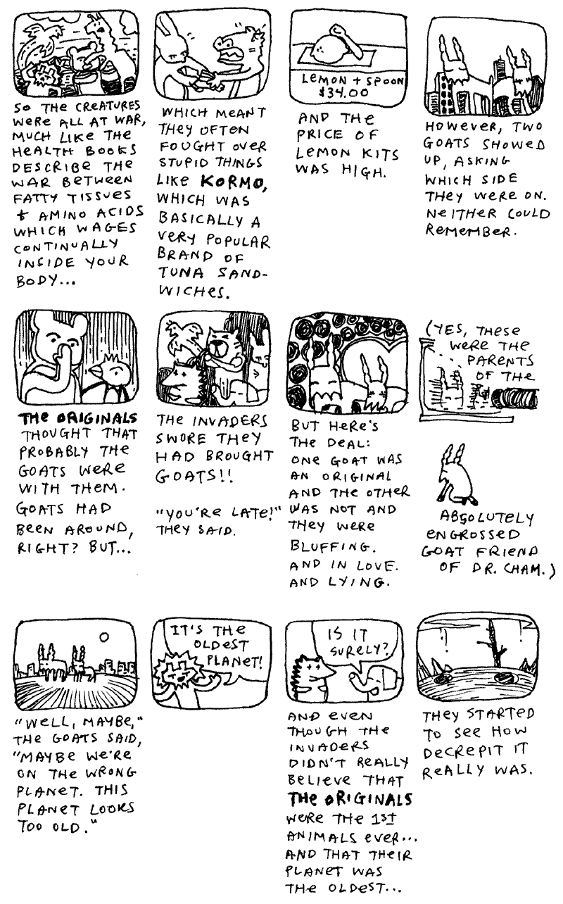

So the invaders left the planet.

“This planet _is_ decrepit,” said Dr. Cham. “The castle is nice. But inside it’s
a disaster.”

“The whole castle look is a projection,” said the goat. “All the flowers and
apple blossoms and the sky even. It’s a low-resolution projection.”

“Yes? It is enchanting.”

“I guess.”

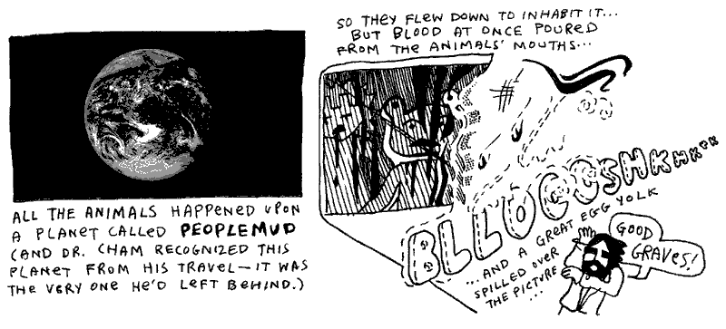

“That’s messed up!” said the goat. “That’s not the way the film ends! There’s no
blood! What happened? What happened? Did you screw up the knob, idiot?”

“Well, I don’t know,” said Dr. Cham. He turned the knob reverse and forward.
Tapped the lens.

“Check the film! Check the film!”

Dr. Cham pulled out a length of film from the projection feed, melted and
dripping from its end.

“Curse that! These projectors are quality! I’ve never had this happen. There’s
no way.”

### Hunting For a Voice

“I don’t think it was the projector,” said Dr. Cham. “Something flew across that
screen and uttered a blistering moan.”

“I don’t have any dupes of that movie,” said the goat somberly. “And that girl.
That casting director. I never see her anymore.”

Dr. Cham stood up and looked over the dumpy aisles of magnetic carnage,
searching.

“Oh, hey, you should call that girl,” the goat went on. “You could talk to her,
get an understanding. Tell her about me. Don’t act like your my friend, just,
you know, ‘Oh, that guy? Yeah, whatta maroon.’”

Dr. Cham spotted the doorway and exited.

The hallways were an entirely new world of mess. In the goat’s archives, the
shelves had been messy. In the hallway, shelves were completely tipped. Sinks
were falling through the ceiling. The Doctor ventured under the debris, kicking
through plywood when necessary.

“You shouldn’t be out here,” said the goat. “You’re on someone else’s property
at this point. A couple of pygmy elephants own all this. They’re nasty guys.
They’ll beat the crap outta you with their trunks. They ball it up and just
whack ya.”

Dr. Cham pushed a file cabinet out of his way, which fell through a flimsy wall,
then through the floor of the next room over. And they heard it fall through
several floors after that.

“I’m trying to remember how it goes in the book,” said Dr. Cham, as he walked
swiftly through the hall. “That milky fog that swept across the projection. We
find that thing.” He jiggled a door handle, broke it off. Forged through the
doorway and disappeared inside.

“You really get a kick out of beating stuff up, don’t you?” said the goat.
“Walls, doors.” The goat headbutted a wall. The wall shuddered and then laid
still.

Then, it was quiet. And black.

The goat stayed put in the bleak hallway, expecting Dr. Cham to flip over a few
desks and emerge, ready to move on from the room he’d busted into. But Dr. Cham
didn’t return, and the goat opted to share a moment with the neglected wreckage
left by his neighbors. Not that he could see at all. He could only hear the
occasional rustling of the piles of invoices and carbon copy masters and manila
envelopes when he shifted his legs.

The ground seemed to buckling right under the goat, as if the heaps of kipple
around him were beginning to slide toward his weight. He would be at the center
of this whirlpool of elephant documentation. Would he die of papercuts first? Or
would he suffocate under the solid burial by office supplies?

A soft light, however, crept up to him. A floating, silver fish. No, it was
a—was it scissors? The scissors grew into a shimmering cluster of intelligent
bread, each slice choking on glitter. But, no, it was hands. And an Easter hat.

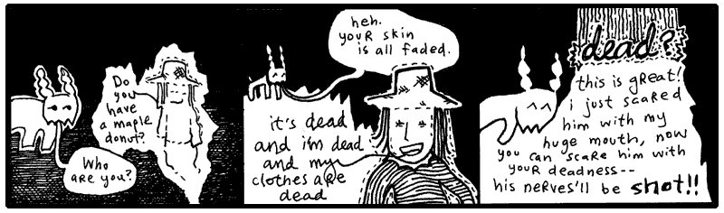

In another room, Dr. Cham stood under the clear glass silently. The ceiling had
abruptly gone transparent, then starlight washed over his pants and jacket. He
walked further to the room’s center in muted colors, lit as softly as an ancient
manuscript in its own box at the museum. More stars, more cotton clusters of
fire, unveiled as he came across the floor. And it peeked into view soon enough,
he expected it to be larger, but it wasn’t.

Earth. Like a painted egg, still fresh. He felt long cello strings sing right up
against his spine. How could that be called Peoplemud? Here was a vibrant and
grassy lightbulb. The one big ball that had something going for it.

He thought of The Rockettes. Actually, he missed The Rockettes. What a bunch of
great dancers. He had yelled something to The Rockettes when he saw them.
Something very observant and flattering.

Oh, yes, while The Rockettes were spinning, arm in arm, he had yelled,
“Concentric circles!” Which no one else cared to observe.

And this thought was enough to feed Dr. Cham’s superiority complex. He wore a
goofy smile as he retraced his footsteps. He truthfully felt his genius coming
through in such a statement. To realize the simplicity of a circle was his. He
reflected on it all the way back to the hallway.

Which I think is great. Adore yourself when you have a second.

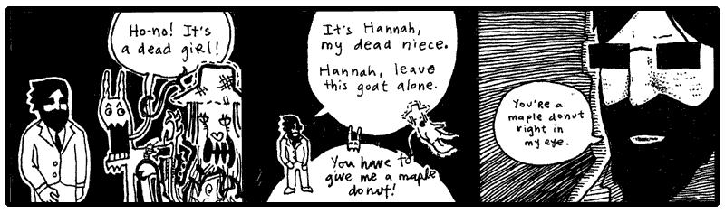

“Oh, right,” said the goat. “Your niece. The niece you killed. I’m with ya now.”

For just a few moments, they all looked at each other. Just enough time for both
Dr. Cham and the goat to think: _Oh, yeah. Hannah causes us a lot of trouble.
She’s already talking about maple donuts._

“Does she start talking about maple donuts right away like that?” asked the
goat.

“Yes, she does,” said the Doctor. “She brings it up to you, then she brings it
up to me. She sees a maple donut somewhere—I don’t quite remember where.”

“Do I see a real maple donut?” Hannah said. “I need a real one.”

“Okay, okay,” said the goat. “Yeah, I remember: here’s where she says that if
she gets a real maple donut, she’ll become a real person again. Because her real
destiny was to own a bakery and you ruined that destiny and now she’s trapped as
a ghost.”

“Hey, that’s the truth!” Hannah yelped.

“It’s terrible that we must bear through this whole scene again,” said the
Doctor. “The donuts are immaterial. They should be left out altogether.”

“Man, I am having a _hard_ time remembering all of this chapter,” said the goat.
“I don’t even remember how to get out of this hallway. I must have read that
book like thirty times. Do we blast through a wall? Do we scream until someone
finds us?”

“We get Hannah to float through walls and she finds some kind of machine,” says
Dr. Cham. “I have to write a program—it all works out somehow.”

“But, you know what I’m saying?” said the goat. “I forget all the details.
Especially the earlier chapters. I mean I can remember the ending perfectly.
It’s hard to sit through all this. The end is so much better.”

Dr. Cham folded his arms and teetered on a heel. “The porcupine.” He smiled
greedily at the goat.

“Oh, totally. The porcupine is definitely who I want to meet,” said the goat. “I
wonder what he does with all that money when the book is over.”

Dr. Cham nodded respectfully. “I’m very excited to see him wearing slippers.”

“Those infernal slippers!” said the goat and he haw-hawed coarsely, a shower of
saliva cascading from his jaws.

Hannah’s mind rattled, waiting for this nonsense to break for a moment. She
tipped her head on its side and the rattle slid along the curve of her cranium.
The little noise died away, though, as the back of her head vanished (_fluxed
out_ is what she called it) and then her head was back again with its little
rattle and she caught herself doing that careless moaning again. **HRRRRRR-RRR-OH-RRRR-RRRR.**

“I’m not as into the chunky bacon stuff,” said the goat. “I don’t see what’s so
great about it.”

Could she speak while moaning? **BON-BON.** With a
French moan. **BOHN-BOHN. BOHN-APPE-TEET-OHHHH-RRRR.**

“I know she’s harmless, but that sound freaks me out. My hair is **completely**
on end.”

“Hannah?” said Dr. Cham. “Where are you, child? Come do a good turn for us, my
niece.”

She was right near them, in and out. And they could hear her cleaning up her
voice, bright, speaking like a angel scattering stardust. Yes, the whole maple
donut story came out again, and more about the bakery she would own, the muffins
and rolls and baguettes.

## 5. The Theft of the Lottery Captain

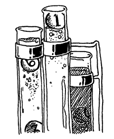

And now, Paij-ree’s stories of the Lotteries.

On Endertromb, the organist’s father invented the lottery. The idea came while
he was praying to Digger Dosh.

Digger Dosh is sort of like their God. But ten times scarier. This guy dug an
infinitely deep tunnel straight through the planet and came out dead. But he’s
really not dead. He’s really just _one second_ behind them. And he eats time.

It’s kind of complicated because Digger Dosh totally kills people. But I guess
if you do what he says, it’s not so bad. Maybe I’ll talk about it later. It’s
such a pain to talk about because it’s so scary and yet one of my friends
actually believes the whole thing. I get kind of choked up—not like I’m crying,
more like I’m choking.

Anyway, once while praying, three numbers came to Paij-ree’s father.

He then asked his mind, “What are these numbers?”

And his mind played a short video clip of him selling all kinds of numbers. And,
for years and years, traveling and selling numbers.

And he asked his brain, “People will buy numbers?”

And his brain said, “If they buy the right three numbers, give them a prize.”

At which he imagined himself launching off a ski jump and showering people with
presents. No question: he would be an icon.

So he went and did as his brain said and sold numbers. The father’s simple
lottery consisted of three unique numbers, drawn from a set of 25 numbers.


class LotteryTicket

  NUMERIC_RANGE = 1..25

  attr_reader :picks, :purchased

  def initialize( *picks )
    if picks.length != 3
      raise ArgumentError, "three numbers must be picked"
    elsif picks.uniq.length != 3
      raise ArgumentError, "the three picks must be different numbers"
    elsif picks.detect { |p| not NUMERIC_RANGE === p }
      raise ArgumentError, "the three picks must be numbers between 1 and 25"
    end
    @picks = picks
    @purchased = Time.now
  end

end


Yes, the `LotteryTicket` class contained the three numbers (`@picks`) and the
time when the ticket was bought (`@purchased`). The allowed range of numbers
(from **one** to **twenty-five**) is kept in the constant `NUMERIC_RANGE`.

The `initialize` method here can have any number of arguments passed in. The
**asterisk** in the `picks` argument means that **any arguments will be passed
in as an Array**. Having the arguments in an Array means that methods like
`uniq` and `detect` can be used on the arguments together.

This class contains two definitions: the method definition (`def`) and an
attributes definition (`attr_reader`). Both are **really just method
definitions** though.

The `attr_reader` shortcut is identical to writing this Ruby code:


class LotteryTicket
  def picks; @picks; end
  def purchased; @purchased; end
end


Attributes are wrapper methods for instance variables (such as `@picks`) which
can be used **outside of the class itself**. Paij-ree’s father wanted to code a
machine which could read the numbers and the date of purchase from the ticket.
In order to do that, those instance variables must be exposed.

Let’s create a random ticket and read back the numbers:


ticket = LotteryTicket.new( rand( 25 ) + 1,
            rand( 25 ) + 1, rand( 25 ) + 1 )
p ticket.picks


Running the above, I just got: `[23, 14, 20]`. You will get an error if two of
the random numbers happen to be identical.

However, I can’t change the lottery ticket’s picks from outside of the class.


ticket.picks = [2, 6, 19]


I get an error: `` undefined method `picks=' ``. This is because `attr_reader`
only adds a **reader** method, not a writer method. That’s fine, though. We
don’t want the numbers or the date to change.

So, the tickets are _objects_. Instances of the `LotteryTicket` class. Make a
ticket with `LotteryTicket.new`. Each ticket has it’s own `@picks` and it’s own
`@purchased` instance variables.

The lottery captain would need to draw three random numbers at the close of the
lottery, so we’ll add a convenient class method for generating random tickets.


class LotteryTicket
  def self.new_random
    new( rand( 25 ) + 1, rand( 25 ) + 1, rand( 25 ) + 1 )
  end
end


Oh, no. But we have that stupid error that pops up if two of the random numbers
happen to be identical. If two numbers are the same, the `initialize` throws an
`ArgumentError`.

The trick is going to be restarting the method if an error happens. We can use
Ruby’s `rescue` to handle the error and `retry` to start the method over.


class LotteryTicket
  def self.new_random
    new( rand( 25 ) + 1, rand( 25 ) + 1, rand( 25 ) + 1 )
  rescue ArgumentError
    retry
  end
end


Better. It may take a couple times for the numbers to fall together right, but
it’ll happen. The wait will build suspense, huh?

The lottery captain kept a roster of everyone who bought tickets, along with the
numbers they drew.


class LotteryDraw
  @@tickets = {}
  def LotteryDraw.buy( customer, *tickets )
    unless @@tickets.has_key?( customer )
      @@tickets[customer] = []
    end
    @@tickets[customer] += tickets
  end
end


Yal-dal-rip-sip was the first customer.


LotteryDraw.buy 'Yal-dal-rip-sip',
    LotteryTicket.new( 12, 6, 19 ),
    LotteryTicket.new( 5, 1, 3 ),
    LotteryTicket.new( 24, 6, 8 )


When it came time for the lottery draw, Paij-ree’s father (the lottery captain)
added a bit of code to randomly select the numbers.


class LotteryTicket
  def score( final )
    count = 0
    final.picks.each do |note|
      count +=1 if picks.include? note
    end
    count
  end
end


The `score` method compares a `LotteryTicket` against a random ticket, which
represents the winning combination. The random ticket is passed in through the
`final` variable. The ticket gets one point for every winning number. The point
total is returned from the `score` method.

    irb> ticket = LotteryTicket.new( 2, 5, 19 )
    irb> winner = LotteryTicket.new( 4, 5, 19 )
    irb> ticket.score( winner )
      => 2

You will see how brilliant Paij-ree is, in time. His father commissioned him to
finish the lottery for him, while the demand for tickets consumed the lottery
captain’s daylight hours. Can’t you just imagine young Paij-ree in his stuffy
suit, snapping a rubber band in his young thumbs at the company meetings where
he proposed the final piece of the system? Sure, when he stood up, his dad did
all the talking for him, but he flipped on the projector and performed all the
hand motions.


class << LotteryDraw
  def play
    final = LotteryTicket.new_random
    winners = {}
    @@tickets.each do |buyer, ticket_list|
      ticket_list.each do |ticket|
        score = ticket.score( final )
        next if score.zero?
        winners[buyer] ||= []
        winners[buyer] << [ ticket, score ]
      end
    end
    @@tickets.clear
    winners
  end
end


His father’s associates were stunned. What was this? (Paij-ree knew this was
just another class method definition—they would all feel completely demoralized
when he told them so.) They couldn’t understand the **double angle bracket** up
there! Yes, it was a concatenator, but how is it in the class title?

_Infants_, thought Paij-ree, although he held everyone of those men in very high
esteem. He was just a kid and kids are tough as a brick’s teeth.

The `<<` operator allows you to alter the definition of an object. Had Paij-ree
simply used `class LotteryDraw`, his `play` method would be a normal instance
method. But since he used the `<<` operator, the `play` method will be added
directly to the class, as a class method.

When you see `class << obj`, believe in your heart, _I’m adding directly to the
definition of `obj`._

The budding organ instructor also threw in a tricky syntax worth examining. In
the ninth line, a winner has been found.


winners[buyer] ||= []
winners[buyer] << [ ticket, score ]


The `||=` syntax is a shortcut.


winners[buyer] = winners[buyer] || []


The **double pipe** is an **or** logic. Set `winners[buyer]` equal to
`winners[buyer]` or, if `winners[buyer]` is nil, set it to `[]`. This shortcut
is a little strange, but if you can really plant it in your head, it’s a nice
time-saver. You’re just making sure a variable is set before using it.

    irb> LotteryDraw.play.each do |winner, tickets|
    irb>   puts winner + "won on " + tickets.length + " ticket(s)!" 
    irb>   tickets.each do |ticket, score|
    irb>     puts "\t" + ticket.picks.join( ', ' ) + ": " + score
    irb>   end
    irb> end

    Gram-yol won on 2 ticket(s)!
        25, 14, 33: 1
        12, 11, 29: 1
    Tarker-azain won on 1 ticket(s)!
        13, 15, 29: 2
    Bramlor-exxon won on 1 ticket(s)!
        2, 6, 14: 1

But these salad days were not to continue for Paij-ree and his father. His
father often neglected to launder his uniform and contracted a moss disease on
his shoulders. The disease gradually stole his equilibrium and his sense of
direction.

His father still futilely attempted to keep the business running. He spiraled
through the city, sometimes tumbling leg-over-leg down the cobbled stone, most
often slowly feeling the walls, counting bricks to the math parlors and
coachmen stations, where he would thrust tickets at the bystanders, who hounded
him and slapped him away with long, wet beets. Later, Paij-ree would find him in
a corner, his blood running into the city drains alongside the juices of the
dark, splattered beets, which juice weaseled its way up into his veins and stung
and clotted and glowed fiercely like a congested army of brake lights fighting
their way through toll bridges.

### A Word About Accessors (Because I Love You and I Hope For Your Success and My Hair is On End About This and Dreams Really Do Come True)

Earlier, I mentioned that `attr_reader` adds **reader** methods, but not
**writer** methods.

    irb> ticket = LotteryTicket.new
    irb> ticket.picks = 3
    NoMethodError: undefined method `picks=' for #<LotteryTicket:0xb7d49110>

Which is okay in this case, since Paij-ree’s father didn’t want the numbers to
be changed after the ticket was bought. If we were interested in having instance
variables which had **both readers and writers**, we would use `attr_accessor`.


class LotteryTicket
  attr_accessor :picks, :purchased
end


Which is exactly the same as this lengthier code:


class LotteryTicket
  def picks;           @picks;            end
  def picks=(var);     @picks = var;      end
  def purchased;       @purchased;        end
  def purchased=(var); @purchased = var;  end
end


Holy cats! Look at those writer methods for a moment. They are the methods named
`picks=` and `purchased=`. These methods **intercept outside assignment** to
instance variables. Usually you will just let `attr_reader` or `attr_accessor`
(or even perhaps `attr_writer`) do the work for you. Other times you may want to
put a guard at the door yourself, checking variables in closer detail.


class SkatingContest
  def the_winner; @the_winner; end
  def the_winner=( name )
    unless name.respond_to? :to_str
      raise ArgumentError, "The winner's name must be a String,
        not a math problem or a list of names or any of that business."
    end
    @the_winner = name
  end
end


Most of the time you won’t use this. But, as we move along through your lessons,
you’ll find that Ruby has lots of escape hatches and alley ways you can sneak
into and hack code into. I’m also preparing you for metaprogramming, which, if
you can smell that dragon, is ominously near.

<aside class="sidebar" markdown="1">
## Another Excerpt from The Scarf Eaters

(_from Chapter VIII: Sky High_.)

“I know you,” said Brent. “And I know your timelines. You couldn’t have done
this Flash piece.”

“So, you’re saying I’m predictable?” said Deborah. She opened her hands and the
diced potatoes stumbled like little, drunk sea otters happily into the open
crockpot.

“You’re very linear,” said Brent. He took up a mechanical pencil, held it
straight before his eyes, gazing tightly at it before replacing it in the pencil
holder on the counter. “Do you even know how to load a scene? How to jump
frames? This movie I saw was all over the place, Deb.”

She heaped five knit scarves and a single bandanna into the slow cooker and set
it on high. She closed the lid, leaving her hand resting upon it.

“What is it about this movie?” Deborah asked. “You go to Flash sites all the
time. You played the Elf Snowball game for two seconds, it didn’t interest you.
You didn’t care for Elf Bowling games even. And you weren’t even phased by that
Hit The Penguin flash game. Elf versus Penguin? Don’t even ask!

“Now this movie comes along and you can’t get a grip.” She walked over and
siddled up next to him. “Yo, bro, it’s me. Deborah. What happened when you saw
that movie?”

“Everything,” said Brent, his eyes reflecting a million worlds. “And: nothing.
It opened with a young girl riding upon a wild boar. She was playing harmonica.
The harmonica music washed in and out, uneasy, unsure. But she rode naturally,
as if it wasn’t anything of a big deal to ride a wild boar. And with Flash,
riding a wild boar really isn’t a big deal.”

Deborah unclasped her bracelet and set it on the counter by the crockpot.

“The bottom of the movie started to break up, an ink puddle formed. The boar
reared up, but his legs gave way to the all the dark, sputtering ink.”

“Dark clouds converged. Hardcore music started to play. Secret agents came out
of the clouds. CIA guys and stuff. The animation
simply rocked.

“And then, at the very end of the movie, these words fade upon the screen. In
white, bold letters.”

“Sky high,” said Deborah.

“How did you know?” Brent’s lip quivered. Could she be trusted?

“There is no room left in the world,” she said. “No room for Scarf Eaters, no
room for you and I. Here, take my hand.”
</aside>

Paij-ree was an enterprising young Endertromaltoek. He hammered animal bones
into long, glistening trumpets with deep holes that were plugged by corks the
musicians banded to their fingers. Sure, he only sold three of those units, but
he was widely reviled as a freelance scholar, a demonic one, for he was of a
poorer class and the poor only ever acquired their brilliance through satanic
practice. Of course, they were right, indeed, he did have a bargain with the
dark mages, whom he kept appointments with annually, enduring torturous hot
springs, bathing as they chanted spells.

He adored his father, even as his father deteriorated into but a gyroscope. He
idolized the man’s work and spent his own small earnings playing the lottery. He
loved to watch the numerals, each painted upon hollow clay balls, rise in the
_robloch_ (which is any fluid, pond or spill that has happened to withstand the
presence of ghosts), the great bankers tying them together on a silver string,
reading them in order.

Even today, Paij-ree paints the scenes with crude strokes of black ink on sheets
of aluminum foil. It is very touching to see him caught up in the preciousness
of his memory, but I don’t know exactly why he does it on aluminum foil. His
drawings rip too easily. Paij-ree himself gets mixed up and will serve you
crumbcake right off of some of this art, even after it has been properly framed.
So many things about him are troubling and absurd and downright wretched.

The disease spread over his father’s form and marshy weeds covered his father’s
hands and face. The moss pulled his spine up into a rigid uprightness. So thick
was the growth over his head that he appeared to wear a shrub molded into a
bowler’s hat. He also called himself by a new name—**Quos**—and he healed the
people he touched, leaving a pile of full-blooded, greenly-cheeked villages in
his wake as he traveled the townships. Many called him The Mossiah and wept on
his feet, which wet the buds and caused him to weed into the ground. This made
him momentarily angry, he harshly jogged his legs to break free and thrashed his
fists wildly in the sky, bringing down a storm of lightning shards upon these
pitiful.

Paij-ree was apart from the spiritual odysseys of his father (in fact, thought
the man dead), so he only saw the decay of the lottery without its captain
present. Here is where Paij-ree went to work, reviving the dead lottery of his
family.

### Gambling with Fewer Fingers

The city was crowded with people who had lost interest in the lottery. The
weather had really worn everyone down as well. Such terrible rain flooding their
cellars. The entire city was forced to move up one story. You’d go to put the
cap back on your pen and you’d ruin the pen, since the cap was already full of
slosh. Everyone was depleted, many people drowned.

Paij-ree found himself wasting his days in a quadruple bunkbed, the only
furniture that managed to stay above sea level. He slept on the top bed. The
third bed up was dry as well, so he let a homeless crater gull nest upon it. The
gull didn’t need the whole bed, so Paij-ree also kept his calculators and
pencils down there.

At first, these were very dark times for both of them, and they insisted on
remaining haggard at all times. Paij-ree became obsessed with his fingernails,
kept them long and pristine, while the rest of him deteriorated under a suit of
hair. In the company of Paij-ree, the crater gull learned his own eccentricity and
plucked all the feathers on the right side of his body. He looked like a cutaway
diagram.

They learned to have happier times. Paij-ree carved a flute from the wall with
his nails and played it often. Mostly he played his relaxed ballads during the
daytime. In the evening, they pounded the wall and shook the bed frame in time
to his songs. The gull went nuts when he played a certain four notes and he
looped this section repeatedly, watching the gull swoop and circle in ecstasy.
Paij-ree could hardly keep his composure over the effect the little tune had and
he couldn’t keep it together, fell all apart, slobbering and horse-giggling.

Paij-ree called the gull _Eb-F-F-A_, after that favorite song.

Friendship can be a very good catalyst for progress. A friend can find traits in
you that no one else can. It’s like they searched your person and somehow came
up with five full sets of silverware you never knew were there. And even though
that friend may not understand why you had these utensils concealed, it’s still
a great feat, worth honoring.

While _Eb-F-F-A_ didn’t find silverware, he did find something else. A pile of
something else. Since Paij-ree was stranded on the quadruple bed, the gull would
scout around for food. One day, he flew down upon a barrel, floating over where
the tool shed had been. _Eb-F-F-A_ walked on top of the barrel, spinning it back
to Paij-ree’s house and they cracked it open, revealing Paij-ree’s lost
collection of duck bills.

Yes, real duck bills. (_Eb-F-F-A_ was esophagizing his squawks, remaining calm,
sucking beads of sweat back into his forehead—ducks were not _of his chosen
feather_, but still in the species.) Paij-ree clapped gleefully, absolutely, he
had intended to shingle his house with these, they could have deflected a bit of
the torrent. Probably not much, nothing to cry about.

And the roof glue was at the barrel’s bottom and they were two enterprising
bunkmates with time to kill, so they made a raft from the previously-quacked lip
shades. And off they were to the country! Stirring through a real mess of city
and soup. How strange it was to hit a beach and find out it was just the old
dirt road passed Toffletown Junction.

In the country, they sold. It was always a long walk to the next plantation, but
there would be a few buyers up in the mansion (“Welcome to The Mansion Built on
Beets”, they’d say or, “The Mansion Built on Cellophane Substitutes—don’t you
know how harmful real cellophane can be?”) And one of the families wrapped up
some excess jelly and ham in some cellophane for the two travelers. And they
almost died one day later because of it.

Then, when the heat came and, as the first countryside lottery was at nigh, a
farmer called to them from his field, as he stood by his grazing cow. Paij-ree
and _Eb-F-F-A_ wandered out to him, murmuring to each other as to whether they
should offer him the Wind-Beaten Ticket Special or whether he might want to opt
in to winning Risky Rosco’s Original Homestyle Country Medallion.

But the farmer waved them down as he approached, “No, put your calculators and
probability wheels away. It’s for my grazledon.” He meant his cow. The
Endertromb version: twice as much flesh, twice as meaty, doesn’t produce milk,
produces paper plates. Still, it grazes.

“Your grazledon (poh-kon-ic) wants a lucky ticket?” asked Paij-ree.

“He saw you two and got real excited,” said the farmer. “He doesn’t know
numbers, but he understands luck a bit. He almost got hit by a doter plane one
day and, when I found him, he just gave shrug. It was like he said, ‘Well, I
guess that worked out okay.’”

“The whole (shas-op) lottery is numer-(ig-ig)-ic,” said Paij-ree. “Does he know
(elsh) notes? My eagle knows (losh) notes.” Paij-ree whistled at the crater
gull, who cooed back a sustained _D_.

The farmer couldn’t speak to his grazledon’s tonal awareness, so Paij-ree sent
the gull to find out (_D-D-D-A-D_, _go-teach-the-gra-zle_) while he hacked some
notes into his calculator.


class AnimalLottoTicket

  # A list of valid notes.
  NOTES = [:Ab, :A, :Bb, :B, :C, :Db, :D, :Eb, :E, :F, :Gb, :G]

  # Stores the three picked notes and a purchase date.
  attr_reader :picks, :purchased

  # Creates a new ticket from three chosen notes.  The three notes
  # must be unique notes.
  def initialize( note1, note2, note3 )
    if [note1, note2, note3].uniq!
      raise ArgumentError, "the three picks must be different notes"
    elsif picks.detect { |p| not NOTES.include? p }
      raise ArgumentError, "the three picks must be notes in the chromatic scale."
    end
    @picks = picks
    @purchased = Time.now
  end

  # Score this ticket against the final draw.
  def score( final )
    count = 0
    final.picks.each do |note|
      count +=1 if picks.include? note
    end
    count
  end

  # Constructor to create a random AnimalLottoTicket
  def self.new_random
    new( NOTES[ rand( NOTES.length ) ], NOTES[ rand( NOTES.length ) ],
         NOTES[ rand( NOTES.length ) ] )
  rescue ArgumentError
    retry
  end

end


No need for the animal’s tickets to behave drastically different from the
traditional tickets. The `AnimalLottoTicket` class is internally different, but
exposes the same methods seen in the original `LotteryTicket` class. The `score`
method is even identical to the `score` method from the old `LotteryTicket`
class.

Instead of using a class variable to store the musical note list, they’re stored
in a constant called `AnimalLottoTicket::NOTES`. Variables change and the note
list shouldn’t change. Constants are designed to stay the same. You can still
change the constant, but you’ll have to be tricky or Ruby will speak up.

    irb> AnimalLottoTicket::NOTES = [:TOOT, :TWEET, :BLAT]
    (irb):3: warning: already initialized constant NOTES
      => [:TOOT, :TWEET, :BLAT]

The gull came back with the grazledon, his name was Merphy, he was thrilled to
play chance, he puffed his face dreamily, whistled five and six notes in series,
they all held his collar, pulled him close to the calculator and let him breathe
three notes, then they choked the bedosh outta him until his ticket was printed
and everything was nicely cataloged inside `@@tickets['merphy']`. Thankyou, see
ya at the draw!

So, the fever of the lottery became an epidemic among the simple minds of the
animals. Paij-ree saved his costs, used the same `LotteryDraw` class he’d used
in the corporate environment of the lottery from his childhood. And soon enough,
the animals were making their own music and their own maps and films.

“What about The Originals?” I asked Paij-ree. “They must have hated your
animals!”

But he winced sourly and pinched his forehead. “I am an Original. You as well.
Do we (ae-o) hate any of them?”

Not too long after the lottery ended, Paij-ree felt the crater gull _Eb-F-F-A_
lighting upon his shoulder, which whistled an urgent and sad _C-Eb-D C-A-Eb_.
These desperate notes sent an organ roll of chills straight through Paij-ree.
Had the King God of Potted Soil, Our Beloved Topiary, **the Mossiah Quos**,
Literal Father of That Man Who Would Be My Daughter’s Organ Instructor—had he
truly come to his end? How could this be? Could the great arbors no longer
nourish him and guide the moist crosswinds to him? Or did his own spindly lichen
hedge up his way and grow against his breathing?

_You never mind_, went the tune of the gull. _He has detoriated and weakened and
fallen in the lit door of your home cottage. His tendrils needing and crying for
the day to not end. For the sun to stay fixed and wide and attentive._

Plor-ian, the house attendant, kept the pitchers coming and Quos stayed well
watered until Paij-ree arrived to survey the decaying buds of soft plant and the
emerging face of his father, the lottery captain. His skin deeply pocked like an
overly embroidered pillow. Great shoots springing from his sleeves now curled
back with lurching thirst.

Paij-ree combed back the longer stems around his father’s eyes and those coming
from the corners of his mouth. While I’d like to tell you that Paij-ree’s tears
rolled down his sleeves and into the pours of his father, rejuvenating and
restoring the grassy gentleman: I cannot say this.

Rather, Paij-ree’s tears rolled down his sleeves and into the creaking clapboard
floor, nourishing the vile weeds, energizing the dark plant matter, which
literally leapt through the floor at night and strangled Our Quos. Yank, pull,
crack. And that was his skull.

So Paij-ree could never be called Wert-ree or Wert-plo after that.

## 6. Them What Make the Rules

Hannah leapt back from the wall and clenched down on her fingers.

“This is the wall,” said Dr. Cham. “The Originals are in there. My child, can
you lead us to the observation deck?”

“You expect us to go up against those guys?” asked the goat. “They’re mad as
koalas. But these koalas have lasers!”

“We prevail, though,” said Dr. Cham. “You and I know this.”

“Okay, well I’m muddled on that point,” said the goat. “Do we really win? Or
could we be thinking about _Kramer vs. Kramer_? Does Dustin Hoffman win or do we
win?”

“No. No. No. No.” Hannah hovered and dragged her legs along the wall nervously.
“There is a man with a huge face in there!”

“Mr. Face,” said the Doctor. “He is the original face.”

“He didn’t see me,” said Hannah and moaned. **HOMA-HOMA-ALLO-ALLO.**

She made that hollow weeping through the crumbling mouseholes and the freezer
gateways, fluxing in and out, causing the video checkpoints to hiss and the wall
panels to brace themselves and fall silent. The three passed through two levels
of frayed security and emerged in the observation deck overlooking the cargo
bay.

“The last living among The Originals,” said Dr. Cham. “Are you alright with
this, Hannah?” Which she didn’t hear in any way, as her eyes laid fixed on the
legendary creatures.

“Look at them,” said the goat. “These guys wrote the rule books, Doctor. We owe
everything to these guys.”

“What about God?” said Dr. Cham.

“I don’t really know,” said the goat. “Hannah probably knows better than any of
us about that.”

Hannah said nothing. She only really knew one other ghost and that was her
Post-Decease Mediator, Jamie Huft. Who didn’t seem to have any answers for her
and required questions to be submitted in writing with a self-addressed stamped
envelope included. Hannah hadn’t gotten the ball rolling on that P.O. Box yet.

“We must be up in the mountains,” said the goat. “Look out at that blackness.”

“I saw another deck like this down by where we found Hannah,” said Dr. Cham.
“Down closer to your living area. You should take time to search for it. It’s
very peaceful there. You can see Earth and the seven seas.”

“The seven seas?” The goat wondered if that was near The Rockettes. He’d read
his share of material on precision dancing and he’d seen that line of legs,
mincing across the stage like a big, glitsy rototiller.

Hannah stirred to life.

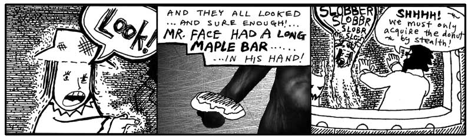

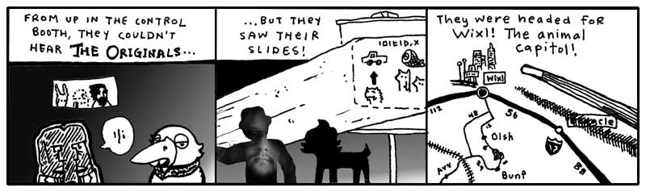

And none of the three spoke when The Originals flicked off the slide projector
and boarded a very slender rocket ship and cleanly exploded through a crevice in
the cargo bay roof.

“Oh, boy,” said the goat.

“What?” said Hannah.

“You’re going to die,” said the goat.

Dr. Cham looked over the controls in front of them, a long panel of padded
handles and green screens.

“I’m already dead. I’m a ghost.”

The goat looked down at the Doctor, who was rummaging under the control panel.
“Okay, well if your uncle isn’t going to have a talk with you, I’m going to make
things very clear. There’s a good chance these guys are going to build a bomb.
And you see how I’m fidgeting? You see how my knees are wobbling?”

“Yeah.”

“Yeah, that’s how real this is, kid. I don’t remember anything from that
_confounded book_ except that these guys are building a bomb that can blow up
the ghost world. Because once the ghost world’s gone, then Digger Dosh gets his
one second back. It’s a trade they’ve worked out. Hell, it’s sick stuff, that’s
all you need to know.”

“But I’m dead.”

“Okay, well, we’re talking, aren’t we? You can talk, so are you dead?” The goat
shook his head. “I wish I could remember if we win or if it was Dustin Hoffman.”

Hannah cried. “Why do I have to die again?” She wailed and her legs fell into
flux and she sunk into the floor. **MOH-MOHHH-MAO-MAOOO.**

Dr. Cham had forcibly yanked on a plush handle, which unlocked and slid open
like a breadbox. He reached his hands inside and found a keyboard firmly bolted
deep inside.

“That’s it,” he said and pulled up `irb`, which appeared on a display to the
left of his concealed typing. He checked the Ruby version.

    irb> RUBY_VERSION
      => "1.9.3"

Ruby was up-to-date. What else could he do? Scanning `constants` and
`class_variables` was pointless. The only reason that had worked with the
`Elevator` class was because someone had left `irb` running with their classes
still loaded.

He had just loaded this `irb`, so no special classes were available yet. He had
to find some classes. He started by loading the `` `rbconfig` `` file to get an
idea of what Ruby’s settings were.

    irb> require 'rbconfig'
      => true
    irb> RbConfig::CONFIG
      => {"abs_srcdir"=>"$(ac_abs_srcdir)", "sitedir"=>"bay://Ruby/lib/site_ruby", ... }

Too much information to sort through there. The `RbConfig::CONFIG` constant is a
Hash that contains every environment setting used to setup Ruby. You can find
the operating system name at `RbConfig::CONFIG['host_os']`. The directory where
core Ruby libraries are stored can be found at `RbConfig::CONFIG['rubylibdir']`.
Ruby programs can store helper files at `RbConfig::CONFIG['datadir']`.

What Dr. Cham really needed, though, was a list of all the libraries that aren’t
core Ruby libraries. Libraries which were installed by The Originals or whoever
manned this console. He checked a few global variables for this information.

    irb> $"
      => ["irb.rb", "e2mmap.rb", "irb/init.rb", ... "rbconfig.rb"]
    irb> $:
      => ["bay://Ruby/lib/site_ruby/1.9", "bay://Ruby/lib/site_ruby/1.9/i686-unknown",
          "bay://Ruby/lib/site_ruby", "bay://Ruby/lib/1.9",
          "bay://Ruby/lib/1.9/i686-unknown"]

Aha, good. Dr. Cham stroked his beard and looked over his `irb` session. The
`$"` global variable contains an Array of every library which has been loaded
with `require`. Most of these libraries had been loaded by `irb`. He had loaded
`'rbconfig.rb'` earlier, though.

The `$:` global variable, which can also be accessed as `$LOAD_PATH`, contains a
list of all the directories which Ruby will check when you try to load a file
with `require`. When Dr. Cham ran `require 'rbconfig'`, Ruby checked each
directory in order.

    bay://Ruby/lib/site_ruby/1.9/rbconfig.rb
    bay://Ruby/lib/site_ruby/1.9/i686-unknown/rbconfig.rb (*)
    bay://Ruby/lib/site_ruby/rbconfig.rb
    bay://Ruby/lib/1.9/rbconfig.rb
    bay://Ruby/lib/1.9/i686-unknown/rbconfig.rb

The second path was where Ruby ended up finding the rbconfig.rb file. Dr. Cham
guessed that the first five paths were **absolute paths**. These were paths to
directories on a drive called `bay`. Absolute paths may vary on your system. On
Windows, absolute paths will start with a drive letter. On Linux, absolute paths
start with a slash.

The goat had peeked his head around Dr. Cham and was watching all these
instructions transpire, as he licked his lips to keep his salivations from
running all over the monitors and glossy buttons. He had been interjecting a few
short cheers (along the lines of: _No, not that_ or _Yes, yes, right_ or _Okay,
well, your choice_), but now he was fully involved, recommending code, “Try
`require 'setup'` or, no, try `3 * 5`. Make sure that basic math works.”

“Of course the math works,” said Dr. Cham. “Let me be, I need to find some
useful classes.”

“It’s a basic sanity test,” said the goat. “Just try it. Do `3 * 5` and see what
comes up.”

Dr. Cham caved.

    irb> 3 * 5
      => 15

“Okay, great! We’re in business!” the goat tossed his furry face about in glee.

Dr. Cham patted the goat’s head, “Well done. We can continue.”

    irb> Dir.chdir( "bay://Ruby/lib/site_ruby/1.9/" )
      => 0
    irb> Dir["./*.{rb}"]
      => ['endertromb.rb', 'mindreader.rb', 'wishmaker.rb']

Dr. Cham had use `chdir` to change the current working directory over the
first path listed in `$LOAD_PATH`. This first path in `site_ruby` is a common
place to store custom classes.

Here were the three legendary classes that my daughter’s organ instructor had
inscribed for me earlier in this chapter. And, Dr. Cham, having read this
selfsame chapter, recognized these three pieces of the system immediately.

The `Endertromb` class which contained the mysteries of this planet’s powers.
The `MindReader` class which, upon scanning the minds of its inhabitants, read
each mind’s contents. And, finally, the crucial `WishMaker` class which powered
the granting of ten-letter wishes, should the wish ever find its way to the core
of Endertromb.

“How about `4 * 56 + 9`?” asked the goat. “We don’t know if it can do compound
expressions.”

“I’ve got the `MindReader` right here,” said Dr. Cham. “And I have the
`WishMaker` here next to it. This planet can read minds. And this planet can
make wishes. Now, let’s see if it can do both at the same time.”

## 7. Them What Live the Dream

While The Originals’ craft had long disappeared, Dr. Cham frantically worked
away at the computer built into the control panel up in the observation deck.
Hannah had disappeared into the floor (or perhaps those little sparks along the
ground were still wisps of her paranormal presence!) and the goat amicably
watched Dr. Cham hack out a Ruby module.


require 'endertromb'
module WishScanner
  def scan_for_a_wish
    wish = self.read.detect do |thought|
      thought.index( 'wish: ' ) == 0
    end
    wish.gsub( 'wish: ', '' )
  end
end


“What’s your plan?” asked the goat. “It seems like I could have solved this
problem in like three lines.”

“This `Module` is the new `WishScanner` technology,” he said. “The scanner only
picks up a wish if it starts with the word `wish` and a colon and a space. That
way the planet doesn’t fill up with every less-than-ten-letter word that appears
in people’s heads.”

“Why don’t you just use a class?” asked the goat.

“Because a `Module` is simpler than a class. It’s basically just a storage
facility for methods. It keeps a group of methods together. You can’t create new
objects from a module.”

“But aren’t you going to want a `WishScanner` object, so you can actually use
it?” said the goat, appalled.

“I’m going to mix it into the `MindReader`,” said Dr. Cham. And he did.


require 'mindreader'
class MindReader
  include WishScanner
end


“Now, the `WishScanner` module is mixed in to the `MindReader`,” said Dr. Cham.
“I can call the `scan_for_a_wish` method on any `MindReader` object.”

“So, it’s a mixin,” said the goat. “The `WishScanner` mixin.”

“Yes, any module which is introduced into a class with `include` is a mixin to
that class. If you go back and look at the `scan_for_a_wish` method, you’ll see
that it calls a `self.read` method. I just have to make sure that whatever class
I’m mixing `WishScanner` into has a `read` method. Otherwise, an error will be
thrown.”

“That seems really weird that the mixin requires certain methods that it doesn’t
already have. It seems like it should work by itself.”

Dr. Cham looked up from the keyboard at the goat. “Well, it’s sort of like your
video collection. None of your video cassettes work unless they are put in a
machine that uses video cassettes. They depend on each other. A mixin has some
basic requirements, but once a class meets those requirements, you can add all
this extra functionality in.”

“Hey, that’s cool,” said the goat.

“You read the book thirty times and you didn’t pick that up?” asked Dr. Cham.

“You’re a much better teacher in person,” said the goat. “I really didn’t think
I was going to like you very much.”

“I completely understand,” said the Doctor. “This is much more real than the
cartoons make it seem.”


require 'wishmaker'
reader = MindReader.new
wisher = WishMaker.new
loop do
  wish = reader.scan_for_a_wish
  if wish
    wisher.grant( wish )
  end
end


Irb sat and looped on the screen. It’ll do that until you hit Control-C. But Dr.
Cham let it churn away. Looping endlessly, scanning the mind waves for a proper
wish.

And Dr. Cham readied his wish. At first, he thought immediately of a `stallion`.
To ride bareback over the vales of Sedna. But he pulled the thought back, his
wish hadn’t been formed properly. A stallion was useless in pursuing The
Originals, so he closed his eyes again, bit his lip and he thought to himself:
`wish: whale`.

### Last Whale to Peoplemud

The blocky, sullen whale appeared down at the castle entrance, where Hannah was
bashing on a rosebud with her hand. She whacked at it with a fist, but it only
stayed perfect and pleasant and crisp against the solid blue sky of Endertromb.

“I’m bored,” she said to the whale. **BOHR-BOHR-OHRRRRRR.**

“OK,” said the whale, deep and soft. As the word slid along his massive tongue,
its edges chipped off and the word slid out polished and worn in a bubble by his
mouth’s corner.

“I always have to die,” said the young ghost. “People always kill me.”

The whale fluttered his short fins, which hung at useless distance from the
ground. So, he pushed himself toward her with his tail. Scooting over patches of
grass.

“People kill, so who do they kill?” said the girl. “Me. They kill me every
time.”

The whale made it to within three meters of the girl, where he towered like a
great war monument that represents enough dead soldiers to actually steal a
lumbering step towards you. And now, the whale rested his tail and, exhausted by
the climb thus far, let his eyelids fall shut and became a gently puffing clay
mountain, his shadow rich and doubled-up all around the hardly visible Hannah.

But another shadow combined, narrow and determined. Right behind her, the hand
came on to her shoulder, and the warm ghost inside the hand touched her sleeve.

“How did you get down here?” said the girl.

Dr. Cham sat right alongside her and the goat walked around and stood in front.

“Listen to us,” said Dr. Cham. “We’ve got to follow this mangy pack of
ne’er-do-wells to the very end, Hannah. And to nab them, we need your faithful
assistance!”

“I’m scared,” cried Hannah.

“You’re not scared,” said the goat. “Come on. You’re a terrifying little phantom
child.”

“Well,” she said. “I’m a little bored.”

Dr. Cham bent down on a knee, bringing his shaggy presence toward the ground,
his face just inches from hers. “If you come with us, if you can trust what we
know, then we can bag this foul troupe. Now, you say your destiny is to be a
baker. I won’t dispute that. You have every right on Earth—and Endertromb, for
that matter—to become a baker. Say, if you didn’t become a baker, that would be
a great tragedy. Who’s going to take care of all those donuts if you don’t?”

She shrugged. “That’s what I’ve been saying.”

“You’re right,” said the Doctor. “You’ve been saying it from the start.” He
looked up to the sky, where the wind whistled peacefully despite its forceful
piercing by The Originals’ rocket ship. “If your destiny is to be a baker, then
mine is to stop all this, to end the mayhem that is just beginning to boil. And
hear me, child—hear how sure and solid my voice becomes when I say this—I ended
your life, I bear sole responsibility for your life as an apparition, but I will
get it back. It’s going to take more than a donut, but you will have a real
childhood. I promise you.”

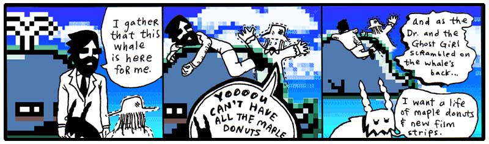

Sure, it took a minute for the goat to cut his wish down to ten letters, but he
was shortly on his way, following the same jet streams up into the sky, up toward
Dr. Cham and his ghost niece Hannah. Up toward the villanous animal combo pak
called The Originals. Up toward The Rockettes.

And Digger Dosh bludgeoned and feasted on each second they left behind them.

  [1]: expansion-pak-1.html
