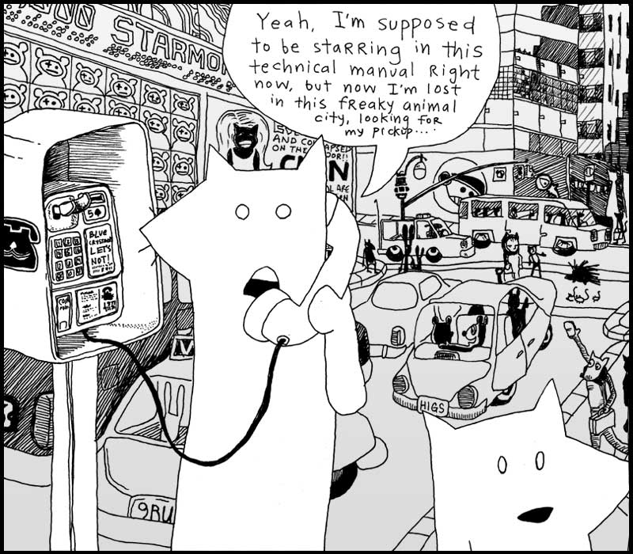
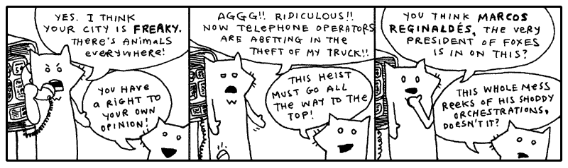

Oblivious to their involvement in the expansive plan of The Originals, both the
tall fox and the much shorter fox had wandered right into the red alert zone,
the city Wixl. I desire a spatula to scoop them aside with, shuffle them off to
the coast near the beach hatcheries, hide them in piles of fish eggs, hold down
their pointy ears, concealing their luxurious hides. And above them I would
stand, casting an unmoving shadow, holding my rifle aloof.

I can’t. I have you to teach. I have to groom and care for myself. The
lightbulbs upstairs need changing. A free pack of halogen lightbulbs just showed
up out of the mail. Somebody out there is obviously trying to get me to use
them. So I’m going to screw ‘em in. And just stand there, casting an unmoving
shadow, holding my rifle aloof.

Should that shadow be nice and defined, then I’ll keep ‘em.

## 1. If I Were Looking For a Vehicle

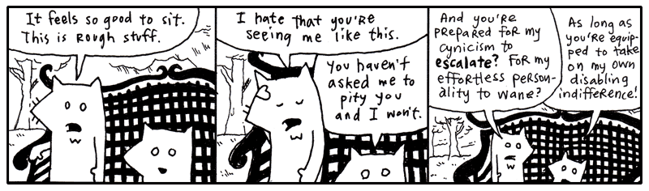

I like seeing these two out in the wild. They got pretty bored here in the
studio. They started making up weird slogans and stuff. They had some phrase
they kept repeating, forming fixations upon. You can’t be exposed to all that
contrived fox nonsense.

Let’s just say: I am really trying my best to keep things collegiate. Having
never attended college, I can’t well say if every passage written chimes right
with the stringent criteria which academia demands. I have university friends
aplenty, some who tour the globe in their pursuits, and I try to inflect my
voice with just their blend of high culture.

Sometimes I applaud myself for going beyond the work of my educated friends—only
in quiet corridors, we never butt heads publicly—because _I have actually
subscribed_ to a school of thought while they are still in their books, turning
and turning.

**I am a preeventualist.** I have dabbled in it long enough and am glad to come
forth with it. Inevitably, some of you have already started mining this book for
Marxist symbology. I am sad to kill those interpretations, but I believe any
nihilist conclusions you’ve drawn will still hold up under scrutiny.

Anyway, I’ll drop the rhetoric. I only mention preeventualism because, aside
from being a refreshing and easy alternative to the post-modernism we’re born
with, _this_ meta-cult offers a free lost-and-found service for the residents of
Wixl.


require 'open-uri'
open( "http://preeventualist.org/lost" ) do |lost|
  puts lost.read
end


I have no way of alerting the foxes to this service. And I’m sure it’s too soon
for their truck to be listed. Still, the good intentions are here.

If you’re connected to the Internet, the above Ruby should have downloaded the
web page from the Internet and printed it to the screen. In a message resembling
this:

<pre class="text">                   THE PREEVENTUALIST'S LOSING AND FINDING REGISTRY
          (a free service benefiting the ENLIGHTENED who have been LIGHTENED)

                                      ---
                      updates are made daily, please check back!
                                      ---

                         this service is commissioned and
                     subsidized in part by The Ashley Raymond
                                Youth Study Clan

                                      ...
                      all seals and privileges have been filed
                under the notable authorship of Perry W. L. Von Frowling,
          Magistrate Polywaif of Dispossession.  Also, Seventh Straight Winner
                   of the esteemed Persistent Beggar's Community Cup.
                                      ...

  ABOUT THE REGISTRY
  ==================
  Hello, if you are new, please stay with us.  A brief explanation of our service will 
  follow.  First, a bit of important news from our beloved magistrate.  (The kids call
  him Uncle Von Guffuncle. Tehe!)

  IMPORTANT NEWS
  ==============
  / 15 April 2005 /
  hi, big news.  we were on channel 8 in wixl and ordish.  cory saw it.  i was on and 
  jerry mathers was on.  if you didn't see it, e-mail cory.  he tells it the best.  all 
  i can say is those aren't MY hand motions!! (joke for people who watch channel 8.)  
  thanks harry and whole channel 8 news team!!
                                                   - perry

  / 07 April 2005 /
  we're all sifting through the carpet here at hq, but if you could all keep an eye out 
  for caitlin's clipboard, she's too quiet of a gal to post it and i know that it's 
  REALLY important to her.  she had a few really expensive panoramic radiographs of her 
  husband's underbite clipped to a few irreplacable photos of her husband in a robocop 
  costume back when the underbite was more prominent.  she says (to me), "they'll know
  what i mean when they see them."  i don't know what that means.  :(

  i've checked: * the front desk * the hall * the waiting area * the bathroom * the candy 
  closet * the big tv area * the lunch counter * the disciples room * gaff's old room
  (the one with the painting of the cherry tree) * the server room * staircase.  i'll 
  update this as i find more rooms.
                                                   - love, perry

  / 25 Feb 2005 /
  server went down at 3 o'clock.  i'm mad as you guys.  gaff is downstairs and he'll 
  be down there until he gets it fixed. :O -- UPDATE: it's fixed, back in bizz!!
                                                   - perry

  / 23 Feb 2005 /
  i know there's a lot of noise today.  stanley bros circus lost twelve llamas and a
  trailer and a bunch of Masterlocks and five tents.  they're still finding lost stuff.
  pls keep your heads, i need everyone's help.  these entertainers have _nothing_.  i 
  mean it.  i gave a guy a purple sticker today (it's just something i like to do as a
  kind gesture) and he practically slept on it and farmed the ingredients for pizza sauce
  on it.  they are on rock bottom.

  so please donate.  i know we don't have paypal or anything.  so if you want to donate,
  just post that you found something (a children's bike, a month of perishable canned 
  goods) and that it has the circus people's names written on it or something.
                                                   - great, perry

  / 15 Nov 2004 /
  preeventualist's day sale.  if you lose something today, you get to pick one free 
  item (of $40 value or less) from the house of somebody who found something.  we're 
  having so much fun with this!!  this is EXACTLY how i got my rowing machine last year
  and i LOVE IT!!
                                                   - perry
</pre>

I think the Youth Study Clan is doing a great job with this service. It’s a
little hokey and threadbare, but if it can get animals to stop using their
instinctive means of declaring ownership, then hats off.

Still, a preeventualist youth group? How can that be? You’ve got to at least
_flirted with real cynicism_ before you can become a preeventualist. And you
definitely can’t attend school. So, I don’t know.

Going back to the list of instructions from the Preeventualist’s Losing and
Finding Registry.

<pre class="text"> USING THE L&#38;F SERVER
 ====================
 The L&#38;F is a free service.  The acts of losing and finding are essential qualities in
 building a preeventualist lifestyle.  We hope to accommodate your belief.

 We do not use HTML, in order to simplify our work here.  Our guys are already working
 fifteen hour days.  (Thanks, Terk!!  Thanks, Horace!!)

 You may search our service for your lost items.  Or you may add your lost (or found)
 item to our registry.  This is done by typing the proper address into your browser.

 SEARCHING
 =========
 To search for lost items, use the following address:

   http://preeventualist.org/lost/search?q={search word}

 You may replace {search word} with your search term.  For example, to search for "cup":

   http://preeventualist.org/lost/search?q=cup

 You will be given a list of cups which have been lost or found.

 If you want to search for only lost cups or only found cups, use the `searchlost' and
 `searchfound' pages:

   http://preeventualist.org/lost/searchlost?q=cup
</pre>

I’m not playing games. I know where the truck is. Really, I’m not teasing you.
I’ll show you in just a sec. I’m just saying, look at the foxes:

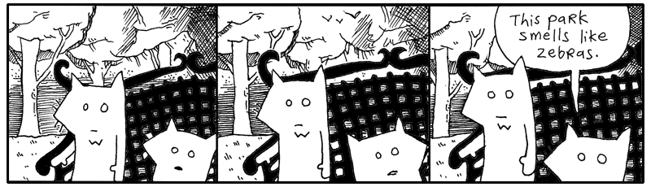

They are helpless. And yet, here is this great tool. A possible key to getting
out of this mess. I just want to poke around, see if there are any clues here.


require 'open-uri'

# Searching all found items containing the word `truck'.
open( "http://preeventualist.org/lost/searchfound?q=truck" ) do |truck|
  puts truck.read
end


I’m not seeing anything about the tall fox’s truck in this list. That’s okay.
The foxes are out of it anyway. We have some time.

You’ve learned a very simple technique for retrieving a web page from the
Internet. The code uses the `OpenURI` library, which was written by one of my
favorite Rubyists, Akira Tanaka. He’s simplified reading from the Internet so
that it’s identical to reading a file from your computer.

In a previous chapter, we stored your diabolical ideas in a text file. You read
these files in Ruby using `open`.


require 'open-uri'

# Opening an idea file from a folder on your computer.
open( "folder/idea-about-hiding-lettuce-in-the-church-chairs.txt" ) do |idea|
  puts idea.read
end


Files are **input-output objects**. You can read and write to a file. In Ruby,
all IO (input-output) objects have `read` and `write` methods. The `open` method
slides an IO object **down the chute** into a block for your use. IO is your
ticket to the outside world. It’s the rays of sunlight cast through the prison
bars. (However, you can’t `write` to a web page with `OpenURI`. You’ll need to
find a tool for copying to your web server. An FTP
program, for instance.)

If someone wants to read your diabolical idea about hiding lettuce in the church
chairs, assuming you’ve posted it as a web page:


require 'open-uri'

# Opening an idea file available on a web site.
open( "http://your.com/idea-about-hiding-lettuce-in-the-church-chairs.txt" ) do |idea|
  puts idea.read
end


The `OpenURI` library also understands FTP addresses
as well. This widens the possibilities for where you can store files. On your
system or elsewhere on the Internet.

### Reading Files Line by Line

When you’re using `OpenURI` to get information from the web with the `open` and
`read` methods, the page is given to you as a `String`. You can also read the
page one line at a time, if you’re searching for something. Or if the page is
big and you want to conserve your computer’s memory.


require 'open-uri'
open( "http://preeventualist.org/lost/searchfound?q=truck" ) do |truck|
  truck.each_line do |line|
    puts line if line['pickup']
  end
end


The above code will retrieve the list of trucks found by preeventualists, then
display only those lines that actually contain the word ‘pickup’. That way we
can trim out the descriptions and look for only the pertinent lines.

Above, the **index brackets** are used on a string, so the string is searched
for whatever is inside the brackets. Since the string `'pickup'` is inside the
brackets, the `line` string is searched for the word “pickup”.

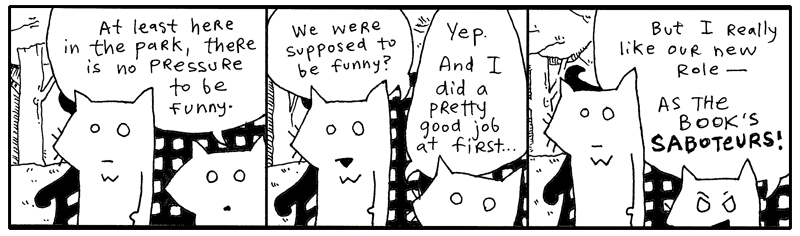

When a web page is loaded with `read`, the entire page is loaded into memory.
Usually this only takes up a few thousand bytes. But if a page is big (several
megabytes), you’ll probably want to use `each_line`, which loads one line at a
time to avoid exhausting memory.

### Yielding is Kiddie Blocks

Ruby often uses iterators in this fashion. Yes, iterators are used for cycling
through each item in a collection of items, such as an array or hash. Now look
at an IO source as a collection of lines. The iterator can crawl that collection
of lines.


class IO
  # Definition for the each_line method.  Notice how it has no
  # argument list.  Blocks don't need to be listed as arguments.
  def each_line
    until eof?        # until we reach the end of the file...
      yield readline  # pass a line into the block
    end
  end
end


The `yield` keyword is the easiest way to use a block. One word. Just like a
curtain has a pullstring or like a suitcase has a handle. Inside a method, you
can press the blinking `yield` button and it will run the block attached to that
method. Glowing a strong red color until the code inside the block is done. And
then it goes back to blinking and you can press the button again if you like.


def yield_thrice
  yield
  yield
  yield
end


Punch the `yield` button three times quick and the block gets to live its life
three times.

    irb> a = ['first, birth.', 'then, a life of flickering images.', 'and, finally, the end.']
    irb> yield_thrice { puts a.shift }
    # prints out:
    #   first, birth.
    #   then, a life of flickering images.
    #   and, finally, the end.

The `shift` method pulls the first item off an array. The barber `shift` cuts
the hair off and hands it over. Then, the scalp. And just keeps going, whittling
the poor guy down to nothing.

You’ve seen blocks attached to methods. Any Ruby method can have a block
attached to the end.


# The brief style of attaching a block to a method.
# Here the block is surrounded with curly braces.
open( "idea.txt" ) { |f| f.read }

# The verbose style of attaching a block to a method.
# Here the block is surrounded with `do' and `end'
open( "idea.txt" ) do |f|
  f.read
end


If you pass arguments to `yield`, those arguments will also be passed to the
block. The block is riding in a little sidecar attached to the method’s
motorcycle. The method yells out a list arguments, screaming to the block over
all the wind as they’re racing through the desert. The block taps his helmet
like, “I get it, my brain gets it.”


# The method opens two files and slides the resulting IO objects down the
# chute to an attached block.
def double_open filename1, filename2
  open( filename1 ) do |f1|
    open( filename2 ) do |f2|
      yield f1, f2
    end
  end
end

# Prints the files out side-by-side.
double_open( "idea1.txt", "idea2.txt" ) do |f1, f2|
  puts f1.readline + " | " + f2.readline
end


You may also wonder what the `yield` keyword has to do with street signs. And
really, it’s a good question with, I believe, a good answer. When you run a
method, you are giving that method control of your program. Control to do its
job and then come back to with an answer.

With `yield`, the method is stopping at the intersection, giving control back to
you, to your block. The method is letting you do your work before resuming its
work. So while the `each_line` method does the work of actually reading lines
from a file, the **block attached to the `each_line` method** is handed the line
itself and gets a chance to hammer away at it in the sidecar.

### Preeventualism in a Gilded Box

You’ve learned so much about `OpenURI` and using `yield` to write your own
iterators. You know your way around the lost-and-found service. Really, you can
starting hunting through the Wixl junk drawer without me.

Let’s neatly _encapsulate_ the entire service into a single class.


require 'open-uri'
module PreEventualist
  def self.open page, query
    qs =
      query.map do |k, v|
        URI.escape "#{ k }=#{ v }"
      end.join "&"
    URI.parse( "http://preeventualist.org/lost/" + page + "?" + qs ).open do |lost|
      lost.read.split( "--\n" )
    end
  end
  def self.search word
    open "search", "q" => word
  end
  def self.searchlost word
    open "searchlost", "q" => word
  end
  def self.searchfound word
    open "searchfound", "q" => word
  end
  def self.addfound your_name, item_lost, found_at, description
    open "addfound", "name" => your_name, "item" => item_lost,
                     "at" => found_at, "desc" => description
  end
  def self.addlost your_name, item_found, last_seen, description
    open "addlost", "name" => your_name, "item" => item_found,
                    "seen" => last_seen, "desc" => description
  end
end


At some point with your code, you need to start shaping it into something neat.
Save the above module in a file called `preeventualist.rb`.

This module is a very simple library for using the Preeventualist’s service.
This is exactly the way libraries are written. You whip up a module or a class,
store it in a file, and, if you’re happy with it and want the world to benefit,
put it on the web.

These stragglers can use your module just like I used `OpenURI` earlier.

    irb> require 'preeventualist'
    irb> puts PreEventualist.search( 'truck' )
    irb> puts PreEventualist.addfound( 'Why', 'Ruby skills', 'Wixl park',
           "I can give you Ruby skills!\nCome visit poignantguide.net!" )

## 2. Meanwhile, The Porcupine Stops To Fill-Up

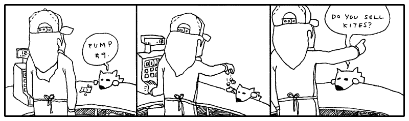

## 3. A Sponsored Dragon-Slaying

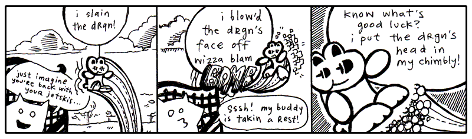

“Look around,” said Fox Small. “Some of us don’t have time for quests. Some of
us have major responsibilities, jobs, so on. Livelihood, got it?”

“_Heyyyy_, my **JOB** was to kill the drgn!!” screamed
the wee rabbit, blinking his eyes and bouncing frantically from tree to tree to
pond to pond. “His snout was a **HUGE**
responsibility!! His smoky breath was _mine to reckon with!!_ I spent fifty
dollars on the cab **JUST** to get out there, which
was another _huge huge_ ordeal. You have _nothing on me_, not a _single_
indictment, my whole **HERONESS** is _absoflutely
unimpeachable_, my whole **APPROACH** is _abassoonly
unapricotable_, just ask Lester.”

<aside class="sidebar" markdown="1">
## The Inadvertent Meteor

_When I first began my inquiry into preeventualism, I was relayed the following
story. I was told that this was all I needed to understand the philosophy._

There was this sculptor who just wasn’t satisfied with his work. He had
primarily studied traditional subject matter and excelled at sculpting both the
human figure and elaborate vegetation. And he was really quite an exquisite
sculptor. He just didn’t feel like he was making his mark upon the world.

By this time, he had aged well into his fifties and wanted to vaunt into the
realm of legendary masters. So he began to construct a massive sculpture of two
pears with beads of dew clinging precariously to them.

The sculpture was enormous and hovered ominously above the sculptor’s hometown,
held aloof by a massive infrastructure of struts and beams. In fact, the giant
pears were so significant that they truly wreaked havoc on the Earth’s rotation,
ever so slightly, what with a new asteroid-sized fruit basket clinging to it.

The government sent jets and war crafts to destroy the statue. They unleashed a
vicious attack on the village, dismantling the statue, blowing it into thousands
of pieces, chipping away at it with missiles. Soon enough, the statue was
obliterated and all was back to normal.

A huge chunk of the statue had taken orbit in the heavens and often veered
perilously close to the planet. When it did, it was always met by an arsenal of
advanced weaponry, which further damaged it and deflected its course skyward.

Eventually, this inadvertent meteor was nothing more than the size of a very
daunting man. And, when it at last hit the ground, weathered and polished by its
ninety year journey, it was hailed as an enigmatic masterpiece, a message from
the great beyond. Here was a stunning likeness of a male nude looking wistfully
into the sky with an intricate lace work of vines creeping around his waist and
covering his improprieties.

The statue was last sold for fifty-two million dollars and stayed in the
permanent exhibit at the Louvre, with the plaque:

> “Heavenly Nude” by Anonymous
</aside>

“Who’s Lester?” said the Fox Small.

“Lester’s my cab driver! He parked at the base of Dwemthy’s Array!!” The rabbit
ricocheted madly like a screensaver for a supercomputer. _“Just ask Dwemthy!!”_

“Well,” said the Fox Small. He turned back to look up at Fox Tall, who was
sitting straight and looking far into the distance. “Wait, they have a parking
lot on Dwemthy’s Array?”

**“YEP!!** And a pretzel stand!!”

“But, it’s _an Array_? Do they sell churros?”

**“CHOCOLAVA!!”** bleeted the rabbit.

“What about those glow-in-the-dark ropes that you can put in your hair? Or you
can just hold them by your side or up in the air—”

**“BRAIDQUEST!!”**

“You should get a cut of the salesman’s commission,” spoke Fox Small. “Folks
came out to see you kill the dragon, right?”

**“BUT!!** I don’t operate the tongs that actually extract the chocolava.”

“I’m just sayin’. You **do** operate the killing mechanism. So you _have a stake_
in the ensalada.”

“OH NO!! I left my favorite lettuce leaves in Dwemthy’s Array!!” squealed the
rabbit, twirling like a celebratory saber through the quaking oak. Distantly:
“Or Lester’s trunk, maybe?”

“You know—Gheesh, can you stay put??” said Fox Small.

“My radio,” said Fox Tall, stirring to life for a moment, “in my pickup.” The
glaze still seeping from his eyes. His stare quivered and set back into his
face, recalling another time and place. A drive out to Maryland. Sounds of
Lionel Richie coming in so clearly. The wipers going a bit too fast. He pulls up
to a house. His mother answers the door. She is a heavily fluffed fox. Tears and
makeup.

Slumping back down, “That porcupine is changing my presets.”

The rabbit bounded up on to the armrest of the park bench and spoke closely.
**“BUT!!** Soon I will feast on drgn’s head and the juices of drgn’s tongue!!”
The rabbit sat still and held his paws kindly.

“(Which I hope will taste like cinnamon bears,)” whispered the rabbit,
intimately.

“I love cinnamon,” said Fox Small. “I should go killing with you some time.”

“You should,” said the rabbit and the eyes shine-shined.

“Although, salivating over a tongue. You don’t salivate over it, do you?”

“I DO!!” and the rabbit got so excited that Sticky Whip shot out of his eyes.
(More on Sticky Whip in a later sidebar. Don’t let me forget. See also: _The
Purist’s Compendium to Novelty Retinal Cremes_ by Jory Patrick Sobgoblin,
available wherever animal attachment clips are sold.)

“Okay, you’ve hooked me. I want to hear all about it,” Fox Small declared.
“Please, talk freely about the chimbly. Oh, and Dwemthy. Who is he? What makes
him tick? Then maybe, if I’m still around after that, you can tell me about what
makes rabbits tick, and maybe you can hold our hands through this whole missing
truck ordeal. I need consolation more than anything else. I could probably use
religion right now. I could use your personal bravery and this sense of
accomplishment you exude. Do you smoke a pipe? Could be a handy tool to coax
along the pontification we must engage in.”

And the rabbit began expounding upon Dwemthy and the legend of Dwemthy and the
ways of Dwemthy. As with most stories of Dwemthy, the rabbit’s tales were mostly
embellishments. Smotchkkiss, there are delicacies which I alone must address.

Please, never ask who Dwemthy is. Obviously he is a mastermind and would never
disclose his location or true identity. He has sired dynasties. He has set
living ogres aflame. Horses everywhere smell him at all times. Most of all, he
knows carnal pleasures. And to think that this…

This is his Array.

### Dwemthy’s Array

You stand at the entrance of Dwemthy’s Array. You are a rabbit who is about to
die. And deep at the end of the Array:


class Dragon < Creature
  life 1340     # tough scales
  strength 451  # bristling veins
  charisma 1020 # toothy smile
  weapon 939    # fire breath
end


A scalding _SEETHING LAVA_ infiltrates the
**cacauphonous ENGORGED MINESHAFTS** deep within the
ageless canopy of the _DWEMTHY FOREST_... chalky and
nocturnal screams from **the belly of the RAVENOUS WILD
STORKUPINE**... who eats **wet goslings** _RIGHT
AFTER_ they’ve had a few graham crackers and a midday nap… amidst starved
hippos _TECHNICALLY ORPHANED_ but truthfully sheltered
by umbrellas owned jointly by car dealership conglomerates… beneath _uncapped
vials_ of mildly pulpy **BLUE ELIXIR**... _which shall
remain… heretofore… **UNDISTURBED… DWEMTHY!!!**_

_If you don’t understand Dwemthy’s Array, it is Dwemthy’s fault. He designed the
game to complicate our lives and were it simpler, it would not be the
awe-inspiring quest we’ve come to cherish in our arms this very hour._

Dwemthy’s Array has a winding history of great depth. It is not enough to simply
say, “Dwemthy’s Array,” over and over and expect to build credentials from that
act alone. Come with me, I can take you back a couple years, back to the sixties
where it all started with metaprogramming and the dolphins.

You might be inclined to think that **metaprogramming** is another hacker word
and was first overheard in private phone calls between fax machines. Honest to
God, I am here to tell you that it is stranger than that. Metaprogramming began
with _taking drugs in the company of dolphins_.

In the sixties, a prolific scientist named John C. Lilly began experimenting
with his own senses, to uncover the workings of his body. I can relate to this.
I do this frequently when I am standing in the middle of a road holding a pie or
when I am hiding inside a cathedral. I pause to examine my self. This has proven
to be nigh impossible. I have filled three ruled pages with algebraic notation,
none of which has explained anything. The pie, incidentally, has been very easy
to express mathematically.

But the scientist Lilly went about his experiments otherwise. He ingested LSD in the company of dolphins. Often in a dark, woeful
isolation tank full of warm salt water. Pretty bleak. But it was science! (Lest
you think him criminal: until 1966, LSD was supplied
by Sandoz Laboratories to any interested scientists, free of charge.)

**Drugs, dolphins and deprivation.** Which led to Lilly’s foray into things
meta. He wrote books on mental programming, comparing humans and computers. You
may choose to ingest any substance you want during this next quote—most likely
you're reaching for the grain of salt—but I assure you that there’s no Grateful
Dead show on the lawn and no ravers in the basement.

> When one learns to learn, one is making models, using symbols, analogizing,
> making metaphors, in short, inventing and using language, mathematics, art,
> politics, business, etc. At the critical brain (cortex) size, languages and
> its consequences appear. To avoid the necessity of repeating learning to
> learn, symbols, metaphors, models each time, I symbolize the underlying idea
> in these operations as metaprogramming.
>
> John C. Lilly, <em>Programming and Metaprogramming in the Human
> Biocomputer</em>, New York, 1972.

We learn. But first we learn to learn. We setup programming in our mind which is
the pathway to further programming. (Lilly is largely talking about programming
the brain and the nervous system, which he collectively called the
_biocomputer_.)

Lilly’s metaprogramming was more about feeding yourself imagery, reinventing
yourself, all that. This sort of thinking links directly to folks out there who
dabble in shamanism, wave their hands over tarot cards and wake up early for
karate class. I guess you could say metaprogramming is New Age, but it’s all
settled down recently into a sleeping bag with plain old nerdiness. (If you got
here from a Google search for “C++ Metaprogramming”, stick around, but I only
ask that you _burn_ those neural pathways that originally invoked the search.
Many thanks.)

Meta itself is spoken of no differently in your author’s present day.

> All sensuous response to reality is an interpretation of it. Beetles and
> monkeys clearly interpret their world, and act on the basis of what they see.
> Our physical senses are themselves organs of interpretation. What
> distinguishes us from our fellow animals is that we are able in turn to
> interpret these interpretations. In that sense, all human language is
> meta-language. It is a second-order reflection on the ‘language’ of our
> bodies—of our sensory apparatus.
>
> Terry Eagleton, <em>After Theory</em>, London, 2003, ch. 3.

To that end, you could say programming itself is a meta-language. _All code_
speaks the language of action, of a plan which hasn’t been played yet, but
shortly will. Stage directions for the players inside your machine. I’ve waxed
sentimental on this before.

But now we’re advancing our study, venturing into metaprogramming, but don’t
sweat it, **it’s still just the Ruby you’ve seen already**, which is why Dwemthy
feels no qualms thrusting it at you right away. Soon enough it will be as easy
to spot as addition or subtraction. At first it may seem intensely bright, like
you’ve stumbled across your first firefly, which has flown up in your face.
Then, it becomes just _a little bobbing light_ which makes living in Ohio so
much nicer.

<aside class="sidebar" markdown="1">
## Bread Riddles

Question: Can one take five bites from a bread and make the shape of a bicycle?
Answer: Yes.

Question: Can one rip a bread in half and still fit the bread in an envelope?
Answer: Yes.

Question: Can one man take a bread and throw it while another man sits without
bread? Answer: Yes.

Question: Can four breads in a box be explained? Answer: Yes.

Question: Can a clerical error in my company books be attributed to bread?
Answer: Yes.

Question: Can dancers break through a scrim of bread? Answer: Yes.

Question: Can those same dancers, when faced with an inexplicably different
scrim of bread, fail to break through? Answer: Yes.

Question: Does bread understand my darkest fears and wildest dreams? Answer:
Yes.

Question: Does bread desire me? Answer: Yes.

Question: Will bread be invisible to robots? Answer: Yes.

Question: Can one robot take eight bites on a bread, without knowing it’s there,
and make the shape of a smaller bread? Answer: Yes.

Question: Should my clerics be equipped with bread? Answer: Yes.

Question: In relation to bread, will robots each have their own elephants?
Answer: Yes.

Question: Can one rip a bread in half and not let it ruin one’s game of
dominoes? Answer: Yes.

Question: Will we always love bread? Answer: Yes.

Question: Will we have more bread? Answer: Yes.

Question: Can four breads marry a robot’s elephant? Answer: Yes.
</aside>

Metaprogramming is _writing code which writes code_. But not as M.C. Escher
would sketch it. **The program isn’t reaching back around and overwriting
itself, nor is the program jumping onto your screen and wrenching the keyboard
from your hands.** No, it’s much smaller than that.

Let’s say it’s more like **a little orange pill** you won at the circus. When
you suck on it, the coating wears away and behind your teeth hatches a massive,
floppy sponge brontosaurus. He slides down your tongue and leaps free,
frolicking over the pastures, yelping, “Papa!” And from then on, whenever he
freaks out and attacks a van, well, that van is _sparkling clean_ afterwards.

Now, let’s say _someone else_ puts **their little orange pill** under the
faucet. Not on their tongue, _under the faucet_. And this triggers a different
catalysm, which births a set of wailing sponge sextuplets. **Umbilical cords and
everything.** Still very handy for cleaning the van. But an altogether different
kind of chamois. And, one day, these eight will stir Papa to tears when they
perform the violin concerto of their lives.

Metaprogramming is packing code into pill-form, such that a slender drop of
water could trigger it to expand. More importantly, you can control the pill’s
reaction, so that a brontosaurus is produced, scaly and lumbering. Or septulets,
**CERTAINLY**. Or seamstresses. Or cat brains. Or
dragons.


class Dragon < Creature
  life 1340     # tough scales
  strength 451  # bristling veins
  charisma 1020 # toothy smile
  weapon 939    # fire breath
end


This is not metaprogramming yet. Only the pill. The _product_ of
metaprogramming. We are pausing, looking at the beast itself before descending
beneath its flesh with a scalpel and microscope.

The `Dragon` is a class. You’ve seen that many times now. The `Dragon` is a
descendant of the `Creature` class.

Now, eyes up. Look at me. The `Creature` class contains the metaprogramming
code. You can write metaprogramming code which can be used _everywhere_,
throughout Ruby, in `Creature` or `Dragon`, in `String` or in `Object`,
anywhere. Our example here, since this is the most common form of meta-code,
focuses on metaprogramming inside your own classes only.

Each of the `Dragon`’s traits are simply **class methods**. You could also write
this as:


class Dragon < Creature
  life( 1340 )     # tough scales
  strength( 451 )  # bristling veins
  charisma( 1020 ) # toothy smile
  weapon( 939 )    # fire breath
end


Removing the parens removes clutter, so let’s leave them out. Only use parens
when you are using several methods together and you want to be very clear.

### Creature Code

Now, with a lateral slice across the diaphragm, we expose the innards of
`Creature`. **Save this code into a file called `dwemthy.rb`.**


# The guts of life force within Dwemthy's Array
class Creature

  # Get a metaclass for this class
  def self.metaclass; class << self; self; end; end

  # Advanced metaprogramming code for nice, clean traits
  def self.traits( *arr )
    return @traits if arr.empty?

    # 1. Set up accessors for each variable
    attr_accessor( *arr )

    # 2. Add a new class method to for each trait.
    arr.each do |a|
      metaclass.instance_eval do
        define_method( a ) do |val|
          @traits ||= {}
          @traits[a] = val
        end
      end
    end

    # 3. For each monster, the `initialize' method
    #    should use the default number for each trait.
    class_eval do
      define_method( :initialize ) do
        self.class.traits.each do |k,v|
          instance_variable_set("@#{k}", v)
        end
      end
    end

  end

  # Creature attributes are read-only
  traits :life, :strength, :charisma, :weapon
end


Focus on the closing lines of code, specifically the line where the `traits` are
being set up. All of the code before that line sets up the `traits` class
method. This bears resemblance to the basic lottery tickets from the chapter
previous.


class LotteryTicket
  attr_reader :picks, :purchased
end


Both `traits` and `attr_reader` are simply class methods. When `attr_reader` is
used in the `LotteryTicket`, metaprogramming kicks in behind the scenes and
starts blowing up balloons, creating **reader** methods for the instance
variables `@picks` and `@purchased` above.

The code for the `traits` method is the metaprogramming I’ve been alluding to.
Comments in the code reveal the three stages the method goes through when adding
traits.

1. The **list of traits is passed on to `attr_accessor`**, which builds
   **reader** and **writer** code for instance variables. One for each trait.
2. **Class methods are added** for each trait. (A `life` class method is added
   for a `:life` trait.) These class methods are used in the class definition
   just like you would use `traits` or `attr_accessor`. This way, you can
   specify the trait, along with the points given for a trait to a certain
   creature.
3. **Add an initialize method** which sets up a new monster properly, grabbing
   the right points and _POWER UP! POWER UP!_ the
   monster is alive!

The beauty of these three steps is that you’ve taught Ruby how to code monsters
for you. So when Ruby gets to the `traits`:


class Creature
  traits :life, :strength, :charisma, :weapon
end


Ruby fills in the code behind the scenes and transplants a spiny green heart and
jumpstarts the body with a pullcord. Ruby will use the metaprogramming from the
`Creature` class and build out all the various methods, expanding the `traits`
list like this:


class Creature

  # 1. set up reader and writer methods
  attr_accessor :life, :strength, :charisma, :weapon

  # 2. add new class methods to use in creature
  def self.life( val )
    @traits ||= {}
    @traits['life'] = val
  end

  def self.strength( val )
    @traits ||= {}
    @traits['strength'] = val
  end

  def self.charisma( val )
    @traits ||= {}
    @traits['charisma'] = val
  end

  def self.weapon( val )
    @traits ||= {}
    @traits['weapon'] = val
  end

  # 3. initialize sets the default points for
  #    each trait
  def initialize
    self.class.traits.each do |k,v|
      instance_variable_set("@#{k}", v)
    end
  end

end


Now, Ruby will gladly accept this six-line `Dragon` code, short enough to look
nice when printed on playing cards:


class Dragon < Creature
  life 1340     # tough scales
  strength 451  # bristling veins
  charisma 1020 # toothy smile
  weapon 939    # fire breath
end


### Eval, the Littlest Metaprogrammer

While the metaprogramming code above is just plain Ruby, it can be difficult to
follow still. I totally understand if you’ve come to this point and your eyes
are spinning in their sockets and your knees have locked up. The trickiest parts
of the above are the lines which call the methods `instance_eval` and
`class_eval`. Just rub some tiger balm on your joints while I talk about `eval`.

We’ve been talking about **metaprogramming**. Writing code which writes code.
The `eval` method hangs out in this alley. The vagrant `eval` takes code you
have stored up in a string and it executes that code.


drgn = Dragon.new
# is identical to...
drgn = eval( "Dragon.new" )
# or, alternatively...
eval( "drgn = Dragon.new" )


Here, let’s write a program which has a hole in it. Instead of writing a program
which creates a new `Dragon`, let’s leave a hole where the `Dragon` would be.


print "What monster class have you come to battle? "
monster_class = gets
eval( "monster = " + monster_class + ".new" )
p monster


The program asks for a monster. If you type in `Dragon`, then the
`monster_class` variable will contain the string `"Dragon"`. Inside the `eval`,
a few strings get added together to make the string `"monster = Dragon.new"`.
And when the `eval` executes this string, the `monster` variable contains a
`Dragon` object. Ready for battle.

This is great! Now we can leave it up to the player to pick a monster! Of
course, we’re trusting the player to supply a real monster class. If they type
in `BotanicalWitch` and there is no `BotanicalWitch` class, they’ll get an
exception tossed in their face.

So, in short, `eval` lets you make up code as you go. Which can be useful and
which can be dangerous as well.

The `instance_eval` and `class_eval` method used in the metaprogramming for the
`Creature` class are slightly different from the normal `eval`. These two
special methods run code just like `eval` does, but they duck into classes and
objects and run the code there.

    # The instance_eval method runs code as if it were run inside an
    # object's instance method.
    irb> drgn = Dragon.new
    irb> drgn.instance_eval do
    irb>   @name = "Tobias" 
    irb> end

    irb> drgn.instance_variable_get( "@name" )
      => "Tobias" 

    # The class_eval method runs code is if inside a class definition.
    irb> Dragon.class_eval do
    irb>   def name; @name; end
    irb> end

    irb> drgn.name
      => "Tobias"

As you can see above, the `instance_eval` and `class_eval` methods also can take
a code block instead of a string. Which is just how things are done in Dwemthy’s
Array.

### Enough Belittling Instruction and Sly Juxtaposition—Where Is Dwemthy’s Array??

Tread carefully—here is **the other half of DWEMTHY’S
ARRAY!!** **Add these lines to `dwemthy.rb`.**


class Creature

  # This method applies a hit taken during a fight.
  def hit( damage )
    p_up = rand( charisma )
    if p_up % 9 == 7
      @life += p_up / 4
      puts "[#{ self.class } magick powers up #{ p_up }!]"
    end
    @life -= damage
    puts "[#{ self.class } has died.]" if @life <= 0
  end

  # This method takes one turn in a fight.
  def fight( enemy, weapon )
    if life <= 0
      puts "[#{ self.class } is too dead to fight!]"
      return
    end

    # Attack the opponent
    your_hit = rand( strength + weapon )
    puts "[You hit with #{ your_hit } points of damage!]"
    enemy.hit( your_hit )

    # Retaliation
    p enemy
    if enemy.life > 0
      enemy_hit = rand( enemy.strength + enemy.weapon )
      puts "[Your enemy hit with #{ enemy_hit } points of damage!]"
      self.hit( enemy_hit )
    end
  end

end

class DwemthysArray < Array
  alias _inspect inspect
  def inspect; "#<#{ self.class }#{ _inspect }>"; end
  def method_missing( meth, *args )
    answer = first.send( meth, *args )
    if first.life <= 0
      shift
      if empty?
        puts "[Whoa. You decimated Dwemthy's Array!]"
      else
        puts "[Get ready. #{ first.class } has emerged.]"
      end
    end
    answer || 0
  end
end


This code adds two methods to `Creature`. The `hit` method which reacts to a hit
from another `Creature`. And the `fight` method which lets you place your own
blows against that `Creature`.

When your `Creature` takes a hit, a bit of defense kicks in and your `charisma`
value is used to generate a power-up. Don’t ask me to explain the secrets behind
this phenomenon. A random number is picked, some simple math is done, and, if
you’re lucky, you get a couple life points. `@life += p_up / 4`.

Then, the enemy’s blow is landed. `@life -= damage`. That’s how the
`Creature#hit` method works.

The `fight` method checks to see if your `Creature` is alive. Next, a random hit
is placed on your opponent. If your opponent lives through the hit, it gets a
chance to strike back. Those are the workings of the `Creature#fight` method.

I’ll explain `DwemthysArray` in a second. I really will. I’m having fun doing
it. Let’s stick with hitting and fighting for now.

### Introducing: You.

You may certainly tinker with derivations on this rabbit. But official Dwemthy
Paradigms explicitly denote the code—and the altogether character—inscribed
below. **Save this as `rabbit.rb`.**


class Rabbit < Creature
  traits :bombs

  life 10
  strength 2
  charisma 44
  weapon 4
  bombs 3

  # little boomerang
  def ^( enemy )
    fight( enemy, 13 )
  end
  # the hero's sword is unlimited!!
  def /( enemy )
    fight( enemy, rand( 4 + ( ( enemy.life % 10 ) ** 2 ) ) )
  end
  # lettuce will build your strength and extra ruffage
  # will fly in the face of your opponent!!
  def %( enemy )
    lettuce = rand( charisma )
    puts "[Healthy lettuce gives you #{ lettuce } life points!!]"
    @life += lettuce
    fight( enemy, 0 )
  end
  # bombs, but you only have three!!
  def *( enemy )
    if @bombs.zero?
      puts "[UHN!! You're out of bombs!!]"
      return
    end
    @bombs -= 1
    fight( enemy, 86 )
  end
end


You have four weapons. The boomerang. The hero’s sword. The lettuce. And the
bombs.

To start off, open up `irb` and load the libraries we’ve created above.

    irb> require 'dwemthy'
    irb> require 'rabbit'

Now, unroll yourself.

    irb> r = Rabbit.new
    irb> r.life
      => 10
    irb> r.strength
      => 2

Good, good.

### Rabbit Fights ScubaArgentine!

You cannot just go rushing into Dwemthy’s Array, unseatbelted and merely
perfumed!! You must advance deliberately through the demonic cotillion. Or
south, through the thickets and labyrinth of coal.

For now, let’s lurk covertly through the milky residue alongside the aqueducts.
And sneak up on the `ScubaArgentine`.


class ScubaArgentine < Creature
  life 46
  strength 35
  charisma 91
  weapon 2
end


To get the fight started, make sure you’ve created one of you and one of the `ScubaArgentine`.

    irb> r = Rabbit.new
    irb> s = ScubaArgentine.new

Now use the little boomerang!

    irb> r ^ s
    [You hit with 2 points of damage!]
    #<ScubaArgentine:0x808c864 @charisma=91, @strength=35, @life=44, @weapon=2>
    [Your enemy hit with 28 points of damage!]
    [Rabbit has died.]

For crying out loud!! Our sample rabbit died!!

<aside class="sidebar" markdown="1">
## The Shoes Which Lies Are Made Of

_Earlier, I told you that “The Inadvertant Meteor” was the only story you need
to know in order to understand preeventualism. But, really, all you need to
understand about preeventualism is that it is still in its infancy and any of
its most basic concepts could change._

_Which is why I’ve authored a competing story which I believe uncovers an
entirely different and very relevant intellectual scenario._

There was a guy who had been around the block. And he wasn’t very old, so he
decided to write a biography of his life.

Well, he started to lie in his biography. He made up some stories. But mostly
little stories that were inconsequential. Filler. Like he had a story about a
painting he’d done of a red background with elephant legs in front.

But he hadn’t ever painted anything of the sort. He further embellished the
story by talking about a pricey auction he’d snuck into. An auction in New York
City where he’d he overheard his painting go to sale for twenty grand. But that
wasn’t the point of the story. The point was that he could fold his body to fit
under a lid on a banquet tray. People would raise the lid and they wouldn’t even
notice him bracing himself inside. He didn’t even mention the price his painting
sold at.

Anyway, he really started to like that story (and others like it), to the point
where he started to ignore his friends and family, instead preferring to watch
what his lie self did after the auction. In his head.

So, then, one day he was shopping and he found a pair of shoes that had stripey
laces. And he grabbed the shoes and went to the store counter, forcing them in
the cashier’s face, yelling, “Look! Look at these! Look! These are the shoes my
lie self would wear!” And he bought the shoes and put them on and the whole
Earth cracked open and the cash register popped open and swallowed him up and he
was suddenly elsewhere, in his lie apartment, sitting down to paint dolphin
noses, three of them on a green background.

It was a lot of work, painting all those noses. And he went broke for a while
and had to stoop so low as to filming abominable snowman NASCAR.
</aside>

Grim prospects. I can’t ask you to return to the rabbit kingdom, though. Just
pretend like you didn’t die and make a whole new rabbit.

    irb> r = Rabbit.new

    # attacking with boomerang!
    irb> r ^ s

    # the hero's sword slashes!
    irb> r / s

    # eating lettuce gives you life!
    irb> r % s

    # you have three bombs!
    irb> r * s

Pretty neat looking, wouldn’t you say? The code in `rabbit.rb` alters a few math
symbols which work only with the `Rabbit`. Ruby allows you to change the
behavior of math operators. After all, **math operators are just methods!**

    # the boomerang is normally an XOR operator.
    irb> 1.^( 1 )
      => 0

    # the hero's sword normally divides numbers.
    irb> 10./( 2 )
      => 5

    # the lettuce gives the remainder of a division.
    irb> 10.%( 3 )
      => 1

    # the bomb is for multiplication.
    irb> 10.*( 3 )
      => 30

Where it makes sense, you may choose to use math operators on some of your
Classes. Ruby uses these math operators on many of its own classes. Arrays, for
example, have a handful of math operators which you can see in the list of
instance methods when you type: `ri Array`.

    # the plus operator combines two arrays into a single array
    irb> ["D", "W", "E"] + ["M", "T", "H", "Y"]
      => ["D", "W", "E", "M", "T", "H", "Y"]

    # minus removes all items in the second array found in the first
    irb> ["D", "W", "E", "M", "T", "H", "Y"] - ["W", "T"]
      => ["D", "E", "M", "H", "Y"]

    # the multiplier repeats the elements of an array
    irb> ["D", "W"] * 3
      => ["D", "W", "D", "W", "D", "W"]

You may be wondering: what does this mean for math, though? What if I add the
number three to an array? What if I add a string and a number? **How is Ruby
going to react?**

Please remember these operators are just methods. But, since these operators
_aren’t readable words_, it can be harder to tell what they do. Use `ri`. Often
you’ll find that the operators are identical to other readable methods. You can
then choose to use the operator or the method. Whichever is clearer to you.

    # divide with an operator method ...
    irb> 10 / 3
      => 3

    # ... or a readable method?
    irb> 10.div 3
      => 3

And that’s how the Rabbit’s sword divides.

### The Harsh Realities of Dwemthy’s Array AWAIT YOU TO MASH YOU!!

Once you’re done playchoking the last guy with his oxygen tube, it’s time to
enter The Array. I doubt you can do it. You left your hatchet at home. And I
hope you didn’t use all your bombs on the easy guy.

You have six foes.


class IndustrialRaverMonkey < Creature
  life 46
  strength 35
  charisma 91
  weapon 2
end

class DwarvenAngel < Creature
  life 540
  strength 6
  charisma 144
  weapon 50
end

class AssistantViceTentacleAndOmbudsman < Creature
  life 320
  strength 6
  charisma 144
  weapon 50
end

class TeethDeer < Creature
  life 655
  strength 192
  charisma 19
  weapon 109
end

class IntrepidDecomposedCyclist < Creature
  life 901
  strength 560
  charisma 422
  weapon 105
end

class Dragon < Creature
  life 1340     # tough scales
  strength 451  # bristling veins
  charisma 1020 # toothy smile
  weapon 939    # fire breath
end


These are the living, breathing monstrosities of Dwemthy’s Array. I don’t know
how they got there. No one knows. Actually, I’m guessing the
`IntrepidDecomposedCyclist` rode his ten-speed. But the others: NO ONE knows.

If it’s really important for you to know, let’s just say the others were born
there. Can we move on??

As Dwemthy’s Array gets deeper, the challenge becomes more difficult.


dwary = DwemthysArray[IndustrialRaverMonkey.new,
                      DwarvenAngel.new,
                      AssistantViceTentacleAndOmbudsman.new,
                      TeethDeer.new,
                      IntrepidDecomposedCyclist.new,
                      Dragon.new]


Fight the Array and the monsters will appear as you go. Godspeed and may you
return with harrowing tales and nary an angel talon piercing through your
shoulder.

Start here:

    irb> r % dwary

Oh, and none of this “I’m too young to die” business. I’m sick of that crap. I’m
not going to have you insulting our undead young people. They are our future.
After our future is over, that is.

### The Making of Dwemthy’s Array

Fast forward to a time when the winds have calmed. The dragon is vanquished. The
unwashed masses bow. We love you. We are loyal to you.

But what is this centipede nibbling in your eardrum? You dig with your finger,
but you can’t get him out! Blasted! It’s that infernal Dwemthy’s Array again.
**Explain yourself Dwemthy!**

Here, I shall unmask the Array itself for you.


class DwemthysArray < Array
  alias _inspect inspect
  def inspect; "#<#{ self.class }#{ inspect }>"; end
  def method_missing( meth, *args )
    answer = first.send( meth, *args )
    if first.life <= 0
      shift
      if empty?
        puts "[Whoa.  You decimated Dwemthy's Array!]"
      else
        puts "[Get ready. #{ first.class } has emerged.]"
      end
    end
    answer || 0
  end
end


By now, you’re probably feeling very familiar with inheritance. The
`DwemthysArray` class inherits from `Array` and, thus, behaves just like one.
For being such a mystery, it’s alarmingly brief, yeah?

So it’s an Array. Filled with monsters. But what does this extra code do?

### Inspect

The `inspect` method isn’t really a necessary part of Dwemthy’s Array. It’s
something Dwemthy added as a courtesy to his guests. (Many call him twisted,
many call him austere, but we’d all be ignorant to go without admiring the
footwork he puts in for us.)

Every object in Ruby has an `inspect` method. It is defined in the `Object`
class, so it trickles down through the pedigree to every wee child object just
born.

    irb> o = Object.new
      => #<Object:0x81d60c0>
    irb> o.inspect
      => "#<Object:0x81d60c0>"

Have you noticed this? Whenever we create an object in `irb`, this noisy
`#<Object>` verbage stumbles out! It’s a little name badge for the object. The
`inspect` method creates that name badge. The badge is just a string.

    irb> class Rabbit
    irb>   attr_accessor :slogan
    irb>   def initialize s; @slogan = s; end
    irb>   def inspect; "#<#{ self.class } says '#{ @slogan }'>"; end
    irb> end

    irb> class FakeRabbit < Rabbit
    irb> end

    irb> Rabbit.new "i blow'd the drgn's face off!!" 
      => #<Rabbit says 'i blow'd the drgn's face off!!'>
    irb> FakeRabbit.new "Thusly and thusly and thusly..." 
      => #<FakeRabbit says 'Thusly and thusly and thusly...'>

The thing is: `irb` is talking back. Every time you run some code in `irb`, the
_return value_ from that code is inspected. How handy. It’s a little
conversation between you and `irb`. And `irb` is just reiterating what you’re
saying so you can see it for your self.

You could write your own Ruby prompt very easily:


loop do
  print ">> "
  puts  "=> " + eval( gets ).inspect
end


This prompt won’t let you write Ruby code longer than a single line. It’s the
essence of interactive Ruby, though. How do you like that? Two of your recently
learned concepts have come together in a most flavorful way. The `eval` takes
the typed code and runs it. The response from `eval` is then inspected.

Now, as you are fighting monsters in `irb`, Dwemthy’s Array will be inspected
and reply with the monsters you have left to fight.

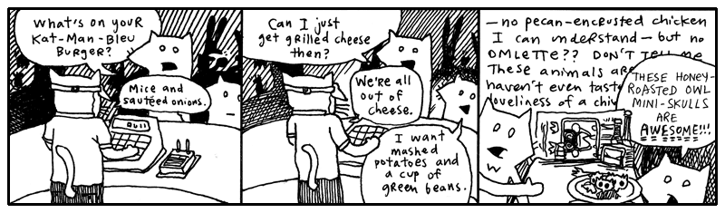

### Method Missing

Don’t you hate it when you yell “Deirdre!” and like ten people answer? That
_never_ happens in Ruby. If you call the `deirdre` method, only one `deirdre`
method answers. You can’t have two methods named the same. If you add a second
`deirdre` method, the first one disappears.

You can, however, have a method which **answers to many names**.


class NameCaller
  def method_missing( name, *args )
    puts "You're calling `#{name}' and you say:"
    args.each { |say| puts "  " + say }
    puts "But no one is there yet."
  end
  def deirdre( *args )
    puts "Deirdre is right here and you say:"
    args.each { |say| puts "  " + say }
    puts "And she loves every second of it."
    puts "(I think she thinks you're poetic.)"
  end
end


When you call the method `deirdre` above, I’m sure you know what will happen.
Deirdre will love every second of it, you and your dazzling poetry.

But what if you call `simon`?

    irb> NameCaller.new.simon( 'Hello?', 'Hello? Simon?' )
    You're calling `simon' and you say:
      Hello?
      Hello? Simon?
    But no one is there yet.

Yes, `method_missing` is like an answering machine, which intercepts your method
call. In Dwemthy’s Array we use call forwarding, so that when you attack the
Array, it passes that attack on straight to the first monster in the Array.


def method_missing( meth, *args )
  answer = first.send( meth, *args )
  # ... snipped code here ...
end


See! See! That skinny little `method_missing` passes the buck!

## 4. So, Let's Be Clear: The Porcupine Is Now To The Sea

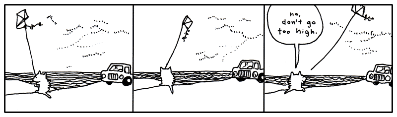

## 5. Walking, Walking, Walking, Walking and So Forth

The evening grew dark around the pair of foxes. They had wound their way through
alleys packed with singing possums, and streets where giraffes in rumpled
sportscoats bumped past them with their briefcases. They kept walking.

And now the stores rolled shut their corrugated metal lids. Crickets crawled out
from the gutters and nudged at the loose change.

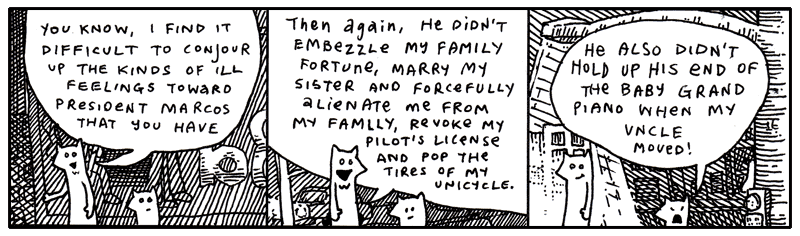

“Anyway, you must admit he’s a terrible President,” said Fox Small. _“Why_ does
President Marcos have a rabbit as Vice President of the Foxes.”

“The Vice President? The rabbit with the _eyebrows_?”

“No, the rabbit with the **huge sausage lips**,” said Fox Small.

But their conversation was abruptly interrupted by a freckly cat head which
popped from the sky just above the sidewalk.

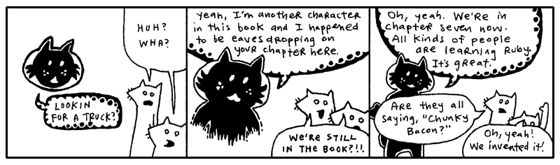

What is this about?!

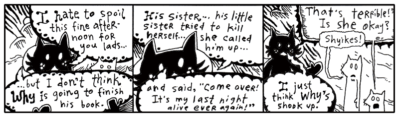

Oh, come on. This is rich. More meta.

I’m not going to bother illustrating this discussion Blixy had with the foxes at
this point! It’s all a **bunch of _conjecture_**. _HOW_ can they presume to know the landscape of my family
drama? I love my sister. For a long time, I _worshipped_ her. (This is my sister
Quil.)

I admit that there was a pretty painful day a few months ago and I kind of
freaked out. I was laid out on the long patio chair by the pool in my mom’s
backyard. I had a Dr. Pepper and a bit of German chocolate cake. I was eating
with a kid fork. Everything else was in the dishwasher, that’s all they had.
Three prongs.

My mom started talking about Quil. All about how much money she was blowing on
pants and purses. A five-hundred dollar purse. And then she said, “She’s losing
it. She sounded totally high on the phone.” (She nailed it on the head, Quil was
smoking dope and loving it.)

So I’d been noticing how observant my mom could be. That’s why, when she said,
“I actually think she’s on cocaine,” I _physically_ stood up and chucked my soda
across the yard.

It sailed off into the woods somewhere. We had been talking awhile, so it was
dark when the can flew. I paced a bit. And then I screamed at the top of my
lungs.

My uncle Mike was standing there with the glass door open, staring at me. He
said something totally nervous like, “Oh, okay. Well, I’ll—” And the tea in his
glass was swishing back and forth, sloshing all over. He disappeared. He’s not
very good at saying things to people. He’s more of a whistler. And resonant.

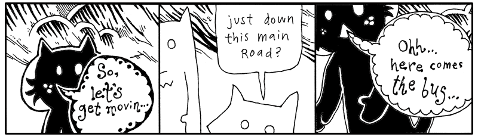

So, to be completely honest, yes, I got a little mad. I got mad. You know. I
dealt with it. Quil calls me regularly. For some stupid reason, I rarely call
her.

Plus, she didn’t end up killing herself. So it’s just not an issue. Who knows if
it was real. She just had a lot of vodka. And she’s little. So it was just scary
to see Quil guzzling it down like that. I mean forcing it down.

But why talk about it? It’ll just make her feel like I’m disappointed. Or like
I’m a jerk.

Well, I got off track there a bit. Where was I? Blix is basically helping the
foxes around, getting them on the trail of their truck. Yeah, back to all that.

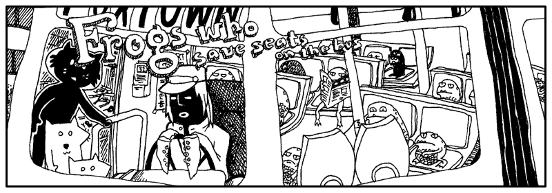

“We can’t squeeze on to this bus,” said the smallest fox.

“Guys, walk on up,” said Blix. “What’s the hold up? Oh, the frogs. Yeah, just
squeeze through.” Blixy pushed from behind.

“Hey,” said the Tall Fox. “I’m crammed on this little step! Somebody move!”

“Did you get through—young fox??” said the cat.

“No,” said Fox Small, “can’t you see? The driver keeps shaking his head and it’s
_really_ making me nervous. I don’t think he wants us on.”

“Go,” said Blix. He stepped down from his step and walked around the bus,
peering through the plexiglass windows. “Well, I don’t know, guys. I dunno. I
guess it’s got a lot of frogs.” He pounded on the window. “Hey! Move over!”

And that’s the reality of riding intercity transit in Wixl. It’s terribly
competitive. The morning bus is so crowded that most white collar animals get
frogs to hold their seat through the nighttime. For whatever reason, it works.
It’s become this staple of their workflow and their economy.

If you can muster up a bit of imagination, you can see a **percent sign** as a
frog’s slanted face. Got the picture in your head? Now let me show you frogs
that camp out inside strings.

    # The %s format is for placing full strings.
    irb> "Seats are taken by %s and %s." % ['a frog', 'a frog with teeth']
      => "Seats are taken by a frog and a frog with teeth." 

    # The %d format is for placing numbers, while the %f format is for
    # floats (decimal numbers).
    irb> frogs = [44, 162.30]
    irb> stats = "Frogs have filled %d seats and paid %f blue crystals." 
    irb> stats % frogs
      => "Frogs have filled 44 seats and paid 162.30 blue crystals." 

    # Formatting is flexible with types, you can pass in strings
    # and format them like numbers.
    irb> frogs = ['44', '162.30']
    irb> stats % frogs
      => "Frogs have filled 44 seats and paid 162.30 blue crystals."

What you are seeing above uses the `%` method in the `String` class. This method
takes **a string** and **an array** and slurps them in together to create a new
string. The items from the list are yanked out (in order) and placed in their
saved seats. It’s the open of the business day and the frogs have done their
job.

    # See, here's the String#% method called like other methods.
    irb> "Please move over, %s.".%( 'toothless frog' )
      => "Please move over, toothless frog" 

    # Now let's call it the prettier way, with the percent sign
    # right between the string and the array.
    irb> "Here is your 1098 statement for the year, %s." % ['teeth frog']
      => "Here is your 1098 statement for the year, teeth frog."

This is also available as the `Kernel::format` method or `Kernel::sprintf`
method. (In the C language, there is a `sprintf` method which operates just like
this.)

    irb> format "Frogs are piled %d deep and travel at %d mph.", [5, 56]
      => "Frogs are piled 5 deep and travel at 56 mph."

For the most part, you’ll only need `%s` (strings), `%d` (integer numbers) or
`%f` (float numbers) format specifiers. The `%p` placeholder will run `inspect`
on an object.

Yeah, so, frog formatting is really handy for building strings that are
assembled from different kinds of data. You can learn all the various kinds of
format specifiers by reading the `ri sprintf` page. I’m just going to give you a
few quick pointers.

Let’s say you have the array but you want the items to appear in **a different
order** in the string. In such a situation, you can identify specific items by
placing a number (`1$` for the first item, `2$` for the second, and so on) right
after the percent sign.

    irb> "This bus has %1$d more stops before %2$d o'clock.  That's %1$d more stops." % [16, 8]
      => "This bus has 16 more stops before 8 o'clock.  That's 16 more stops."

The second tip I have for you is that you can allot a certain number of
characters for each item, a width. And if an item is smaller than the width,
extra spaces will be used before the item, to pad it. If the width is a negative
number, the item will be forced to left and the padding will come after it.

    # Give one item 30 characters of width
    irb> "In the back of the bus: %30s." % ['frogs']
      => "In the back of the bus:                          frogs." 

    # Give one left-justified item 30 characters of width
    irb> "At the front of the bus: %-30s." % ['frogs']
      => "At the front of the bus: frogs                         ."

Fox Small kept looking up at the bus driver. Remember, he wouldn’t enter the
bus!

“What’s the deal?” said Fox Tall. “Can’t you just get on and we’ll just stand in
the aisle?”

“You really want to get on this bus? That driver has no hands,” said Fox Small,
speaking close and hushed to Fox Tall, “and all he has, instead of hands, are
sucker cups.”

<aside class="sidebar" markdown="1">
## More From The Chilling Ongoing Preview of The Scarf Eaters

(_from Chapter XII: Thank Heaven for Little Men_.)

“Close the door,” Spencer repeated, but Lara’s hand trembled and she fumbled
sloppily at the latch. Her dad hadn’t taught her to close doors like this one.

“Yes, it’s an unusual door,” said Brent. He walked over and closed the door for
her. Then, he held her hand and looked into her eyes. His eyes lit up like huge
matchsticks that would be too huge to be practical. “It’s an unusual handle,
which ensures that those who don’t eat scarves stay out.”

“Sit down, everyone,” Spencer demanded, as he bounded across the room and took
command. “I command this organization,” he stated. “The secret organization of
The Scarf Eaters!”

The torches encircling the room blazed like invincibly huge matches and the
handful of teenagers sat. Except for Spencer who stood high and mighty, drawing
all the oxygen in the entire room into his nostrils before speaking.

“One of us,” he said, dramatically and invincibly, “is missing!”

The entire room gasped, which also used oxygen. The room was abuzz. “Who?”
“How?” “Who was it?” Nobody knew. Except for Spencer, who leapt across the room
and took charge.

“Our dear friend Steve Bridell has been stolen from us,” announced Spencer in a
deafeningly loud voice, as if thousands of giant matchsticks were struck against
a brittle surface in unison amidst a pile of oxygen. “Steve Bridell. Do any of
you know Steve Bridell?”

The hall was silent.

Spencer continued. “Steve Bridell was an incredible resource and you all knew
him and loved him. He carved this enormous wooden man we use as our podium.”
Spencer pointed. “He also made the set of wooden cymbals that are back in our
instrument closet right now.”

Some of the audience stood.

“Wait,” instructed Spencer. “Don’t go back there. I’ve already checked. The
cymbals are gone!”
</aside>

“So what? You don’t think animals with tentacles can drive?”

“Well, not only is he going to flub up the steering wheel but he has all these
legs all over the foot pedals. This is not smart. Let’s get another bus. Come
on.”

“You know, he’s probably been driving like that all day. Is he really going to
start crashing at this point in his career?”

“Buses do crash,” said Fox Small. “Some do. This smells crashworthy.”

“Sheer doo-doo!” And Fox Tall yelled to the driver, “Hey, cabby, how long have
you been driving this bus for?”

The bus driver peered over darkly under his cap and started to turn toward them,
but his tentacles were stuck to the wheel. He jerked swiftly at his forelegs
and, failing their release, he turned to the wheel and focused his energies on
milking his glands for some slicker secretions. Bubbles of mucus oozed.

“Let’s get outta here,” said Fox Tall and the two ran off into the street,
slamming right into the cat Blix.

“Alright, well, the bus is full,” said Blix. “I don’t know why the driver
stopped if he knew the bus was crammed with hoppers.”

“We’re thinking he was about to crash into us,” said Fox Tall, “and he opened
the door to make it look like a planned route stop.”

“Keep in mind, Blix, we hadn’t really discussed that possibility out loud, so I
haven’t had a chance to formally agree,” said Fox Small. “Nevertheless, it
sounds rational to me.”

“I’m thinking all the buses are going to be full like this.” Blix bit his lip,
thinking and flicking his eyes about. “Let’s just—”  He pointed down the
circuitry of apartment buildings that wound to the south.  “But maybe—” He
looked up and surveyed the stars, scratching his head and counting the
constellations with very small poking motions from the tip of his finger.

“Are you getting our bearings from the stars and planets?” asked Fox Small.

Blix didn’t speak, he ducked off to the north through a poorly laid avenue back
behind the paint store. But before we follow them down that service road,
Smotchkkiss, I have one more frog for you, perched on a long lilypad that
stretches out to hold anything at all.

    irb> cat = "Blix"
    irb> puts "Does #{ cat } see what's up?  Is #{ cat } aware??"
      => "Does Blix see what's up?  Is Blix aware??"

The little frogs from earlier (`%s` or `%d`) were only placeholders for single
strings. Saving places in the string.

The lilypads above start with a flower bud, the **octothorpe**. You’ve also seen
it as a pound sign on telephones. After the flower bud, two leaves form the
edges of the lilypad. The leaves are **curly braces**, also seen many times
before as the _crab pincers_ for a code block.

An empty lilypad `"#{}"` becomes an empty string `""`.

When the lilypad is found in a **double-quoted** string, Ruby runs any code
found in between the two leaves of the lilypad. The lilypad is lifted out and
the result of the code is placed there in the string. This lilypad swap is
called _string interpolation_.

    irb> fellows = ['Blix', 'Fox Tall', 'Fox Small']
    irb> puts "Let us follow #{ fellows.join ' and ' } on their journey." 
      => "Let us follow Blix and Fox Tall and Fox Small on their journey."

The lilypad is very durable and can hold any kind of code inside. Above we are
using `Array#join`, but you can do anything you like inside. Call object
methods, conditional `if` or `case` statements, even define classes.

    irb> blix_went = :north
    irb> puts "Blix didn't speak, he ducked off to the #{ blix_went } through #{
                if blix_went == :north
                  'a poorly laid avenue behind the paint store'
                elsif blix_went == :south
                  'the circuitry of apartment buildings'
                else
                  '... well, who knows where he went.'
                end }.  But before we follow them..." 
    => "Blix didn't speak, he ducked off to the north through a poorly laid avenue
        behind the paint store.  But before we follow them..."

The foxes followed Blixy off behind the paint store and down the cracked, uneven
asphalt. All of the stores on the dilapidated lane leaned at angles to each
other. In some places, slabs of sidewalk jutted up from the ground, forming a
perilous walkway, a disorderly stack of ledges. Almost as if the city planners
had hoped to pay tribute to the techtonic plates. One small drug store had slid
below the surface, nearly out of eyesight.

Truly, it was colorful, though. The paint store had been tossing out old paints
directly onto its neighbors. The shops nearest the paint store were clogged with
hundreds of colors, along the windowsills and in the rain gutters. Yes, on the
walls and pavement.

Basically, beginning with the back porch of the paint store, the avenue erupted
into a giant incongruous and poorly-dyed market.

Further down, a dentist’s office was primed with red paint and, over that, a
fledgling artist had depicted a large baby who had fallen through a chimney and
arrived in a fireplace full of soot. Crude black strokes marked the cloud of
ashes raised during impact, easily mistaken for thick hair on the child’s arms
and back. The child looked far too young to have much hair, but there they were:
rich, blonde curls which toppled liberally from the child’s head. Under the
child’s legs was painted the word _BREWSTER_.

The same artist had hit the library next store and had hastily slapped together
a mural of a green sports car being pulled from the mud by a team of legless
babies tugging with shiny chains. Again, the drastically blonde curls!

“I need answers,” said the Fox Tall, who had ground to a halt in front of the
scenery.

“I’m starting to believe there’s no such thing,” said Fox Small. “Maybe these
are the answers.”

“Brewster?” said Fox Tall. He walked nearer to the library and touched the cheek
of one of the legless children who was closer in perspective. The child’s cheek
appeared to contain a myriad of jawbones.

Blix was another two houses down, navigating through the askew brickwork, the
paved gully that led to _R.K.’s Gorilla Mint_, as the metallic sticker on the
door read. The building was plastered with miniature logos for the variety of
payment options and identification acceptable at _R.K.’s Gorilla Mint_. Even the
bars over the window were lined with insurance disclosures and security warnings
and seals of government authorization, as well as addendums to all of these,
carbon paper covering stickers covering torn posters and advertising. And all
mingled with paint splashes that intruded wherever they pleased.

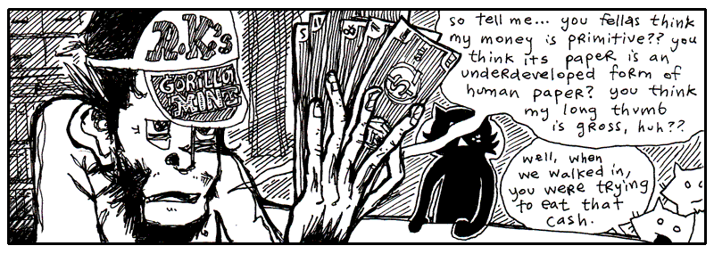

“I like the way the fresh paper feels against my tongue,” said the gorilla at
the counter. His fingers rubbed quietly against the bills. He drew his face near
to the fanned currency and whisked his nose along the pulpy cash.

“Is R.K. in this evening?” asked Blix.

“R.K. is not,” said the gorilla cashier. He turned to the three travelers and
spread his money out on the counter’s surface, evenly spacing them apart and
lining up all the edges neatly. “Now, which one of these do you think is worth
the most?”

The foxes looked over the different bills and Fox Small muttered to himself,
“Well, maybe—no, but I’ll bet—Wait, does one of these have bananas on it? ‘Cause
that one—nope, no fruit or rope swings or—Terrible, this is difficult!” And in a
lower voice, “So difficult to read. What does this one say? Symbols or
something? If all these bills have are symbols, it’s going to be impossible for
us to figure out which one is of the greatest value.”

“That’s why I said, ‘_Guess_.’” The gorilla tapped each bill in order. “See,
you’ve got a 1 in 5 chance.”

“Unless the symbols mean something,” said Fox Tall. “Unless we can figure it
out.”

“We can figure it out,” said Fox Small.

“No,” said the gorilla. “The symbols are meaningless.”

“Whoever created the money intended some meaning for them,” said Fox Small. “Why
use _this_ symbol?” He pointed to an ampersand printed in dark ink.

“Yeah, we saw you sniffing the money and fantasizing about it back there,” said
Fox Tall. “I’ll bet these symbols mean all kinds of things to you!”

“No, I don’t think so,” said the gorilla.

If I can weigh in at this point, I think the symbols do have meaning. They may
not be _loaded_ with meaning, it may not be oozing out through the cracks, but
I’m sure there’s a sliver of meaning.

    irb> $:
      => ["/usr/lib/ruby/site_ruby/1.8", "/usr/lib/ruby/site_ruby/1.8/i686-linux",
          "/usr/lib/ruby/site_ruby", "/usr/lib/ruby/1.8",
          "/usr/lib/ruby/1.8/i686-linux"]

Variables which start with the American cash sign are global variables. They can
be seen from anywhere in the program, **from inside any scope**. (Dr. Cham used
this variable while snooping around The Originals’ computer bay.)

So why does the **cash sign followed by a colon** represent an array of **all
directories where Ruby will search when you try to load a file with `require`**?
The cash sign means “global.” But why the colon?

Historically, on many operating systems, a list of directories contains colons
which separated each entry. I like to see the colon as a pair of eyes, scanning
the directories for files. We store our lookout list behind the eyes.

Here’s a few more special global variables:

    irb> $"      # The $" variable contains all files which have been loaded with `require'
      => ["irb.rb", "e2mmap.rb", "irb/init.rb", ... "rbconfig.rb"]
                 # These files are stored somewhere else, but their code is being used
                 # in this program.  Much like quoting someone else's work -- these are the
                 # footnotes -- hence the double-quote.

    irb> $0      # The $0 variable contains the running program's filename.
      => "irb"   # A zero can be considered the beginning of a number count.
                 # This variable answers the question, "Where did this program begin?" 

    irb> $*      # The $* variable contains all the arguments passed into a program.
      => ['--prompt', 'simple']
                 # This one is easy to remember, if you remember that Ruby methods
                 # also use the asterisk to capture arguments into an array.

    # The $! contains the current exception raised.
    # The exclamation indicates a state of alarm.  An exception!
    irb> begin
    irb>   raise TypeError, "I don't believe this information." 
    irb> rescue
    irb>   p $!
    irb> end
      => #<TypeError: I don't believe this information.>

    # The $@ contains the current backtrace, if an exception was raised.
    # The backtrace shows were Ruby was _at_ when the exception fired.
    irb> begin
    irb>   raise TypeError, "I don't believe this information." 
    irb> rescue
    irb>   p $@
    irb> end
      => ["(irb):25:in `irb_binding'", "/usr/lib/ruby/1.8/irb/workspace.rb:52:in `irb_binding'", 
          "/usr/lib/ruby/1.8/irb/workspace.rb:52"]

“I don’t remember you.” Blix looked at the gorilla with great interest. “Are you
one of R.K.’s kids or something?”

“Oh, come on!” said Fox Small, holding up a bill with an exclamation mark on it
up to the gorilla’s nose. “Don’t tell me this means _nothing_ to you! This one
is probably _really important_ since it has an exclamation on it. Maybe it pays
for emergency stuff! Hospital bills or something!”

**“Yeah, surgery!”** said Fox Tall.

The gorilla looked at the foxes with disgust from under the brim of his cap.
“No, you’re wrong. You can’t pay for surgeries with that.”

“But you see our point,” said the small fox. He grabbed some of the other bills.
“And you say this bill _cannot_ pay for surgeries? Well that sounds like it has
a specific _non-surgery-related_ purpose. Now, the question mark one. Oh, what
would that one be for?”

“Hey, give me those,” the gorilla snatched at the bills over the counter, but
his long thumb kept getting in the way and every time he thought he had grabbed
bills, it turned out he had only grabbed his long thumb.

“Hey, hey, look, he’s mad,” said Fox Tall, happily clapping. “I wonder why. Did
you notice how mad he started getting once we mentioned all these interesting
meanings? **We’re on to you! We figured out your game so fast!”**

“We totally did!” said Fox Small, one of his elbows caught in the grip of the
gorilla, the other arm waving a bill that featured an underscore. “This one’s
for buying floor supplies, maybe even big rolls of tile and linoleum.”

“See,” said Fox Tall, working to pry the gorilla’s fingers free, “we just have
to figure out which is more expensive: surgery or linoleum! This is _so easy!”_

**“NO IT’S NOT!”** yelled the gorilla, yanking at the
smaller fox and battering the fox with his palms. **“YOU DON’T KNOW ANYTHING ABOUT MONKEY
MONEY!! YOU DON’T EVEN _HAVE_ YOUR OWN KINDS OF MONEY!!”**

“We could _easily_ have our own kinds of money!” said Fox Tall, taking the
chimp’s hat and tossing it to the back of the room, where it sailed behind a
wall of safety deposit boxes. “And—_your hat is outta here!_“

“Come on, give him back his bills,” said Blix, waving his arms helplessly from
the sidelines. “We could really use this guy’s help.”

“Stop hitting me!” screamed the littlest fox. “I’ve almost figured out this one
with the dots on it!!”

Suddenly, with great precision and without warning, Fox Tall grabbed the
monkey’s nose and slammed his face down against the counter. The pens and
inkpads on its surface rattled and “Bam!” said the fox. The gorilla’s eyes spun
sleepily as his arms… then his neck… then his head slithered to the floor behind
the counter.

Here are a few more global variables you might care to use:

    irb> $/      # The $/ is the line separator, it is normally set to \n, which represents _Enter_
      => "\n"    # or "end of line".  The slash represents a sword slashing lines in a file.

    # The line separator controls how methods like each_line or readlines breaks up strings.
    irb> "Jeff,Jerry,Jill\nMichael,Mary,Myrtle".each_line { |names| p names }
      => "Jeff,Jerry,Jill\n" 
      => "Michael,Mary,Myrtle" 

    # If you change the line separator, you change how many methods work, such as each_line.
    # See what happens when I change the line separator to a comma.
    irb> $/ = ','
    irb> "Jeff,Jerry,Jill\nMichael,Mary,Myrtle".each_line { |names| p names }
      => "Jeff," 
      => "Jerry," 
      => "Jill\nMichael," 
      => "Mary," 
      => "Myrtle" 

    irb> $,     # The $, variable is the join separator, used when joining strings with
      => nil    # Array#join or Kernel::print.  The comma is a common join character.

    # The join separator is normally empty.
    irb> ['candle', 'soup', 'mackarel'].join
      => "candlesoupmackarel" 
    irb> $, = ' * '; ['candle', 'soup', 'mackarel'].join
      => "candle * soup * mackarel" 

    # But, usually, you won't need the global variable.
    irb> ['candle', 'soup', 'mackarel'].join ' # '
      => "candle # soup # mackarel" 

    irb> $;     # The $; variable is the split separator, used when splitting strings
      => nil    # with String#split.

    # The split separator is normally empty, which means String#split will separate
    # the string where there is whitespace.
    irb> "candle  soup\nmackarel".split
      => ["candle", "soup", "mackarel"]
    irb> $; = 'a'; "candle  soup\nmackarel".split
      => ["c", "ndle  soup\nm", "ck", "rel"]

    # But, usually, you won't need the global variable.
    irb> "candle # soup # mackarel".split ' # '
      => ['candle', 'soup', 'mackarel']

Outside the _Gorilla Mint_, Blix scolded the foxes. “We could have used that
guy’s help! If he knows where R.K. is, we could use his cunning!”

“**We don’t need that ape’s money!**” said Fox Small. “**We can make our _own_
money!**“

“**We could support electronic wristbands!**” said Fox Tall.

“His money is worthless,” said Blix. “It’s gorilla money. It has no value. It’s
worse than blue crystals.”

“But it serves a purpose,” said Fox Tall.

“No it doesn’t,” said Fox Small. “He just said it’s worthless.”

“But what about linoleum and surgeries?” said Fox Tall.

“Yeah,” said Fox Small, up at Blix. “What about linoleum and surgeries?”

“If all the hospitals were staffed by gorillas and all the home improvement
chains were strictly operated by gorillas,
then—YES—you could buy linoleum and surgeries. But I
_guarantee_ that you would have very sloppy linoleum and very hideous surgeries.
I don’t think you’d make it out of that economy alive.”

“So, if R.K. is so cunning,” said Fox Tall, grinning slyly, “why does he print
such worthless currency?”

“It’s a cover for other activities,” said Blix. “Besides, if you’re so smart,
why did you resort to violently pounding that poor gorilla?”

“I guess that was a bad play,” said Fox Tall, hanging his head. “My friend here
will tell you that I’ve been on edge all day.”

“And your rage finally reared its fuming snout!” said Fox Small. “You’re finally
living up to your goatee.”

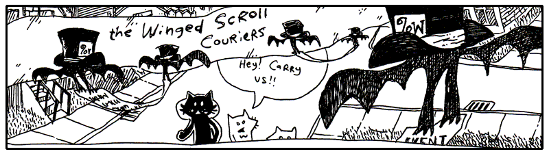

Down the lanes they travelled, the two foxes oblivious to their direction, but
having a good time now that they had Blix leading the way with such urgency.
They lapsed into a careless wandering right behind Blix and spent their
afternoon heckling most of the passersby.

One such target of their ongoing commentary was The Winged Scroll Carriers,
pairs of bats that carry documents which need to be immediately sworn and
notarized. There can be no delay, they must go swift, there is not even time to
roll up the scroll, no, they must drop their swiss cheese and be out the door.

These couriers resemble a kind of Ruby construct called **delimited types**. A
long series of characters comprises the scroll, flanked on each side by a bat
bracing its curly wings to hold the scroll together. The opening bat wears a hat
on which is written `%w`, which identifies the scroll as a set of words.

    irb> bats = %w{The Winged Scroll Carriers}
      => ['The', 'Winged', 'Scroll', 'Carriers']

The `%w` bats and their scroll, when fed into Ruby, emerge as an array of words.
This syntax is a shortcut in case you don’t want to go through the trouble of
decorating each word with commas and quotes. You are in a hurry, too, there can
be no delay. You jot out the words between the bats and let Ruby figure out
where to cut.

Other bats, other hats. For instance, the `%x` hat runs an external program.

    irb> %w{ruby --help}
      => ["ruby", "--help"]
    irb> %x{ruby --help}
      => "Usage: ruby [switches] [--] [programfile] [arguments] ..."

My favorite is the `%Q` hat, which can also be written as just `%`. This acts
just like a double-quoted string, but looks nice when used with strings that
run-on for many lines. Like, say you’re adding a new method with `eval`.


m = "bats!"
eval %(
  def #{ m }
    puts "{" * 100
  end
)


Just like a double-quoted string, you can use the string interpolation lilypads
inside.

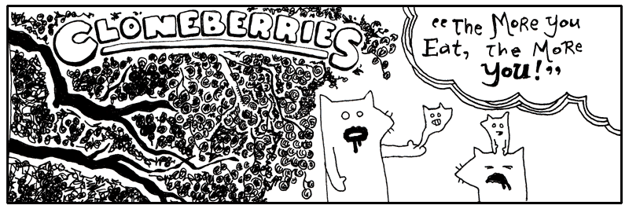

Blixy wagged his head. “Oh, dear me.”

“Egads! My hand is pregnant,” said Fox Tall, watching the little fox embryo
slide about in his palm.

“They are good berries, though,” said Blix. “The wine they make from these
berries will make ya grow a few eyeballs in your teeth. But no more than that.”

“Ah, pain!” yelled Fox Small, as his miniature squeezed out through the pores in
his scalp. But soon he was cradling his little self and murmuring lullablies.
_Nevermore, nevermore, sweetly sang the nightingale. Winking starlight, sleeping
still, whilst perched on a Sycamore stump._

Making duplicates of Ruby objects is no more than a berry’s worth of code.

    irb> tree = [:berry, :berry, :berry]
      => [:berry, :berry, :berry]
    irb> treechild = tree.clone
      => [:berry, :berry, :berry]

The `clone` method makes an exact copy of a Ruby object. How does this differ
from regular assignment?

    irb> tree_charles_william_iii = tree
      => [:berry, :berry, :berry]

Assigning object to variables only creates more nicknames. The above Array can
be called `tree_charles_william_iii` now. Or the shorter `tree`. The same
object, but different names.

However, a clone is a copy of an object. You can modify it without affecting the
original.

    irb> treechild << 'flower'
      => [:berry, :berry, :berry, 'flower']
    irb> tree
      => [:berry, :berry, :berry]

The `clone` method doesn’t make copies of everything attached to the object,
though. In the array above, only the array is copied, not all the symbols and
strings inside.

You may also see the `dup` method used to copy objects. The `dup` method makes
copies which aren’t as exact. For example, there are objects in Ruby which are
“frozen” and can’t be altered. If you `clone` the object, you get an exact copy
which is also frozen. If you use `dup`, you get an unfrozen copy that you can
change if you like.

The `clone` method also copies the metaclass of an object, whereas `dup` does
not.

    irb> o = Object.new
    irb> class << o
    irb>   def nevermore; :nevermore; end
    irb> end
    
    irb> o.clone.nevermore
      => :nevermore
    irb> o.dup.nevermore
    # NoMethodError: undefined method `nevermore' for #<Object:0xb7d4a484>
    #         from (irb):7

You don’t always need to make copies of objects, though, since many methods like
`collect` and `gsub` and `format` make copies for you as part of their work.

Over the hills and down the valleys, they ran through the grass where the Deer
of the Smoky Pink Puffing roam. The sun was obscured by the lumbering pink
clouds, emblazened with deer language, tinting the horizon a gradient of
grapefruit and secreting a glow over the meadow. The clouds slid past each
other, some bobbing upwards, destined for Canadian relatives. Others landing a
readable distance from a recipient’s hooves.

“Let’s stop! _Please!_” yelled Fox Tall. “You can’t expect us to run in this
**unbreathable fluff!**“

“Why are you yelling?” said Blix, as a thin stratus telegram wafted behind his
legs. “You don’t need to raise your voice above a whisper. These long skinny
clouds are usually just a mumble or a sigh. They may not even make it all the
way.”

<aside class="sidebar" markdown="1">
## Steaks ‘n’ Slides

My uncles love waterslides and they also love steakhouses. They have these
waterslide days which are directly followed by a trip over to Joey’s Steakhouse.
I _hate_ Joey’s Steakhouse. It’s all big, brown shoe meat. Floppy and galoshy.
Mixed with the stench of the uncles’ chlorine.

Pruny fingers on meat slabs is The Revolting.

It’s time for steaks and waterslides to come together in a truly repugnant
manner. My uncles have had steaks and waterslides their whole lives. The dynasty
of steaks and waterslides must come to a close. I will marry them in ways
against nature!

Like this:

* Hand steaks to riders as they board the waterslide. Rider looks at the
  lifeguard. Lifeguard says wait. Rider looks again. The lifeguard pauses. Then.
  Okay, it’s time. _Go, kid, go!_ And the look on that kid’s face as he rushes
  down the slope, paws full of chuck! _Go, kid, go!_
* Kids slide on top of steaks. For safety, we’d want the slides stacked five
  steaks deep.
* Or, steaks do the sliding. In their own little swim trunks.
* Or, people. With steak swim trunks.
* People and steaks, side-by-side.
* Steaks travelling down waterslides composed of steaks.
* Steaks travelling down waterslides made of people.
* And, of course, people eating steaks, but their tongues come out as
  waterslides and they have to push the steaks up the waterslides. Which is
  impossible and a lifeguard has to climb up the waterslide and manually insert
  the steak into the esophagus.
* Waterslides eating people and steaks eating people.
* Waterslides and steaks becoming friends after smelling people on each other’s
  breath.
* Or, steaks befriending waterslides, but waterslides not reciprocating.
  Waterslides become increasingly despondent and detached, getting into bad
  crowds and sinking into political extremity. Steaks make ankle bracelets out of
  people and leave them in the waterslides’ trouser pockets, when the trousers are
  unattended. They sneak out of the waterslide commune via a huge waterslide made
  of steak swim trunks.
* Or, like I said, people with steak swim trunks.
</aside>

“All that writing on the cloud is deer talk?” said Fox Small.

“Help! _Where are you guys?_” The taller fox ducked through a stormy tirade
comprised of thick, billowing smoke and sharp wisps. He whirled in every
direction, “Somebody yell if you’re there!”

He searched for a fissure in the dense matter, combing forward with his hands.
The verbose, angry clouds responded by prodding him ahead, forcing him into
tight corners in their brief pause between sentences. He landed in a sinkhole
and kept his head down as the cascades of smoke surged forward.

“Yeah, deer can read this stuff,” said Blix. “They just face their target and
shoot it out of their nostrils. I once heard of a guy who **rode** a stag’s love
poem.”

“No way,” said Fox Small.

“Yep,” said Blix. “And that guy was me.” Blix reached over his shoulder and
latched onto a spiral column of smoke that was twisting just above his head.
“You just have to know which clouds are wimpy and which clouds are
grandiloquent.” Blix let the cloud pull him along and when the cloud banked
upwards, Blix loosed his grip and kept his feet moving slowly along the ground.
“See, here’s a good one, long like a broom handle. A guy found one once and it
was shaped _exactly_ like a car: windshield, driver’s side airbag, power
steering. Uncanny!”

“_And that guy was—_“

**“It was!”** And Blix climbed up atop the long icy cloud, with its dangling
glyphs, and stood proudly, floating high above the small fox’s pointy shadow.

“Oh, I could do that,” said Fox Small. “Tall and I go jetskiing all the time.
_I’ve stood up on my jetski._ It’s just like that.”

Fox Tall dashed through a descending puff, shattering its sentence, which
letters came unglued and littered the ground with scrambled words, but he had
only succeeded in reaching the depressive portions of the deer correspondence,
which manifested itself as a dank and opaque mist.

Meanwhile, his smaller counterpart grabbed a narrow train of smoke that passed
under his arm. He was airborned and yelled, **“Tallyho!”** But he held too
tightly and the cloud evaporated under his arm and sent him back down with a
short hop.

Since you’re just beginning your use of Ruby, you may not fully grasp regular
expressions (or _regexps_) at first. You may even find yourself clipping out
regexps from the [Regular Expression Library][1] and pasting them into your code
without having the foggiest idea why the expression works. Or _if_ it works!


loop do
  print "Enter your password: "
  password = gets
  if password.match( /^\w{8,15}$/ )
    break
  else
    puts "** Bad password! Must be 8 to 15 characters!"
  end
end


Do you see the unreadable deer language in the example code? The `/^\w{8,15}$/`
is a regular expression. If I may translate, the regexp is saying, _Please only
allow letters, numbers or underscores. No less than eight and no more than
fifteen._

Regular expressions are a mini-language built into Ruby and many other
programming languages. I really shouldn’t say _mini_, though, since regexps can
be twisted and complicated and much more difficult than any Ruby program.

Using regular expressions is extremely simple. It is like the Deer: making the
smoke is an arduous process. But hooking your elbow around the smoke and driving
it to the Weinerschnitzel to get mustard pretzel dogs is easy.

    irb> "good_password".match( /^\w{8,15}$/ )
      => #<MatchData:0xb7d54218>
    irb> "this_bad_password_too_long".match( /^\w{8,15}$/ )
      => nil

The `String#match` method is the _simplest practical use_ of regexps. The
`match` method checks to see if the string meets the rules inside the regexp. A
regexp is only useful with strings, to test strings for a series of conditions.
If the conditions are met, a `MatchData` object is returned. If not, you get
`nil`.

The most basic regular expressions are for **performing searches** inside
strings. Let’s say you’ve got a big file and you want to search it for a word or
phrase. Since a bit of time has passed, let’s search the Preeventualist’s Losing
and Finding Registry again.


require 'preeventualist'
PreEventualist.searchfound( 'truck' ) do |page|
  page.each_line do |line|
    puts line if line.match( /truck/ )
  end
end


This isn’t too different from the code we used earlier to search for lines with
the word “truck”. Earlier we used `puts line if line['truck']`, which is
actually a simpler way of searching a string, if you’re just looking for a
simple word. The regexp `/truck/` is identical. Find the word “truck”. Anywhere
in the string.

Uhm, what if truck is capitalized. **Truck.** What then?


puts line if line.match( /[Tt][Rr][Uu][Cc][Kk]/i )


The **character classes** are the sections surrounded by **square brackets**.
Each character class gives a list of characters which are valid matches for that
spot. (The first spot matches either an uppercase `T` or a lowercase `t`. The
second spot matches an `R` or an `r`. And so on.)

But a simpler way to write it is like this:


puts line if line.match( /truck/i )


The letter `i` modifier at the end of the regexp indicates that the search is
**not case-sensitive**. It will match Truck. And TRUCK. And TrUcK. And other ups and downs.

Oh, and maybe you’re truck is a certain model number. A
T-1000. Or a T-2000. You can’t remember. It’s a T _something_ thousand.


puts line if line.match( /T-\d000/ )


See, deer language. The `\d` represents a **digit**. It’s a place holder in the
regexp for any type of number. The regexp will now match T-1000, T-2000, all the
way up to T-9000.

<table>
		<tr>
			<td colspan="3"><strong>Character Classes</strong> </td>
		</tr>
		<tr>
			<td> <code>\d</code> </td>
			<td> matches digits </td>
			<td> can also be written <code>[0-9]</code> </td>
		</tr>
		<tr>
			<td> <code>\w</code> </td>
			<td> matches word characters (letters, numbers and the underscore) </td>
			<td> can also be written <code>[A-Za-z0-9_]</code> </td>
		</tr>
		<tr>
			<td> <code>\s</code> </td>
			<td> matches whitespace (spaces, tabs, carriage returns, line feeds) </td>
			<td> a.k.a. <code>[ \t\r\n]</code> </td>
		</tr>
		<tr>
			<td> <code>\D</code> </td>
			<td> matches everything <em>but</em> digits </td>
			<td> a negated set <code>[^\d]</code> </td>
		</tr>
		<tr>
			<td> <code>\W</code> </td>
			<td> matches everything <em>but</em> word chars </td>
			<td> just like <code>[^\w]</code> </td>
		</tr>
		<tr>
			<td> <code>\S</code> </td>
			<td> matches everything <em>but</em> whitespace </td>
			<td> also <code>[^\s]</code> </td>
		</tr>
		<tr>
			<td> <code>.</code> </td>
			<td> the period matches <strong>everything</strong>. </td>
		</tr>
	</table>

Building a regexp involves chaining these placeholders together to express your
search. If you’re looking for a number, followed by whitespace: `/\d\s/`. If
you’re looking for three numbers in a row: `/\d\d\d/`. **The opening and closing
slashes mark the beginning and end of the regexp.**

A search for three numbers in a row can also be written as: `/\d{3}/`.
Immediately following a character class like `\d`, you can use a quantifier
symbol to mark how many times you want the character class to be repeat.

<table>
		<tr>
			<td colspan="3"><strong>Quantifiers</strong> </td>
		</tr>
		<tr>
			<td> <code>{n}</code> </td>
			<td> match exactly <em>n</em> times </td>
			<td> Precisely three numbers in a row is <code>/\d{3}/</code> </td>
		</tr>
		<tr>
			<td> <code>{n,}</code> </td>
			<td> matches <em>n_ times or _more</em> </td>
			<td> Three or more letters in a row is <code>/[a-z]{3,}/i</code> </td>
		</tr>
		<tr>
			<td> <code>{n,n2}</code> </td>
			<td> matches at least <em>n_ times but no more than _n2</em> times </td>
			<td> So, <code>/[\d,]{3,9}/</code> matches between three and nine characters which are numbers or commas </td>
		</tr>
		<tr>
			<td> <code>*</code> </td>
			<td> the asterisk <code>*</code> is short for <code>{0,}</code> </td>
			<td> To match a colon, followed by zero or more word characters: <code>/:\w*/</code> </td>
		</tr>
		<tr>
			<td> <code>+</code> </td>
			<td> the plus is short for <code>{1,}</code> </td>
			<td> To match one or more minus or plus signs, use <code>/[-+]+/</code> </td>
		</tr>
		<tr>
			<td> <code>?</code> </td>
			<td> the question mark is short for <code>{0,1}</code> </td>
			<td> To match three numbers followed by an optional period: <code>/\d{3}[.]?/</code> </td>
		</tr>
	</table>

A really common regular expression is for matching phone numbers. American phone
numbers (including an area code) can be matched using the digit character class
and the precise quantifiers.

    irb> "Call 909-375-4434" =~ /\d{3}-\d{3}-\d{4}/
      => 5
    irb> "The number is (909) 375-4434" =~ /[(]\d{3}[)]\s*\d{3}-\d{4}/
      => 14

This time, instead of using `match` to search for the expression, the `=~`
operator was used. This operator is the **match operator**, an equals sign
followed by **a tilde**. The tilde is like a bit of smoke coming off the edge of
a smokestack. Remember the deer, the smoke they blow, a cryptic language just
like regular expressions. The smoky tilde points toward the regexp.

The match operator returns a number. The number is the spot in the string where
the regular expression matched. So when the match operator returns `5`, it’s
saying, “Before the match, there are five characters in the string.”

If you need to get the full string matched, you can use the special `$&` global
variable if you’re using the match operator. Or, if you’re using the `match`
method, you can get the full string by converting the `MatchData` object to a
string.

    # Using =~ and $& together.
    irb> "The number is (909) 375-4434" =~ /[(]\d{3}[)]\s*\d{3}-\d{4}/
      => 14
    irb> $&
      => "(909) 375-4434" 
    
    # Using the MatchData object.
    irb> phone = /[(]\d{3}[)]\s*\d{3}-\d{4}/.match("The number is (909) 375-4434")     
      => #<MatchData:0xb7d51680>
    irb> phone.to_s
      => "(909) 375-4434"

Most Rubyists prefer the second approach, as it uses an object within a _local
variable_ rather than a _global variable_. Global variables are kind of sketchy,
since they can be easily overwritten. If you run two regular expressions in a
row, the global variable gets overwritten the second time. But with local
variables, you can keep both matches around as long as the variables are named
differently.

Other than matching, another common use of regular expression is to do
**search-and-replace** from within Ruby. You can search for the word “cat” and
replace it with the word “banjo.” Sure, you can do that with strings or regexps.

    irb> song = "I swiped your cat / And I stole your cathodes" 
    irb> song.gsub 'cat', 'banjo'
      => "I swiped your banjo / And I stole your banjohodes" 
    
    irb> song.gsub /\bcat\b/, 'banjo'
      => "I swiped your banjo / And I stole your cathodes"

The `gsub` method is named for “global substitution.” Notice how in the first
example it replaced the word “cat” and the first three letters of “cathodes.”
Strings also have a simple `sub` method which will substitute only once.

And so this chapter ends, with Blix and the Foxes cruising aloft the solid pink
belched from a very outspoken deer somewhere in those pastures.

## 6. Just Stopping To Assure You That the Porcupine Hasn't Budged

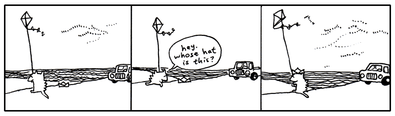

## 7. I'm Out

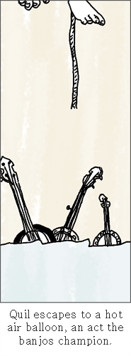

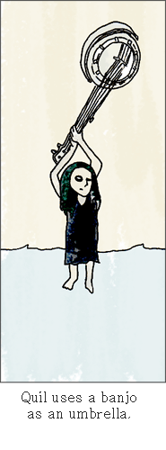

One day, back around the time I met Bigelow (that dog who walked off with the
balloons), I came back to my apartment hauling some board games I’d bought at a
garage sale. And Quil was on my porch. Which stunned me since she’d been in San
Antonio for like three years. She was sleeping in a sleeping bag on my porch.

She had run out of money to go to art school, so she stayed at my place for five
months or so.

I found this used bunkbed for our place. At night we’d sit in our beds and read
each other stories from our notebooks. I was writing a book about a kid who’s a
detective and he’s trying to figure out who killed this kid on his tennis team
and all these animals end up helping him figure it out. She was writing a book
about this kid who puts an ad in the classifieds to get other kids to join his
made-up cult and they end up building a rocket ship. But during most of her book
these kids are lost in the woods and pretty directionless, which I got a kick
out of hearing each night.

Yeah, each night it was poetry or stories or ideas for tricking our neighbors.
Our neighbor Justin was a big fan of Warhammer and he had all these real swords
and tunics. We decided to make suits of armor out of tin foil and go attack his
apartment. We started ransacking his apartment and he loved it. So he made his
own suit of armor out of tin foil and we all went to a professional glamour
studio and had a quality group shot taken.

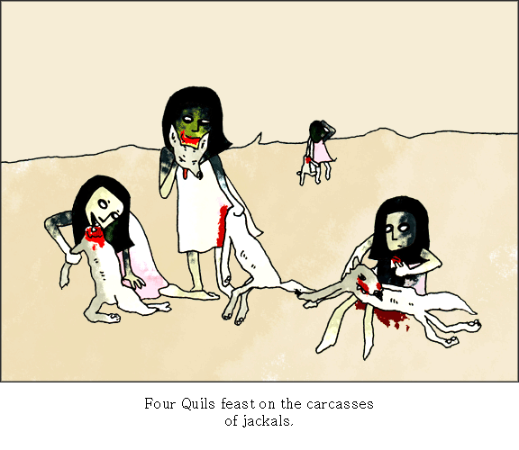

I’m not saying my life is any better than yours. I just miss my sister. Life
isn’t like that now. We’re dissolved or something.

I don’t know. I’m confused. Is this growing up? Watching all your feathers come
off? And even though some of those feathers were the most lovely things?

I’m having a hard time telling who stopped it all up. Who stopped loving who?
Did I stop caring? Maybe I only saw her in two-dimensions and I didn’t care to
look at the other angles. I only saw planes. Then she shimmied up the z-axis
when I wasn’t looking and I never did the homework to trace the coordinates. A
limb on a geometrical tree and I am insisting on circles.

Blix was right. I’m in so shape to write this book. Goodbye until I can shake
this.

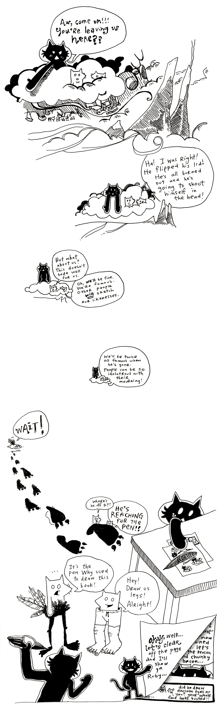

  [1]: http://regexlib.com/DisplayPatterns.aspx
